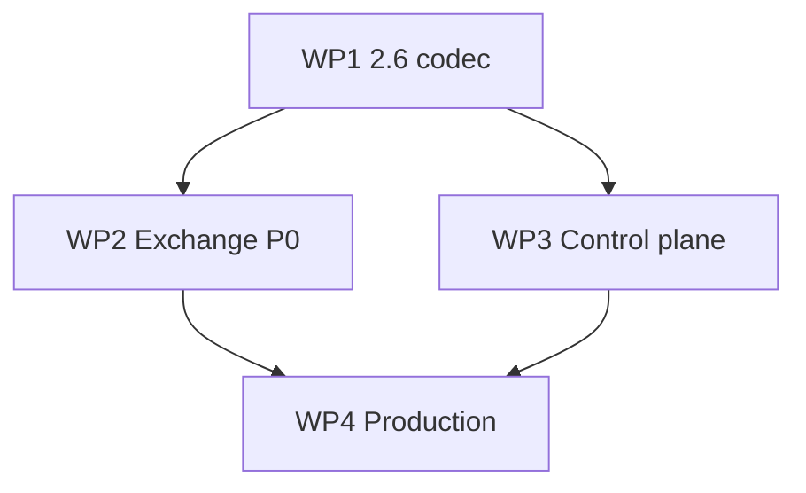

# Milestone: OpenRTB 2.6 Exchange + RTB Production (SMB / mid-market)

**ID:** `M-OPENRTB-26` (formerly `M-OPENRTB-FULL`, rescoped)  
**Audience:** Small/mid programmatic — regional SSP/DSP, ad networks, self-hosted tracker+billing (не Google AB / Xandr Tier-1).  
**Scope:** In-process RTB (`internal/rtb`) + **OpenRTB 2.6** exchange на `POST /openrtb/bid` + control plane для partner onboarding + ops hooks (reconcile, config, CH retention).  
**Sales promise:** «Подключите SSP по OpenRTB 2.6: display + video, PMP deals, shadow→live, reconcile export».

**Out of scope (milestone):** OpenRTB 3.0 / AdCOM envelope, `mid` creative CDN, ads.cert, CTV pods, DOOH, Native 1.2, Audio, `device.sua`, async `lurl` worker, full ads.txt crawler, Privacy Sandbox, ARTF, header-bidding orchestration, DCR. → **§12 Deferred (Tier-1 / vertical)**.

**Production-ready** здесь = [adtech.eu SSP/DSP checklist](https://adtech.eu/connect-ssp-to-dsp/) smoke → small-budget live → reconcile — на полях **§0.2 integration profile**, не на полном IAB spec.

Источники P0: [IAB OpenRTB 2.6](https://github.com/InteractiveAdvertisingBureau/openrtb2.x/blob/main/2.6.md), [Admixer RTB-Stack SSP](https://helpcenter.admixer.com/openrtb-ssp-integration), [Traff / MGID integration guides](https://docs.traff.co/openrtb-integration/specification-for-ssp-integration), [BidSwitch on 3.0 adoption](https://blog.bidswitch.com/openrtb-3.0-what-is-it-and-why-is-almost-nobody-using-it-yet).

### Progress snapshot (2026-08-01)

| Area | Status |
|------|--------|
| WP1 codec (`internal/openrtb`) | **Done** — wire26, decode, encode, validate, macros, profile, testdata |
| WP2 exchange hot path | **Done** — DFA `ParseOpenRTB26Split`, `mapParsedToTargeting`, `RunAuction`, zero-alloc encode |
| WP2 hot/cold split | **Done** — `OpenRTB26Hot` 224 B, cold in `connContext` |
| WP2 extension fields | **Done** — ifa, tid, pmp.private, page, ver, connectiontype, eids, metric → CH |
| WP2 blocklists | **Done** — `bcat`/`badv`/`bapp` parse; `bapp`+`badv` pre-check; `bcat` → `RunAuction` |
| WP2 `nurl` / gzip response | **Done** — `RTB_EXCHANGE_DELIVERY=nurl`; `RTB_EXCHANGE_GZIP` + `Accept-Encoding: gzip` |
| WP3 admin API | **Done** — validate, deals CRUD, profile, shadow-diff, reconcile export |
| WP4 ops | **Done** — CH `rtb_exchange_log`, metrics, QPS, runbook, doctor, env |
| P0.1 multi-imp / wseat | **Done** |
| Perf | `ParseOpenRTB26` ~2 µs, 0 allocs; exchange gnet p99 < 80 ms (CI) |
| Fuzz (DFA + codec) | `openrtb_fuzz_test.go`, `scripts/test/openrtb_fuzz_smoke.sh` in `test-alloc-gate` |

**Осталось до release gate:** нет — milestone **M-OPENRTB-26** ready (§12 deferred only).

---

## 0. P0 — что реально нужно для продаж (mid-market)

IAB: технически достаточно `id` + `imp[]`; mid-market **отклоняет** без inventory context. Integration checklist между партнёрами — норма (IAB §Introduction).

### 0.1 Transport

| # | Requirement | Done |
|---|-------------|------|
| T1 | `POST /openrtb/bid`, `Content-Type: application/json` | [x] |
| T2 | `x-openrtb-version: 2.6` on request; echo on response | [x] |
| T3 | HTTP keep-alive (gnet default) | [x] |
| T4 | Honor `tmax` → auction deadline | [x] |
| T5 | gzip response when `Accept-Encoding: gzip` — config toggle (optional P0.1) | [x] |

### 0.2 Integration profile — поля milestone (parse / respond)

**Request — required (reject if missing):**

| Field | Map to |
|-------|--------|
| `id` | correlation, response.id, reconcile export |
| `imp[]` (≥1), `imp.id`, `imp.bidfloor` | auction loop; floor |
| `site` **or** `app` (not both) | inventory + domain/bundle targeting |
| `device.ip` or `device.ipv6`, `device.ua` | geo + device signals |
| `device.geo.country` (recommended; fail-open if missing) | geo shard |

**Request — supported (parse if present):**

| Field | Map to |
|-------|--------|
| `imp.banner` or `imp.video` | `MediaTypeMask`, duration, size |
| `imp.video.mimes`, `minduration`, `maxduration`, `w`, `h` | creative gates |
| `imp.pmp.deals[]` | `DealIndex` |
| `site.domain`, `site.page`, `site.cat` / `app.bundle`, `app.cat` | context |
| `device.devicetype`, `device.os` | targeting hints |
| `user.id` | optional frequency context |
| `regs.ext.gdpr`, `regs.ext.us_privacy` | `RTB_REGS_POLICY` flag/reject |
| `bcat`, `badv`, `bapp` | blocklist pre-check |
| `source.ext.schain` | `SchainNodes` parse; allowlist optional |
| `at`, `cur[]`, `tmax`, `test` | clearing, currency, deadline, non-billable |
| `imp.bidfloorcur` | USD/EUR |

**Request — explicitly not supported (integration-profile `not_supported`):**

`dooh`, `imp.native`, `imp.audio`, pod fields (`podid`, `slotinpod`, …), `device.sua`, ads.cert, OpenRTB 3.0 root/items, `mid` delivery.

**Response — required on bid:**

| Field | Notes |
|-------|-------|
| `id` = request.id | fix current stub |
| `seatbid[].bid[].id`, `impid`, `price` | |
| `adm` **or** `nurl` | VAST/HTML display; Traff-style win via `nurl` |
| `adid`, `crid`, `cid`, `adomain[]` | partner QA |
| `dealid` | when PMP win |

**Response — optional:**

`bidid`, `cur`, `cat[]`, `burl` (URL with macros; billing still via tracker unless partner requires ping), `nurl` macros subset.

**Macros P0 (не full §4.4):** `${AUCTION_PRICE}`, `${AUCTION_ID}`, `${AUCTION_BID_ID}`, `${AUCTION_IMP_ID}`, `${AUCTION_SEAT_ID}`.

**No-bid:** HTTP 204 empty body **or** 200 + `nbr` — config `RTB_EXCHANGE_NO_BID_MODE`; never 204+body.

**Multi-imp:** up to `RTB_EXCHANGE_MULTI_IMP_MAX` (default `1`, max `10`); set env to `10` for multi-imp partners.

### 0.3 Go-live checklist (G1–G8)

- [x] **G1** `GET /api/v1/rtb/integration-profile` — required / supported / not_supported
- [x] **G2** `POST /openrtb/bid` + golden testdata in `openrtb/testdata/`
- [x] **G3** `POST /api/v1/rtb/validate-bid-request` + partner sign-off
- [x] **G4** `RTB_EXCHANGE_MAX_QPS` + edge RL
- [x] **G5** `test=1` non-billable
- [x] **G6** E2E live + `AssertBudgetInvariant` (`tests/e2e/rtb_openrtb_live_budget_test.go`)
- [x] **G7** `GET /api/v1/rtb/reconcile/export` vs partner window
- [x] **G8** Runbook shadow→live + `ad_rtb_exchange_*` metrics

**Removed from P0 go-live:** mandatory ads.txt crawler (G7 old), Grafana fill-rate dashboards as gate (ops doc only).

---

## 1. Current State Inventory

### 1.1 RTB auction core — **implemented** (reuse, не переписывать)

`RunAuction`, budget CAS, deals, VAST display+video, shadow/live/off, reconcile worker, deal outcomes→CH, fault suite, E2E live budget — see `internal/rtb/`, `rtb_track.go`, `tests/e2e/rtb_live_budget_test.go`.

### 1.2 Exchange — **implemented**

| Item | Status |
|------|--------|
| `POST /openrtb/bid` | [x] DFA parse → `RunAuction` → encode; correct `id`/`impid`; 204 or `nbr` |
| `internal/openrtb/` | [x] cold-path codec + admin validate |
| `internal/ingestion/openrtb_26_*` | [x] hot-path DFA parse + hot/cold split |
| `adm` / `nurl` | [x] `adm` VAST/HTML; [x] `nurl` (`RTB_EXCHANGE_DELIVERY=nurl`) |
| Admin validate route | [x] `POST /api/v1/rtb/validate-bid-request` |
| Deals REST | [x] CRUD + outbox |
| Integration profile | [x] `GET /api/v1/rtb/integration-profile` |
| Reconcile export | [x] `GET /api/v1/rtb/reconcile/export` |
| Blocklists | [x] parse + `bapp`/`badv` pre-check + `bcat` in `RunAuction` |
| gzip response | [x] `RTB_EXCHANGE_GZIP` + `Accept-Encoding` |

### 1.3 Product

Default `RTB_MODE=off`; README/ARCHITECTURE updated to **2.6 SMB** positioning ([x] WP4 docs).

---

## 2. Gap Register (P0 only)

| ID | Status | Notes |
|----|--------|-------|
| GAP-01 | [x] | `openrtb_exchange.go` + `openrtb_26_parse.go` |
| GAP-02 | [x] | `internal/openrtb/` |
| GAP-03 | [x] | `adm` + `nurl` (`RTB_EXCHANGE_DELIVERY`) |
| GAP-04 | [x] | validate HTTP |
| GAP-05 | [x] | integration-profile |
| GAP-06 | [x] | deals REST |
| GAP-07 | [x] | catalog-only winner |
| GAP-08 | [x] | reconcile export |
| GAP-09 | [x] | `ad_rtb_exchange_*` |
| GAP-10 | [x] | `RTB_EXCHANGE_MAX_QPS` |
| GAP-11 | [x] | regs/coppa; blocklists full |
| GAP-12 | [x] | schain parse on exchange |
| GAP-13 | [x] | docs honest 2.6 |
| GAP-14 | [x] | env + CH janitor |
| GAP-15 | [x] | shadow-diff route |

---

## 3. Architecture — LoC-first (2.6 only)

**Не делаем:** Clean Arch, DDD, `wire30`, `wire_adcom`, `DetectVersion` для 3.0, mapper packages, `map[string]any` builders.

**Glue pipeline:**

```text
POST body → ParseOpenRTB26Split (DFA, 0 alloc) → mapParsedToTargeting → RunAuction → WriteBidHTTPResponse
```

Admin/cold: `openrtb.Decode` → `Validate` → same profile tables.

**`internal/openrtb` exports:** `Validate`, `Decode`, `EncodeBid`, `EncodeNoBid`, `ApplyMacros` — **no** `DetectVersion` until §12.

**File cap ≤ 8 `.go` (excl. testdata):** `wire26.go`, `decode.go`, `encode.go`, `validate.go`, `macros.go`, `integration_profile.go`, optional `gzip.go`.

**`ingestion`:** `openrtb_exchange.go`, `openrtb_map.go`, `openrtb_26_parse*.go`; `openrtb_validate.go` deleted.

**`adminapi`:** one `rtb_handlers.go` (validate, deals, profile, shadow, reconcile export).

### 3.1 LoC gates

- [x] **L1** Net: `openrtb_validate.go` deleted; exchange merged into `openrtb_exchange.go` + DFA parse
- [x] **L2** No file > 400 LoC except `wire26.go` — `openrtb_26_parse.go` split to helpers/device/schain/seats
- [x] **L3** Zero new single-impl interfaces in `openrtb` / `rtb_handlers`
- [x] **L4** Zero `map[string]any` on exchange path
- [x] **L5** One `mapParsedToTargeting` function

### 3.2 Constraints

- [x] **A1** Reuse `RunAuction` — no rewrite
- [x] **A2** `/track` FSM — 0 alloc; unchanged
- [x] **A3** `/openrtb/bid` — cold path alloc OK
- [x] **A4** `openrtb` does not import `ingestion`/`rtb`
- [x] **A5** Ops knobs via `config.Load()` only (§3.5)

### 3.3 Reuse

`RtbCatalog.RunAuction`, `DealIndex`, `CreativeCache`/`MarshalVASTDocument`, `SchainNodes`, `NoBidReason`→`nbr` table, `service_rtb` deals CRUD, `RtbShadowDiffForWindow`.

### 3.4 3.0 requests

`POST /openrtb/bid` with 3.0-shaped body → HTTP 400 or no-bid `nbr` + integration-profile documents **2.6 only**. No AdCOM codec in milestone.

### 3.5 Configuration (P0 env)

**RTB / exchange**

| Variable | Default | Notes |
|----------|---------|-------|
| `RTB_MODE` | `off` | exists |
| `RTB_BUDGET_AUTHORITY` | `redis` | exists |
| `RTB_CLEARING_MODE` | `second` | exists |
| `RTB_PREBID_IVT` | `false` | exists |
| `RTB_EXCHANGE_MAX_QPS` | `0` | new |
| `RTB_EXCHANGE_MAX_BODY_BYTES` | `1048576` | new |
| `RTB_EXCHANGE_NO_BID_MODE` | `204` | `204` or `nbr` |
| `RTB_EXCHANGE_MULTI_IMP_MAX` | `1` | set `10` for multi-imp partners |
| `RTB_EXCHANGE_GZIP` | `true` | new |
| `RTB_EXCHANGE_DELIVERY` | `adm` | `adm` or `nurl` |
| `RTB_EXCHANGE_NURL_TEMPLATE` | (built-in) | P0 macros; used when `delivery=nurl` |
| `RTB_REGS_POLICY` | `flag` | `off`/`flag`/`reject` |
| `RTB_BLOCKLIST_ENFORCE` | `true` | new |
| `RTB_CATALOG_RELOAD_SLO_MS` | `5000` | deal reload test |

**CH retention (RTB tables)**

| Variable | Default | Notes |
|----------|---------|-------|
| `CH_JANITOR_ENABLED` | `true` | new |
| `CH_JANITOR_INTERVAL_H` | `24` | new (replaces hardcoded) |
| `CH_RETENTION_DAYS_RTB_DEAL_OUTCOMES` | `90` | janitor includes table |
| `CH_RETENTION_DAYS_RTB_EXCHANGE_LOG` | `30` | new table WP4 |
| `RTB_DEAL_OUTCOME_FLUSH_MS` | `5000` | replaces const |

Full catalog: `deploy/rtb/env.example` + `.env.example` — WP4 DoD.

---

## 4. Work Packages

Чеклисты `- [ ]` — PR / release review.

### WP1 — OpenRTB 2.6 codec + glue skeleton

**Deliverables:**

- [x] `internal/openrtb/` — 2.6 only (§3 file cap)
- [x] `openrtb_exchange.go` + `openrtb_map.go` + `openrtb_26_*`
- [x] Delete `openrtb_validate.go`; tests → `openrtb/`
- [x] `x-openrtb-version: 2.6` in glue

**DoD:**

- [x] **1.1** Validate §0.2 required fields; profile-aware errors
- [x] **1.2** Decode/encode roundtrip on IAB 2.6 §6.2 golden subset
- [x] **1.3** `response.id` = `request.id`; `bid.impid` from request
- [x] **1.4** No-bid mode per `RTB_EXCHANGE_NO_BID_MODE`
- [x] **1.5** `POST /api/v1/rtb/validate-bid-request` registered
- [x] **1.6** `integration_profile.go` static tables = §0.2
- [x] **1.7** LoC gates L1–L5
- [x] **1.8** `make lint`, `comments.sh`, `go test ./internal/openrtb/...`

---

### WP2 — Exchange P0 (bid path)

**Deliverables:**

- [x] Full `POST /openrtb/bid` 2.6: map → `RunAuction` → encode
- [x] Display + video `adm`; `nurl` alternative (`RTB_EXCHANGE_DELIVERY=nurl`)
- [x] `pmp.deals`, `schain` parse, regs/blocklists (partial)
- [x] `test=1` non-billable; `tmax`; `at`→clearing; USD/EUR
- [x] P0 macros only (§0.2)
- [x] Optional `burl` URL in response (no async worker)
- [x] Exchange path: winner from catalog only (no client campaign UUID)

**DoD:**

- [x] **2.1** `site`/`app`, `device`, `user`, `regs`, `bcat`/`badv`/`bapp` per §0.2
- [x] **2.2** `imp.banner` / `imp.video` → media mask + duration
- [x] **2.3** `pmp.deals` → `DealIndex`
- [x] **2.4** `schain` parse; allowlist if configured; no mandatory `complete=1`
- [x] **2.5** Response fields §0.2 (incl. `dealid`, `nurl`)
- [x] **2.6** Video `adm` = VAST from `CreativeCache`; display HTML stub
- [x] **2.7** Macros: P0 set only
- [x] **2.8** gnet E2E bid / no-bid / malformed
- [x] **2.T1** `TestFault_OpenRTB26_*` panics == 0
- [x] **2.T2** `AssertBudgetInvariant` on live exchange test
- [x] **2.T3** `internal/rtb/fault_test.go` no regression

**P0.1 (after first partner, same WP2 PR or follow-up):**

- [x] **2.P1** Multi-imp up to `RTB_EXCHANGE_MULTI_IMP_MAX`
- [x] **2.P2** `wseat`/`bseat` when deal seats configured

---

### WP3 — Control plane & partner surface

**Deliverables:**

- [x] `adminapi/rtb_handlers.go` — validate, deals, profile, shadow, reconcile export
- [x] No creative `mid` upload API (deferred §12)

**DoD:**

- [x] **3.1** `POST /api/v1/rtb/validate-bid-request`
- [x] **3.2** Deals CRUD `GET/POST/PATCH/DELETE /api/v1/rtb/deals`
- [x] **3.3** `GET /api/v1/rtb/integration-profile` = §0.2
- [x] **3.4** `GET /api/v1/rtb/shadow-diff`
- [x] **3.5** `GET /api/v1/rtb/reconcile/export` — `request.id`, window, bids/wins/spend
- [x] **3.6** `POST /api/v1/rtb/floors/apply` (exists) documented
- [x] **3.7** RBAC `rtb:read` / `rtb:write`; audit on deal mutations
- [x] **3.8** `rtb_handlers.go` ≤ 350 LoC (~269)

---

### WP4 — Production, observability, config

**Deliverables:**

- [x] Runbook `docs/RTB_PRODUCTION_RUNBOOK.md` shadow→live
- [x] `RTB_EXCHANGE_MAX_QPS`; exchange metrics
- [x] OpenRTB 2.6 bid mix in load smoke (§6.1) — loadgen `smoke` 15% / `full` 10% / `business` 5%
- [x] Deal reload SLO test (`RTB_CATALOG_RELOAD_SLO_MS`)
- [x] CH: `rtb_exchange_log` table + janitor for `rtb_deal_outcomes` + exchange log
- [x] §3.5 env wired; `deploy/rtb/env.example`
- [x] README / ARCHITECTURE / `rtb.mdc` — honest 2.6 SMB scope

**DoD:**

- [x] **4.1** Runbook + staging dry-run
- [x] **4.2** Metrics `ad_rtb_exchange_request_total`, `ad_rtb_exchange_duration_seconds`, `ad_rtb_exchange_validate_errors_total`
- [x] **4.3** QPS throttle + metric
- [x] **4.4** `RTB_PREBID_IVT` on exchange path documented + test
- [x] **4.5** Reconcile export matches CH + exchange log sample window
- [x] **4.6** CFG: `CH_JANITOR_INTERVAL_H`, retention days RTB tables, deal outcome flush from env
- [x] **4.7** `pkg/doctor` rows for critical RTB/CH knobs
- [x] **4.8** Docs D1–D3 (§8)

---

## 5. SLA (regression gates — unchanged)

| Area | Budget |
|------|--------|
| Tracker handler p95/p99 | < 50 / < 80 ms |
| `RunAuction` p99 | < 15 µs, 0 B/op |
| `/openrtb/bid` handler p99 | < 80 ms end-to-end |
| Budget invariant | `AssertBudgetInvariant` |

---

## 6. Performance gates

Same CI as before: `make test-alloc-gate`, `lint`, `comments.sh`, `gate_bench.sh`, `TestFault ./internal/rtb/...`.

- [x] **6.1** Load smoke with OpenRTB **2.6** bid requests; handler SLA holds (loadgen `smoke`/`full`/`business` mix)
- [x] **6.2** FSM benches 0 B/op unchanged
- [x] **6.3** No new escapes in `rankCandidates`
- [x] **6.4** Fuzz smoke: `ParseOpenRTB26*`, OpenRTB3 FSM, `ValidateBytes`, macros, gzip (`make openrtb-fuzz-smoke`)

---

## 7. Fault DoD

- [x] **F1** Malformed bid → no panic; typed no-bid
- [x] **F2** Truncated JSON corpus
- [x] **F3** Concurrent `/openrtb/bid`
- [x] **F4** `internal/rtb/fault_test.go` all pass
- [x] **F5** E2E live budget (exchange path)
- [x] **F6** Fuzz corpora: malformed OpenRTB3 `item[]` hang + `parseSchainNodesAt(-1)` panic fixed

---

## 8. Documentation DoD

- [x] **D1** `README.md` — OpenRTB **2.6** exchange; no 3.0/DOOH claims
- [x] **D2** `docs/ARCHITECTURE.md` — exchange topology
- [x] **D3** `.cursor/rules/rtb.mdc` — file map, not deferred
- [x] **D4** `deploy/rtb/env.example` — §3.5
- [x] **D5** `.env.example` — RTB exchange + CH retention P0 vars
- [x] **D6** `docs/RTB_PRODUCTION_RUNBOOK.md`

---

## 9. Release gate

Milestone **M-OPENRTB-26** is **Done** when:

- [x] **R1** GAP-01…15 closed
- [x] **R2** WP1–WP4 DoD
- [x] **R3** Go-live G1–G8
- [x] **R4** SLA §5 + perf §6 on 2.6 traffic (in-process SLA tests + load-report `sla` gate)
- [x] **R5** Fault §7 — F1–F5
- [x] **R6** Docs §8
- [x] **R7** Golden 2.6 fixtures roundtrip
- [x] **R8** LoC gates §3.1 — L2 split done

**Not required for release:** §12 deferred items, ads.txt hook.

---

## 10. Dependency graph



**Parallel after WP1:** WP2 + WP3.

---

## 11. File map (target)

```
internal/openrtb/
  wire26.go
  decode.go
  encode.go
  validate.go
  macros.go
  integration_profile.go
  gzip.go                # T5 gzip response
  encode_http.go         # gnet WriteBidHTTPResponse
  delivery.go
  fuzz_test.go
  testdata/

internal/ingestion/
  openrtb_exchange.go
  openrtb_map.go
  openrtb_26_parse.go
  openrtb_26_parse_ext.go
  openrtb_26_parse_blocklist.go
  openrtb_26_types.go
  openrtb_26_sections.go
  openrtb_26_exchange_validate.go
  rtb_exchange_log_writer.go
  openrtb_26_parse_seats.go
  openrtb_26_seats.go
  openrtb_fuzz_test.go
  openrtb_ingress_parse.go   # /track FSM — keep
  rtb_catalog.go
  rtb_track.go

internal/controlplane/adminapi/
  rtb_handlers.go

internal/clickhouse/migrate/
  00011_rtb_exchange_log.sql
  00012_rtb_exchange_log_deals.sql
  00013_rtb_exchange_log_extended.sql

docs/RTB_PRODUCTION_RUNBOOK.md

DELETED: openrtb_validate.go, openrtb_26_bid_response.go (merged to exchange)
```

---

## 12. Deferred backlog (Tier-1 / vertical — not M-OPENRTB-26)

Перенос из старого `M-OPENRTB-FULL`; делать только по контракту с партнёром.

| Item | Why defer |
|------|-----------|
| OpenRTB 3.0 + AdCOM `media.ad` | [Industry not on 3.0](https://blog.bidswitch.com/openrtb-3.0-what-is-it-and-why-is-almost-nobody-using-it-yet) |
| `mid` creative registry + upload API | 3.0 / hosted creative model |
| ads.cert verify | Tier-1 / 3.0 |
| CTV ad pods, roadblock | Xandr/Google CTV |
| DOOH + `qty` multiplier billing | Vertical |
| Native 1.2 full | Native networks only |
| Audio `MediaTypeAudio` | Rare in mid-market SSP guides |
| `device.sua` structured UA | Tier-1 2026 enhancement |
| Async notification worker (`lurl`, retry queue) | Debug/shading; not SMB contract norm |
| Full macro table 2.6 §4.4 | Expand on partner request |
| SupplyChain v1.1 `hp=0` dedicated WP | Tolerant parse enough for P0 |
| Mandatory `schain.complete=1` | Config option only |
| `RTB_ADS_TXT_CHECK` crawler | Optional hook only |
| `CH_RETENTION_DAYS_RTB_NOTIFICATION_LOG` | No notification worker in P0 |
| sellers.json sync automation | Operator allowlist file sufficient |

**If re-opening full exchange:** fork milestone `M-OPENRTB-TIER1` from this doc git history; do not expand P0 scope without new sales contract.
