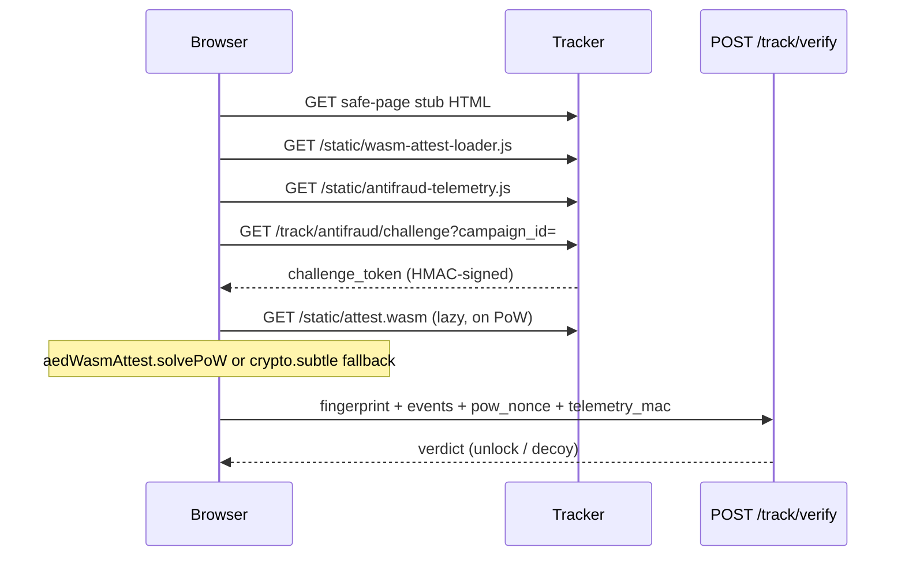

# WASM attestation and browser pixel

Operator reference for tracker static assets: the **browser conversion pixel** (`track.js`) and the **WASM attestation module** (`attest.wasm`) used on safe-page antifraud paths.

Cross-ref:

- `docs/INTEGRATIONS.md` — lander pixel snippet, `event_id`, CAPI dedup
- `deploy/vendor/ANTIFRAUD.md` — safe-page attestation signals and filter semantics
- `deploy/vendor/PERIMETER_INTEL_DEFENSE.md` — Public Safe Sandbox zone, `attestation_mode=strict`
- `docs/DEVELOPMENT.md` — build commands for WASM attest

---

## Terminology

| Term | Artifact | Role |
| :--- | :--- | :--- |
| **Browser pixel** | `track_pixel.js` served as `GET /static/track.js` | Zero-redirect `POST /track` for conversions and optional impressions; **not** WASM-dependent |
| **WASM attest module** | `attest.wasm` at `GET /static/attest.wasm` | Client-side PoW solver and IEEE float-noise probe; lazy-loaded on attestation paths only |
| **WASM loader** | `wasm_attest_loader.js` at `GET /static/wasm-attest-loader.js` | Thin `WebAssembly.instantiate` wrapper; exposes `globalThis.aedWasmAttest` |
| **Antifraud telemetry** | `antifraud_telemetry.js` | Pointer/scroll/RAF probes, challenge fetch, PoW (WASM first, `crypto.subtle` fallback) |
| **Safe-page hydrator** | `safe_page_hydrator.js` | Canvas/WebGL/timezone bundle; posts to `POST /track/verify` |

The colloquial **WASM pixel** means the **pair** `wasm-attest-loader.js` + `attest.wasm` plus the antifraud scripts on the safe-page stub. It does **not** replace the conversion pixel on money landers.

---

## Hot path boundary (hard)

| Surface | WASM allowed? | Gate |
| :--- | :---: | :--- |
| `GET /static/track.js` (`track_pixel.js`) | **No** | `bash scripts/ci/static/track_hot_bundle_wasm_gate.sh` |
| `web/src/static/track.js` (canonical source) | **No** | Same gate |
| `track_telemetry.js`, `track_biometrics.js` | **No** | Same gate |
| Safe-page stub (`attestation_mode` light/strict) | **Yes** (loader + wasm) | Loaded only with `antifraud-telemetry.js` |
| `/track` accept handler (gnet Tier B) | **No** | WASM never runs server-side on ingest |

WASM PoW is **cold relative to `/track` SLA**: it runs in the browser after safe-page load, not in the synchronous filter chain.

---

## Static routes (tracker)

Served from `internal/track/static_assets.go` (embedded defaults; optional polymorph override at tracker boot).

| Path | Content-Type | Cache | Embedded source |
| :--- | :--- | :--- | :--- |
| `/static/track.js` | `application/javascript` | `public, max-age=31536000, immutable` | `internal/track/track_pixel.js` |
| `/static/wasm-attest-loader.js` | `application/javascript` | same | `internal/track/wasm_attest_loader.js` |
| `/static/attest.wasm` | `application/wasm` | same | `internal/track/attest.wasm` |
| `/static/antifraud-telemetry.js` | `application/javascript` | same | `internal/track/antifraud_telemetry.js` |
| `/static/track-telemetry.js` | `application/javascript` | same | `internal/track/track_telemetry.js` |
| `/static/track-biometrics.js` | `application/javascript` | same | `internal/track/track_biometrics.js` |
| `/static/telemetry-stealth-poc.js` | `application/javascript` | same | `internal/track/telemetry_stealth_poc.js` |

CORS: `Access-Control-Allow-Origin: *` on static responses (first-party pixel contract).

---

## Browser conversion pixel

### Source and build

| Step | Command / path |
| :--- | :--- |
| Canonical TS/JS source | `web/src/static/track.js` |
| Embed bundle | `node web/scripts/build_track_pixel.mjs` writes `internal/track/track_pixel.js` |
| Drift check | `node web/scripts/build_track_pixel.mjs --check` |

The pixel is a minified IIFE. It generates `event_id` in the browser (`crypto.randomUUID()` in source) and `POST`s JSON to `/track`. See `docs/INTEGRATIONS.md` for CORS (`TRACK_CORS_ORIGINS`) and CAPI `conversionEventId` alignment.

### Polymorph (install-time)

`build_track_pixel.mjs --seed=<seed>` adds a unique comment banner; semantics unchanged. Used with WASM polymorph in `scripts/install/polymorph_static.sh`.

---

## Attestation modes

Campaign field: `attestation_mode` (`off` | `light` | `strict`). Legacy `attestation_enabled=true` maps to `strict` when mode is unset (`internal/domain/attestation_mode.go`).

| Mode | Safe-page probe | WASM loader in stub | Telemetry bundle |
| :--- | :---: | :---: | :--- |
| `off` | No | No | N/A |
| `light` | Yes | Yes (lazy wasm fetch) | Standard: loader + `antifraud-telemetry.js` + hydrator |
| `strict` | Yes | Via stealth POC (no loader in stub HTML) | `track-telemetry.js` + `telemetry-stealth-poc.js` |

Standard safe-page script order (`internal/track/safe_page.go`):

```
wasm-attest-loader.js -> track-telemetry.js -> antifraud-telemetry.js -> safe_page_hydrator.js (inline boot)
```

Strict stealth replaces the standard trio with `track-telemetry.js` + `telemetry-stealth-poc.js` + stealth boot (`CampaignUsesTelemetryStealthBundle`).

---

## End-to-end antifraud flow (safe page)



### Challenge (`GET /track/antifraud/challenge`)

- Handler: `internal/ingest/antifraud_challenge.go` (gnet path).
- Requires configured attestation keys on tracker (`attestationKeys` non-empty); otherwise **404**.
- Query: `campaign_id=<uuid>`.
- Response JSON: `challenge_token` (base64url), default difficulty **2** (zero leading SHA-256 bytes).
- Token layout: `pkg/antifraudtelemetry/challenge.go` — version, campaign UUID, 16-byte salt, difficulty, expiry, 16-byte HMAC.

### PoW (browser)

`antifraud_telemetry.js` `solvePoW`:

1. If `globalThis.aedWasmAttest.solvePoW` exists, call with `/static/attest.wasm`, salt, difficulty, `maxTries=2000000`.
2. On `0xffffffff` (not found) or missing WASM, fall back to `crypto.subtle.digest('SHA-256', ...)` loop (same 20-byte preimage as server/WASM).

Server verification: `antifraudtelemetry.VerifyPoW(salt, nonce, difficulty)`.

### Telemetry MAC

After PoW, client signs dwell/pointer/RAF/runtime fields with HMAC key derived from `challenge_token` + nonce (`DerivedTelemetryMACKey` in `pkg/antifraudtelemetry/challenge.go`). Server checks `VerifyTelemetryMACDerived`.

### Verify (`POST /track/verify`)

Safe-page hydrator and antifraud bundle post attestation payload. Server scoring: `internal/track/safe_page_attest.go` (`EvaluateSafePageAttestation`) — network, WebGL, timezone, biometrics, runtime float noise hash, etc.

---

## WASM module ABI

Sources: `wasm/attest/*.c`, header `wasm/attest/abi.h`. Target: `wasm32-unknown-unknown`, **zero imports**, ~2.4 KiB raw (CI cap 24 KiB).

| Export | Signature (conceptual) | Purpose |
| :--- | :--- | :--- |
| `memory` | linear 4096 B (`AAD_MEM_SIZE`) | Shared buffer |
| `aad_abi_version` | `() -> u32` | Must return `1` |
| `aad_data_off` | `() -> u32` | Offset of `aad_mem` in linear memory |
| `aad_pow_solve` | `(salt_off, difficulty, nonce_start, max_tries) -> u32` | PoW search; `0xffffffff` if not found |
| `aad_float_noise_ieee` | `(out_off) -> u32` | SHA-256 of fixed IEEE literal `0.3000...004`; status `0` ok |
| `aad_sha256_one_shot` | `(msg_off, msg_len, out_off) -> u32` | Bounds-checked hash |
| `aad_bench_mul` | `(rounds) -> u32` | Deterministic micro-bench (dry-run parity) |
| `aad_poly_seed` / `aad_poly_tag` | polymorph metadata | Install-time rodata junk; ABI unchanged |

PoW preimage (20 bytes): 16-byte salt + big-endian `uint32` nonce. Difficulty: count of leading zero bytes in SHA-256 digest (max **4**).

Parity: `pkg/wasmattest` (wazero sandbox) must match `pkg/antifraudtelemetry` PoW and float-noise hash (`FloatNoiseIEEEHex` in `pkg/wasmattest/abi.go`).

---

## Server sandbox (admin / CI)

| Component | Path | Role |
| :--- | :--- | :--- |
| Loader | `pkg/wasmattest/sandbox.go` | wazero, zero-import verifier, memory/module caps |
| Dry-run API | `POST /api/v1/fraud/wasm-attest/dry-run` | `internal/fraudadmin/wasm_attest_handlers.go` |
| Enable flag | `WASM_ATTEST_ENABLED=0` | Returns **501** on dry-run |

Dry-run runs PoW, float noise, bench, and empty SHA-256 against the same embedded `track.AttestWasm` bytes served to browsers.

---

## Build and embed

| Step | Command |
| :--- | :--- |
| Build WASM | `bash scripts/build/wasm_attest.sh` |
| First-time toolchain | `WASM_ATTEST_FETCH_WASI_SDK=1 bash scripts/build/wasm_attest.sh` |
| CI gate | `bash scripts/ci/static/wasm_attest_gate.sh` |
| Polymorph gate | `bash scripts/ci/static/wasm_polymorph_gate.sh` |
| Embed output | `internal/track/attest.wasm` (unless `WASM_ATTEST_SKIP_EMBED=1`) |

Build flags: `-Oz`, `--no-entry`, `--initial-memory=131072`, optional `wasm-opt -Oz`.

Manifest written to `var/wasm/attest.manifest` (`bytes`, `sha256`, `abi_version`, `seed`).

---

## Per-install polymorph

**Problem:** identical `attest.wasm` and `track_pixel.js` hashes across appliances ease blocklist correlation.

| Artifact | Knob | Effect |
| :--- | :--- | :--- |
| WASM | `WASM_ATTEST_SEED` / `scripts/build/gen_wasm_polymorph_header.sh` | Junk rodata; distinct SHA-256 per seed |
| Pixel | `build_track_pixel.mjs --seed` | Unique banner comment |

Install script:

```bash
bash scripts/install/polymorph_static.sh
# writes ${INSTALL_ROOT}/var/static-polymorph/{attest.wasm,track_pixel.js,polymorph.manifest}
```

Tracker override:

| Env | Default |
| :--- | :--- |
| `TRACKER_STATIC_POLYMORPH_DIR` | `${INSTALL_ROOT}/var/static-polymorph` |

Applied at boot: `track.ApplyStaticPolymorphOverrides` in `cmd/tracker/wire.go`. Missing directory: fail-open to `go:embed` defaults (dev/CI).

---

## Environment knobs

| Variable | Surface | Effect |
| :--- | :--- | :--- |
| `TRACK_CORS_ORIGINS` | Tracker | LP origins allowed for pixel `POST /track` |
| `TRACKER_STATIC_POLYMORPH_DIR` | Tracker | Override embed path for wasm + pixel |
| `WASM_ATTEST_SEED` | Build | Polymorph header for `attest.wasm` |
| `WASM_ATTEST_SKIP_EMBED` | Build | Skip copy to `internal/track/attest.wasm` |
| `WASM_ATTEST_ENABLED` | Control `:8188` | `0` disables fraud dry-run endpoint |

Campaign knobs (admin / PG): `safe_page_enabled`, `attestation_mode`, `attestation_enabled` (legacy), review-traffic routing — see `ANTIFRAUD.md`.

---

## Verification

| Check | Command |
| :--- | :--- |
| WASM gate | `bash scripts/ci/static/wasm_attest_gate.sh` |
| Hot bundle no WASM refs | `bash scripts/ci/static/track_hot_bundle_wasm_gate.sh` |
| wazero parity | `go test ./pkg/wasmattest/ -short -run WasmAttest -count=1` |
| Loader contract | `go test ./internal/track/ -short -run WasmAttestLoader -count=1` |
| Pixel contract | `go test ./internal/track/ -short -run TestTrackPixelContract -count=1` |
| Polymorph holdout | `go test ./internal/track/ -short -run TestApplyStaticPolymorph -count=1` |
| Pixel build drift | `node web/scripts/build_track_pixel.mjs --check` |

Manual smoke (tracker up):

```bash
curl -sfI "https://${TRACK_HOST}/static/attest.wasm" | grep -i content-type
curl -sf "https://${TRACK_HOST}/static/wasm-attest-loader.js" | head -c 200
```

Expect `application/wasm` and `aedWasmAttest` in loader source.

---

## Honest limits

| Claim | Reality |
| :--- | :--- |
| WASM blocks all bots on `/track` | WASM is **not** on the hot pixel; only safe-page attestation tier |
| PoW stops human moderators | Real mobile browser on clean IP may pass; use review routing + ops controls (`PERIMETER_INTEL_DEFENSE.md` T2) |
| WASM module size = ingress SLA proof | ~2.4 KiB module; `/track` p99 from load test / Prometheus (`core.mdc`) |
| Client-only verify | Server `POST /track/verify` is authoritative; client reveal without verdict is a known threat (T22) |
| `crypto.subtle` fallback weaker | Same PoW semantics; WASM is performance path, not a separate trust tier |

Attestation off (`safe_page_enabled=false` or `attestation_mode=off`): no probe; `attestation_missing` may still apply on landing hooks when policy expects attestation (`ANTIFRAUD.md`).

---

## File map

| Path | Role |
| :--- | :--- |
| `wasm/attest/attest.c` | PoW, float noise, bench exports |
| `wasm/attest/sha256.c` | SHA-256 for WASM |
| `wasm/attest/polymorph.c` | Seed junk |
| `internal/track/wasm_attest_loader.js` | Browser loader |
| `internal/track/antifraud_telemetry.js` | Challenge + PoW + MAC client |
| `internal/track/safe_page_hydrator.js` | Verify POST client |
| `internal/track/safe_page.go` | Stub HTML script tags |
| `internal/track/safe_page_attest.go` | Server verify scoring |
| `pkg/antifraudtelemetry/challenge.go` | Challenge + PoW + MAC |
| `pkg/wasmattest/` | wazero sandbox + ABI constants |
| `web/scripts/build_track_pixel.mjs` | Pixel bundle |
| `scripts/build/wasm_attest.sh` | WASM compile |
| `scripts/install/polymorph_static.sh` | Per-install variants |
