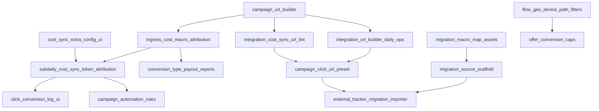
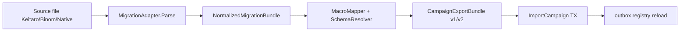

# Competitive parity backlog

Gap list vs cloud trackers (BeMob-class) and self-hosted trackers (Keitaro, Binom). Derived from operator comparisons and current tree (`README.md`, `sku.yaml`, `enhanced_defense_baseline_audit_test.go` product-scope gates).

**Not in scope for this file:** antifraud signal and ML work - see `ANTIFRAUD.md` and [antifraud_backlog.md](./antifraud_backlog.md). Admin REST OpenAPI transition - closed ([openapi_backlog.md](./openapi_backlog.md), 2026-08-26). **Compliance:** defensive perimeter only (`compliance.mdc`); no outbound attack tooling.

Each item uses a semantic slug for cross-reference in PRs and docs. **Do not mark a slug closed** until every checked gate below applies to that PR (skip N/A lines only when the touch surface truly did not change).

---

## Priority legend

| Label | Meaning |
| :--- | :--- |
| `parity_blocker` | Blocks positioning against Keitaro/Binom for typical affiliate workflows |
| `growth` | Improves win rate vs BeMob without changing deploy model |
| `enterprise_optional` | Large build; license-gated or separate SKU surface |
| `pricing_gtm` | Packaging, trial, or onboarding - not a hot-path code change |

---

## Global close checklist (every slug)

Rule: `anti-slop.mdc` agent checklist

- [ ] Every new symbol resolves (`go build` / `go test -c` on touched packages)
- [ ] Hot path does not import `internal/fraud` scoring (`boundaries.mdc`, `hot-path.mdc`)
- [ ] Verification commands pasted in PR with package path (no unrun claims - `quality.mdc`)
- [ ] Holdout or fault test added when behavior is non-obvious (`testing.mdc`)
- [ ] Doc claims match code; no microbench cited as prod SLA (`anti-slop.mdc` lie modes)
- [ ] `bash scripts/ci/pr_fast.sh` scoped to touched packages (`ci.mdc`)
- [ ] No new thin `*_gate.sh` that only re-invokes existing gates (`anti-slop.mdc`)
- [ ] `bash scripts/ci/check_no_legacy_naming.sh` clean on touched `README.md`, `docs/`, `deploy/vendor/` (`naming.mdc`)

Rule: `core.mdc` commit policy (when landing code)

- [ ] Imperative commit title names concrete surface; no `refactor:` / milestone tokens (`core.mdc`)
- [ ] Docs-only changes ship in the same commit as code (`core.mdc`)

---

## Summary

| Slug | Priority | Competitor gap | Rough surface |
| :--- | :--- | :--- | :--- |
| `local_lander_zip_hosting` | parity_blocker | Keitaro/Binom ZIP upload | control + edge static |
| `lander_panel_code_editor` | parity_blocker | In-panel HTML edit | admin UI + object store |
| `visual_flow_builder_ui` | growth | Keitaro flow UI | `web/` flows pages |
| `moderator_intel_feed` | growth | Shipped: signed `moderator_intel_v1` + `moderator_ip` signal | `pkg/moderatorintel` + tracker loader |
| `review_traffic_policy` | growth | Shipped: per-campaign `review_traffic_action` matrix | tracker + campaign config |
| `one_click_compose_bootstrap` | growth | Shipped: `scripts/install/appliance_bootstrap.sh` | install + compose |
| `guided_first_campaign_wizard` | growth | Shipped: `/campaigns/wizard` multi-step onboarding | admin UI |
| `tiktok_cost_sync` | growth | Shipped: spend pull + OAuth refresh | `internal/costsync` |
| `microsoft_ads_cost_sync` | growth | Shipped: Reporting API v13 campaign spend + OAuth refresh | `internal/costsync` |
| `snapchat_cost_sync` | growth | Shipped: ad account stats + OAuth refresh | `internal/costsync` |
| `linkedin_cost_sync` | growth | Shipped: adAnalytics campaign spend + OAuth refresh | `internal/costsync` |
| `pinterest_cost_sync` | growth | Shipped: campaigns analytics + OAuth refresh | `internal/costsync` |
| `trafficstars_cost_sync` | growth | Shipped: campaigns statistics v2 + offline key refresh | `internal/costsync` |
| `richads_cost_sync` | growth | Shipped: advertiser reports API + API key | `internal/costsync` |
| `galaksion_cost_sync` | growth | Shipped: advertiser statistics + token or login | `internal/costsync` |
| `ad_platform_campaign_api` | enterprise_optional | Shipped: pause/resume/budget + status sync | `internal/platformsync` |
| `extended_trial_selfserve` | pricing_gtm | Shipped: 14d pilot SKU + license upgrade CTA | `sku.yaml` + license UI |
| `workspace_billing_split` | pricing_gtm | Shipped: cost_center + usage CSV | tenants + invoices |
| **Tier 1 (cost and automation)** | | | |
| `subdaily_cost_sync_token_attribution` | parity_blocker | Shipped: 15-60 min scheduler + CH token/spread attribution | `internal/costsync` + CH |
| `ingress_cost_macro_attribution` | parity_blocker | Shipped: `ingress_cost_config` + CH `attributed_cost_micro` | `internal/ingestion` |
| `campaign_automation_rules` | growth | Shipped: CH rollup rules + pause/blacklist/notify actions | controlplane worker |
| `cost_sync_credentials_extra_config_ui` | growth | Shipped: `GET /cost-sync/networks` schema + guided extra fields | `web/` cost-sync |
| **Tier 2 (operator UX)** | | | |
| `campaign_url_builder` | growth | Keitaro "Get link" one screen | admin UI (shipped) |
| `integration_cost_sync_url_lint` | growth | Cost Sync join lint on built click URL | admin UI (client) |
| `integration_ingress_cost_inline_edit` | growth | Ingress cost config inline on Integration tab | admin UI + PATCH |
| `integration_url_builder_daily_ops` | growth | Test click, unify templates, hydrate campaign | admin UI |
| `campaign_click_url_preset` | growth | Persist traffic template + sub mapping on campaign | PG + API + UI |
| `integration_lander_macro_helper` | growth | Lander URL macro insert + preview | admin UI |
| `integration_campaign_doctor` | growth | Integration readiness checklist per campaign | controlplane + UI |
| `migration_macro_map_assets` | growth | Keitaro/Binom macro + source YAML maps | `deploy/vendor/migration/` | **Shipped** |
| `migration_source_scaffold` | growth | `internal/migrationsource` + preview API | controlplane (no UI) | **Shipped** |
| `external_tracker_migration_importer` | parity_blocker | Keitaro/Binom bulk migrate + macro map | controlplane + UI | **Shipped** |
| `traffic_source_templates_codegen` | growth | UI templates from `deploy/schemas/traffic_*.yaml` | codegen + `web/` | **Shipped** |
| `campaign_clone_flow` | growth | Clone campaign + flow + postbacks | controlplane (shipped) |
| `offer_conversion_caps` | growth | Keitaro offer cap / rotation stop | flow + PG (shipped) |
| `conversion_type_payout_reports` | growth | Shipped: status mapping + conversion-type-payout report | CH + admin |
| `click_conversion_log_ui` | growth | Shipped: click log drill-down + timeline API | `web/` + CH |
| `campaign_import_export_json` | growth | Migrate off Keitaro | `/api/v1` export | **Shipped** |
| `report_presets_saved_views` | growth | Keitaro saved report slices | reports API + UI | **Shipped** |
| `flow_geo_device_path_filters` | growth | Keitaro path filters (geo/device/OS) | flow builder + ingest | **Shipped** |
| **Tier 3 (integration density)** | | | |
| `cost_sync_pop_network_wave` | growth | Partial: mondiad/juicyads/evadav shipped; 5 networks blocked (no public API) | `internal/costsync` |
| `capi_outbound_platform_wave` | growth | Shipped: Taboola/Outbrain S2S + Microsoft offline CAPI | `internal/postback` |

---

## `local_lander_zip_hosting`

**Priority:** parity_blocker

**Gap:** Keitaro and Binom host landing files inside the tracker. ~~We only store lander metadata (`landers.url`) and redirect/proxy to external URLs (`gateNoLocalLanders = redirect_and_proxy_only`).~~ **Shipped** (`gateLocalLanders = local_zip_hosting`).

**Current state:** Admin ZIP upload to `LANDER_STORE_ROOT`, versioned `lander_assets`, nginx `/lp/` static (or control fallback), flow snapshot resolves hosted URL when `hosted_asset_id` set.

**Target:**

- Admin upload ZIP (size cap, MIME allowlist, path traversal guards).
- Extract to versioned object store (local `var/landers/` dev; S3-compatible prod).
- Serve on campaign/flow hostname via nginx or tracker static handler with cache headers.
- Flow `lander_id` resolves to hosted path when `url` empty and `hosted_asset_id` set.

**Dependencies:** `settings_domains_page` TLS allowlist; per-tenant storage quota in license limits.

### Done gates

Rule: `architecture.mdc` / `hot-path.mdc`

- [x] Static assets served from edge/nginx or cold object store - **no** per-request PG/CH on `/click` hot path
- [ ] If tracker serves bytes: `make test-alloc-gate` and `bash scripts/ci/escape_heap_gate.sh` on touched hot files
- [x] Registry snapshot for hosted path resolution - no per-click sqlc fetch (`architecture.mdc`)

Rule: `cold-path.mdc`

- [ ] Upload handler uses `pkg/coldpath.ReadLimitedBody` / `DefaultMaxBody` (64 KiB default; raise cap explicitly for ZIP with documented max) — ZIP uses `ParseMultipartForm` + `io.LimitReader` at `LANDER_MAX_ZIP_BYTES`
- [ ] `bash scripts/ci/cold_path_static_gate.sh` and `cold_path_json_gate.sh`
- [x] Config mutation + `outbox_events` in same PG txn when lander publish affects tracker (`control-plane.mdc`)

Rule: `compliance.mdc` (edge static route)

- [x] No direct BPF map writes from admin handlers; deny lists still via outbox -> Redis -> sync
- [ ] `bash scripts/ci/compliance.sh` if `deploy/nginx/**` or `internal/edge/**` touched

Rule: `testing.mdc`

- [ ] `*_integration_test.go` with `integration:` skip reason, real store helper, behavioral asserts
- [ ] `bash scripts/ci/integration_test_slop_gate.sh` on new integration tests
- [ ] E2E: upload ZIP -> `GET /click` -> hosted asset 200 with expected body hash

Rule: `ui.mdc` (upload UI)

- [x] DTO fields match Go handler JSON tags; `apiConfirmed` on upload/publish
- [x] `cd web && npm run typecheck` and `bash scripts/ci/admin_web.sh`

Rule: product scope

- [x] Flip or remove `gateNoLocalLanders` in `enhanced_defense_baseline_audit_test.go` (E2E click->hosted hash still open)

---

## `lander_panel_code_editor`

**Priority:** parity_blocker

**Gap:** Competitors edit lander HTML/JS in the admin panel. ~~We have no LP builder (`gateNoVisualEditors = no_grapejs_lp_builder`).~~ **Shipped** text editor (`gateHostedLanderEditor = hosted_lander_code_editor`). GrapeJS drag-and-drop builder remains out of scope.

**Current state:** Hosted lander file tree, textarea editor, draft versions, signed preview URL, publish to live.

**Target:**

- File tree for hosted lander versions (index.html, assets/).
- Monaco or CodeMirror editor in `web/` with save -> new immutable version.
- Preview URL with signed token; publish promotes version to live.

**Dependencies:** `local_lander_zip_hosting`.

### Done gates

Rule: `ui.mdc` / `anti-slop.mdc` admin slop

- [x] No `(skeleton)` / demo KPIs / silent empty tables on error
- [x] `renderErrorBlock` on fetch failures; `StubBanner` only for real 501
- [x] `apiConfirmed` on save/publish; no "Saved" toast before 2xx
- [x] JSDoc on new `web/**` functions and module constants (`quality.mdc`)
- [x] `cd web && npm run typecheck` and `bash scripts/ci/admin_web.sh`

Rule: `cold-path.mdc`

- [x] Version save uses `ReadLimitedBody` / documented max per file
- [x] Preview token verify uses constant-time compare where secrets involved
- [x] `go test ./internal/controlplane/... -short` on touched handlers

Rule: `architecture.mdc`

- [x] Editor and preview are cold path only; live traffic reads published snapshot

Rule: product scope

- [x] Remove or gate-flip `gateNoVisualEditors` only when editor ships

---

## `visual_flow_builder_ui`

**Priority:** growth

**Gap:** Keitaro visual flow editor. ~~We have declarative JSON paths in API (`flows.paths`) and list UI stub scope (`gateNoFlowBuilderUI = declarative_backend_lists_only`).~~ **Shipped** path builder UI (`gateVisualFlowBuilder = visual_flow_builder_ui`) and geo/device path filters (`gateFlowGeoDevicePathFilters = flow_geo_device_path_filters`).

**Current state:** `/campaigns/flows/:id/builder` edits weighted paths, landers, and offers; `PUT /api/v1/flows/{id}` validates graph server-side and publishes `flow:reload`.

**Target:**

- Drag-and-drop path editor: landers, offers, filters (geo, device), weights.
- Validate graph server-side (no orphan lander_id, weight sum rules).
- Keep hot path `CampaignFlowTable.Select` unchanged - only config shape enrichment.

### Done gates

Rule: `hot-path.mdc` / `architecture.mdc`

- [x] `go test ./internal/ingestion/ -run=Flow -count=1` golden fixtures unchanged for same JSON paths
- [x] No new Redis RTT or PG call in `flow_click.go` / `CampaignFlowTable.Select`
- [ ] If hot structs change: `make test-alloc-gate` on `internal/ingestion/`

Rule: `cold-path.mdc` / `control-plane.mdc`

- [x] Flow graph validation in controlplane service - no N+1 lander lookups in loop
- [x] Flow update publishes `flow:reload` (same channel as lander publish)

Rule: `ui.mdc`

- [x] Form fields match `FlowDTO` / path JSON schema from Go
- [ ] `bash scripts/ci/report_live_routes_gate.sh` if new `/campaigns/*` route is `live: true`
- [x] `admin_web.sh` + typecheck

Rule: product scope

- [x] Flip `gateNoFlowBuilderUI` when visual editor replaces declarative-only UX

---

## `moderator_intel_feed`

**Priority:** growth

**Gap:** Articles claim "true cloaking" needs daily-updated moderator and residential-proxy IP sets for Meta, Google, TikTok review traffic. ~~We have fraud signals (DC, TLS, residential intel SKU) but no dedicated moderator corpus.~~ **Shipped** signed pull feed (`gateModeratorIntelFeed = moderator_intel_feed`).

**Current state:** `pkg/moderatorintel` parses `moderator_intel_v1` with HMAC signature and TTL. Tracker loads into in-memory LPM (`ModeratorIPTable`); `/click` serves safe view when campaign `moderator_intel_enabled` and IP matches. SKU `moderator_intel_feed` on Scale+; default off per campaign.

**Target:**

- Optional signed feed channel (similar to GeoIP updater): `moderator_intel_v1` with source attribution and TTL.
- Map to L1-high or dedicated `moderator_ip` signal; default off per campaign.
- Document fail-open on stale feed; never wipe last good snapshot (`testing.mdc` feed pattern).

**Compliance note:** Defensive classification only - show `safe_page_url` to matched review traffic, not offensive probing.

**Dependencies:** `review_traffic_policy` for operator-visible policy matrix.

### Done gates

Rule: `compliance.mdc`

- [x] Feed fetch is vendor -> appliance pull only; workers do not probe visitor IPs
- [x] No SYN/UDP or "hack-back" tooling in repo

Rule: `architecture.mdc` / `hot-path.mdc`

- [x] Hot path reads in-memory snapshot only (same pattern as CIDR / residential table)
- [x] No `internal/fraud` ML inference on tracker
- [x] Corrupt refresh retains last good snapshot (`TestModeratorIntel_FeedRefreshFailClosed_RetainsSnapshot`)

Rule: `licensing.mdc`

- [x] Feature gated in `sku.yaml` (`moderator_intel_feed`: false starter/pro/pilot, true scale+)

Rule: `anti-slop.mdc` documentation

- [x] `moderator_ip` row in `deploy/vendor/ANTIFRAUD.md`
- [x] No claim of "guaranteed no ban" or daily moderator DB in README without code proof

Rule: `testing.mdc`

- [x] Holdout: feed line matches -> LPM hit; corrupt feed does not empty table
- [x] Campaign flag gate: `TestModeratorIntelHook_campaignFlagGate`
- [x] `go test ./pkg/moderatorintel/... ./internal/ingestion/ -run ModeratorIntel -short`

Rule: `control-plane.mdc` / `ui.mdc`

- [x] Campaign PATCH `moderator_intel_enabled` in DTO + admin checkbox
- [x] `bash scripts/ci/admin_web.sh` after web changes

Rule: product scope

- [x] Flip `gateModeratorIntelFeed` in `enhanced_defense_baseline_audit_test.go`

---

## `review_traffic_policy`

**Priority:** growth

**Gap:** Safe page triggers only on fraud/placement reject or `silent_reject_enabled`. Competitors route review traffic to a white lander before offer logic without looking like a hard block. ~~No per-campaign action matrix.~~ **Shipped** (`gateReviewTrafficPolicy = review_traffic_policy`).

**Current state:** Unified pre-filter policy on `/click` for TLS fingerprint, CIDR, proxy/VPN block, and moderator intel signals. Campaign field `review_traffic_action`: `safe_page` (default), `block`, `passthrough`. CH column `review_routed_event` on `clicks`.

**Target:**

- Campaign policy: `review_traffic_action` = `safe_page` | `block` | `passthrough`.
- Bind to signals: moderator feed, manual CIDR list, proxy/VPN block, TLS fingerprint (IPv rotation remains separate).
- Click: safe view, 403 block, or passthrough to offer; track `review_routed_event` in CH.

**Dependencies:** `moderator_intel_feed` for moderator signal binding.

### Done gates

Rule: `hot-path.mdc`

- [x] Unified policy in `review_traffic_policy.go`; no new PG/Redis on `/click`
- [x] Holdout tests: block, passthrough, default safe page
- [ ] `make test-alloc-gate` on touched ingest files

Rule: `anti-slop.mdc` antifraud semantics

- [x] Defensive routing only; no offensive probing copy in docs
- [x] Safe naming: `review_traffic_*` (no cloaking tokens in code or UI)

Rule: `data-layer.mdc`

- [x] CH migration `00023_review_routed_event_column.sql`
- [x] `clickhouse_store` writes `review_routed_event` on clicks

Rule: `control-plane.mdc`

- [x] Campaign PATCH `review_traffic_action` in DTO + admin select
- [x] `bash scripts/ci/admin_web.sh` after web changes

Rule: product scope

- [x] Flip `gateReviewTrafficPolicy` in `enhanced_defense_baseline_audit_test.go`

---

## `one_click_compose_bootstrap`

**Priority:** growth

**Gap:** BeMob registers and runs traffic immediately. ~~Fresh clone is sources-only (`make gen`, GeoIP, BPF, env, compose).~~ **Shipped** `scripts/install/appliance_bootstrap.sh`.

**Current state:** One command runs deps check, `make gen`, pilot license seed (when vendor key present), optional MaxMind GeoIP pull, compose up, `seed_admin.sh`, `smoke_local.sh`, and prints click URL + admin login + template import curl.

**Target:**

- `scripts/install/appliance_bootstrap.sh`: check deps, run codegen, seed demo license, pull GeoIP, `compose up` health wait.
- Print click URL + admin login + integration template import command.
- Document minimum VPS RAM per profile (`ingest-only` vs `full`).

### Done gates

Rule: `anti-slop.mdc` CI honesty

- [x] Script exits non-zero on failed step (no `exit 0` on failure)
- [x] Not a matryoshka gate - does not re-run `pr_fast.sh` internals twice

Rule: `core.mdc` / `naming.mdc`

- [x] No `===` banners or Unicode dashes in script echo/log (`naming.mdc`)
- [x] Artifacts under `var/` or `bin/` - not repo root clutter

Rule: `development.mdc`

- [x] `docs/DEVELOPMENT.md` and README bootstrap section updated in same commit
- [ ] Documented smoke on clean Ubuntu VM or CI job artifact log attached to PR

Rule: `licensing.mdc`

- [x] Demo license uses `pilot` SKU or documented `license-issue` one-liner - no secrets in repo

---

## `guided_first_campaign_wizard`

**Priority:** growth

**Gap:** Beginners need campaign URL, postback URL, and lander wiring explained. Competitors surface this in UI; we documented in `integration_kit.ts` strings only.

**Current state:** **Shipped** (`gateGuidedFirstCampaignWizard = guided_first_campaign_wizard`). Route `/campaigns/wizard` walks template create, traffic macros, lander URL, test click, and postback dry-run.

**Target:**

- Wizard: traffic source template -> click URL with macros -> lander (hosted or external) -> test click -> test postback.
- Link to Cost Sync and CAPI only as optional steps.

### Done gates

Rule: `ui.mdc`

- [x] Wizard steps call real `/api/v1` routes (`live: true` only with backend)
- [x] `apiConfirmed` on campaign create/update; errors via `ErrorBlock` / inline step errors
- [x] No hardcoded demo KPIs; template import uses existing integration API
- [x] JSDoc on wizard helpers; `typecheck` + `admin_web.sh`

Rule: `anti-slop.mdc`

- [x] No user-visible "fixed" for features still in `competitive_backlog.md` open slugs

Rule: `cold-path.mdc`

- [x] Test dispatch endpoints use existing postback test routes - body limits enforced

---

## `tiktok_cost_sync`

**Priority:** growth

**Gap:** TikTok outbound CAPI existed; daily spend pull was missing for true ROI.

**Current state:** `internal/costsync` supports facebook, google, **tiktok**, taboola, outbrain, tonic_rsoc, system1_rsoc. Adapter: `provider_tiktok.go` (`report/integrated/get`, campaign-level spend, `Access-Token` header). OAuth refresh: `refreshTikTokOAuth` via `TIKTOK_APP_ID` / `TIKTOK_APP_SECRET`. Admin: `tiktok` in `COST_SYNC_NETWORKS`.

**Target (residual):** none (shipped).

### Done gates

Rule: `cold-path.mdc`

- [x] Adapter in `internal/costsync` - no tracker import
- [x] OAuth token storage via existing credential pattern; no secrets in API responses
- [x] Unit test `TestFetchTikTokCosts` with httptest fixture

Rule: `testing.mdc`

- [x] `provider_tiktok_integration_test.go` with `integration:` prefix and recorded fixtures
- [x] `integration_test_slop_gate.sh`

Rule: `ui.mdc`

- [x] Cost sync UI fields match Go DTO; credentials not echoed after save

Rule: `anti-slop.mdc` / README

- [x] README Integrations table updated: TikTok in Cost Sync row when shipped

---

## `microsoft_ads_cost_sync`

**Priority:** growth

**Gap:** Microsoft Ads click schema existed; daily spend pull was missing for true ROI vs Keitaro/Binom.

**Current state:** `internal/costsync` adapter `provider_microsoft_ads.go` uses Reporting API v13 async Campaign Performance CSV (`Submit` / `Poll` / download). Credential: `account_id` = advertising account id; `extra_config.customer_id`, `extra_config.developer_token`. OAuth refresh: `refreshMicrosoftOAuth` via `MICROSOFT_ADS_CLIENT_ID` / `MICROSOFT_ADS_CLIENT_SECRET`. Admin: `microsoft_ads` in `COST_SYNC_NETWORKS`.

**Target (residual):** none (shipped).

### Done gates

Rule: `cold-path.mdc`

- [x] Adapter in `internal/costsync` - no tracker import
- [x] OAuth token storage via existing credential pattern; no secrets in API responses
- [x] Unit test `TestFetchMicrosoftAdsCosts_Httptest` with httptest fixture

Rule: `ui.mdc`

- [x] Cost sync UI lists `microsoft_ads` network

Rule: `anti-slop.mdc` / README

- [x] README Integrations table updated

---

## `snapchat_cost_sync`

**Priority:** growth

**Gap:** Snapchat click schema existed; daily spend pull was missing for true ROI vs Keitaro/Binom.

**Current state:** `internal/costsync` adapter `provider_snapchat.go` uses Marketing API `GET /v1/adaccounts/{id}/stats` with `breakdown=campaign`, `granularity=DAY`, `fields=spend` (micro-currency). OAuth refresh: `refreshSnapchatOAuth` via `SNAPCHAT_CLIENT_ID` / `SNAPCHAT_CLIENT_SECRET`. Admin: `snapchat` in `COST_SYNC_NETWORKS`.

**Target (residual):** none (shipped).

### Done gates

Rule: `cold-path.mdc`

- [x] Adapter in `internal/costsync` - no tracker import
- [x] OAuth token storage via existing credential pattern; no secrets in API responses
- [x] Unit test `TestFetchSnapchatCosts_Httptest` with httptest fixture

Rule: `ui.mdc`

- [x] Cost sync UI lists `snapchat` network

Rule: `anti-slop.mdc` / README

- [x] README Integrations table updated

---

## `linkedin_cost_sync`

**Priority:** growth

**Gap:** LinkedIn click schema existed; daily spend pull was missing for true ROI vs Keitaro/Binom.

**Current state:** `internal/costsync` adapter `provider_linkedin.go` uses Marketing API `GET /rest/adAnalytics` (`pivot=CAMPAIGN`, `timeGranularity=DAILY`, `costInUsd`). OAuth refresh: `refreshLinkedInOAuth` via `LINKEDIN_CLIENT_ID` / `LINKEDIN_CLIENT_SECRET`. Admin: `linkedin` in `COST_SYNC_NETWORKS`.

**Target (residual):** none (shipped).

### Done gates

Rule: `cold-path.mdc`

- [x] Adapter in `internal/costsync` - no tracker import
- [x] OAuth token storage via existing credential pattern; no secrets in API responses
- [x] Unit test `TestFetchLinkedInCosts_Httptest` with httptest fixture

Rule: `ui.mdc`

- [x] Cost sync UI lists `linkedin` network

Rule: `anti-slop.mdc` / README

- [x] README Integrations table updated

---

## `pinterest_cost_sync`

**Priority:** growth

**Gap:** Pinterest click schema existed; daily spend pull was missing for true ROI vs Keitaro/Binom.

**Current state:** `internal/costsync` adapter `provider_pinterest.go` lists campaigns then calls `GET /v5/ad_accounts/{id}/campaigns/analytics` (`SPEND_IN_DOLLAR`, `granularity=DAY`). OAuth refresh: `refreshPinterestOAuth` via `PINTEREST_CLIENT_ID` / `PINTEREST_CLIENT_SECRET`. Admin: `pinterest` in `COST_SYNC_NETWORKS`.

**Target (residual):** none (shipped).

### Done gates

Rule: `cold-path.mdc`

- [x] Adapter in `internal/costsync` - no tracker import
- [x] OAuth token storage via existing credential pattern; no secrets in API responses
- [x] Unit test `TestFetchPinterestCosts_Httptest` with httptest fixture

Rule: `ui.mdc`

- [x] Cost sync UI lists `pinterest` network

Rule: `anti-slop.mdc` / README

- [x] README Integrations table updated

---

## `trafficstars_cost_sync`

**Priority:** growth

**Gap:** TrafficStars click schema existed; daily spend pull was missing for pop/SSP parity vs Voluum Automizer.

**Current state:** `internal/costsync` adapter `provider_trafficstars.go` calls `POST /v2/campaigns/statistics` with `group_by=campaign`. Offline API key from TrafficStars profile stored in `refresh_token`; worker exchanges via `refreshTrafficStarsOAuth` (`grant_type=refresh_token`). Admin: `trafficstars` in `COST_SYNC_NETWORKS`.

**Target (residual):** none (shipped).

### Done gates

Rule: `cold-path.mdc`

- [x] Adapter in `internal/costsync` - no tracker import
- [x] OAuth token storage via existing credential pattern; no secrets in API responses
- [x] Unit test `TestFetchTrafficStarsCosts_Httptest` with httptest fixture

Rule: `ui.mdc`

- [x] Cost sync UI lists `trafficstars` network

Rule: `anti-slop.mdc` / README

- [x] README Integrations table updated

---

## `richads_cost_sync`

**Priority:** growth

**Gap:** RichAds click schema existed; advertiser spend API was undocumented publicly but required for tracker parity.

**Current state:** `internal/costsync` adapter `provider_richads.go` calls `GET https://api.richads.com/api/reports/` with `segment=campaign_id` (override via `extra_config.segment`). API key from RichAds account Settings. Admin: `richads` in `COST_SYNC_NETWORKS`.

**Target (residual):** confirm segment field names per account type if API returns empty rows.

### Done gates

Rule: `cold-path.mdc`

- [x] Adapter in `internal/costsync` - no tracker import
- [x] API key via existing credential pattern; no secrets in API responses
- [x] Unit test `TestFetchRichAdsCosts_Httptest` with httptest fixture

Rule: `ui.mdc`

- [x] Cost sync UI lists `richads` network

Rule: `anti-slop.mdc` / README

- [x] README Integrations table updated

---

## `galaksion_cost_sync`

**Priority:** growth

**Gap:** Galaksion click schema existed; API access is account-specific but Voluum lists full Automizer integration.

**Current state:** `internal/costsync` adapter `provider_galaksion.go` calls `GET /v1/advertiser/statistics` on `ssp2-api.galaksion.com` with `groupBy=["campaign"]`. Auth: stored API token or `POST /v1/auth` with `extra_config` email/password (`account_id` + `password`). Admin: `galaksion` in `COST_SYNC_NETWORKS`.

**Target (residual):** optional `extra_config.base_url` for operator overrides when Galaksion rotates API host.

### Done gates

Rule: `cold-path.mdc`

- [x] Adapter in `internal/costsync` - no tracker import
- [x] Token storage via existing credential pattern; no secrets in API responses
- [x] Unit test `TestFetchGalaksionCosts_Httptest` with httptest fixture

Rule: `ui.mdc`

- [x] Cost sync UI lists `galaksion` network

Rule: `anti-slop.mdc` / README

- [x] README Integrations table updated

---

## `ad_platform_campaign_api`

**Priority:** enterprise_optional

**Gap:** None of the compared trackers fully replace ad platform UIs, but some buyers expect pause/budget sync from tracker.

**Current state:** **Shipped** (`gateAdPlatformCampaignAPI = ad_platform_campaign_api`). Cold-path worker `internal/platformsync` syncs Meta/Google campaign status; admin API supports link CRUD, dry-run pause/resume/budget with idempotency keys. License flag `ad_platform_campaign_api` on enterprise + vendor license SKU.

**Target (minimal):**

- Read-only campaign status sync for Google Ads + Meta (optional).
- Write path limited to pause/resume and daily budget cap with idempotency keys.

**Out of scope v1:** Creative upload, audience editing, policy review.

### Done gates

Rule: `architecture.mdc` / `boundaries.mdc`

- [x] Worker runs in control/processor - **zero** hot-path coupling to `/track` or `/click`
- [x] No per-request external HTTP from tracker

Rule: `cold-path.mdc` / `control-plane.mdc`

- [x] Idempotency keys on mutating calls; audit log row per mutation
- [x] Dry-run mode returns diff without vendor write (`X-Dry-Run: 1`)
- [x] `platformsync/mutation_fault_test.go` idempotency key contract + httptest vendor mocks

Rule: `anti-slop.mdc`

- [x] README still states no full campaign CRUD if only pause/budget ships

Rule: `licensing.mdc`

- [x] Feature flag `ad_platform_campaign_api` in JWT / `sku.yaml` (enterprise + license)

---

## `managed_saas_tenant_plane`

**Priority:** enterprise_optional

**Status:** **Removed** (2026-08). Vendor-hosted cells dropped; product is self-hosted only. Buyer runs compose on their VPS; license JWT has no `deployment_mode` claim.

**Was:** Optional SKU `managed_saas`, per-buyer compose cell, bootstrap script, compose overlay.

**Do not reintroduce** without dedicated hosting budget and legal/data-residency process.

---

## `extended_trial_selfserve`

**Priority:** pricing_gtm

**Gap:** Keitaro 14-day trial; BeMob free/low tier. Pilot was 10 days, 5k RPS, vendor-issued JWT.

**Current state:** **Shipped** (`gateExtendedTrialSelfserve = extended_trial_selfserve`). Pilot SKU `valid_days: 14` (same 5k RPS cap). `GET /api/v1/license/status` exposes `days_to_expiry`, `plan_code`, `max_rps`, `upgrade_plan_code`, `trial_self_serve_url` (`VENDOR_TRIAL_SELF_SERVE_URL`). `/settings/license` shows pilot request + Starter upgrade CTA. Telegram flow: `cmd/vendor-trial-bot` + trial registry.

**Target:**

- Self-serve pilot request flow (Telegram bot already exists: `cmd/vendor-trial-bot`).
- Optional 14-day pilot SKU with same RPS cap.
- Clear upgrade path to starter in admin license screen.

### Done gates

Rule: `licensing.mdc`

- [x] `sku.yaml` + `license-issue` support new duration without breaking HWID bind rules
- [x] Trial registry: no second pilot on same `telegram` / `hwid` (existing `trialregistry` tests)
- [ ] `make license-verify` only if crypto paths touched (not required this change)

Rule: `ui.mdc`

- [x] License screen shows `days_to_expiry` and upgrade CTA from `GET /api/v1/license/status`
- [x] `npm run typecheck` + `license_upgrade` unit tests

Rule: `anti-slop.mdc`

- [x] RPS cap cites JWT `max_rps` (`formatLicenseRpsCap`) - no unlimited hype

---

## `workspace_billing_split`

**Priority:** pricing_gtm

**Gap:** BeMob charges extra for team workspaces. We have `max_tenants` per SKU but no per-workspace invoice split.

**Current state:** **Shipped** (`gateWorkspaceBillingSplit = workspace_billing_split`). Optional `customers.cost_center` per tenant; `PATCH /api/v1/customers/{id}/cost-center`; `GET /api/v1/billing/usage/export` CSV from `billing.usage_daily` (operational meter, not financial truth). Ledger export chunk uses `max_export_chunk_bytes` from license. `CreateCustomer` enforces `max_tenants`. Team overview exposes `cost_center`.

**Dependencies:** None for tracker; reporting + ledger views only.

### Done gates

Rule: `cold-path.mdc`

- [x] Reports read CH/PG aggregates - async workers only
- [x] Export chunk respects `max_export_chunk_bytes` from license (`sku.yaml`)

Rule: `architecture.mdc`

- [x] Financial truth remains Postgres `balance_ledger` - meter is operational/analytics

Rule: `testing.mdc`

- [x] `AssertBudgetInvariant` unchanged on ledger paths
- [x] Tenant-scoped report test with holdout for cross-tenant leak

Rule: `ui.mdc`

- [x] Money formatted via `formatUsdDecimal` / `formatAmountMicro` (`ui.mdc`)

---

## Tier 1: cost and automation (Keitaro/Binom ROI parity)

Competitors update spend sub-daily and attribute to clicks via tokens (`{{ad.id}}`, `{campaignid}`, zone/site macros). We ship **daily campaign-level** Cost Sync only (`docs/INTEGRATIONS.md`). Do not mark a slug shipped until reports show updated cost on clicks with a holdout test.

---

## Tier 1-3 implementation playbook

Canonical SLA ceilings: `core.mdc`. Hot-path rules: `hot-path.mdc`. Cold-path rules: `cold-path.mdc`. This section is the operator-facing implementation guide for Tier 1-3 slugs below; do not mark a slug shipped until its **Done gates** and **Code quality** rows pass.

### Dependency order (recommended)

| Sprint | Slugs | Why first |
| :--- | :--- | :--- |
| 1 | `cost_sync_credentials_extra_config_ui` | Unblocks Microsoft/Galaksion/RichAds without raw API; no hot-path risk |
| 2 | `ingress_cost_macro_attribution` | Fast ROI in reports; small hot-path surface |
| 3 | `subdaily_cost_sync_token_attribution` | Depends on credential UI for token mapping; builds on CH cost columns from ingress |
| 4 | `campaign_url_builder`, `campaign_clone_flow` | Daily ops; no tracker change |
| 4b | `integration_cost_sync_url_lint`, `integration_ingress_cost_inline_edit`, `integration_url_builder_daily_ops` | Integration tab P0; no hot-path change |
| 5 | `campaign_click_url_preset`, `integration_lander_macro_helper`, `integration_campaign_doctor` | Persist macros; doctor before bulk migrate |
| 5b | `migration_macro_map_assets`, `migration_source_scaffold` | Macro YAML + parser scaffold before migrate UI |
| 5c | `external_tracker_migration_importer` | Preview UI + bulk import after scaffold |
| 6 | `campaign_automation_rules` | Needs CH rollups + optional sub-daily cost |
| 7+ | Tier 2 reports/caps/filters | After cost columns exist for click log |
| parallel | `cost_sync_pop_network_wave`, `capi_outbound_platform_wave`, `traffic_source_templates_codegen` | One network or codegen PR |



### SLA and latency budget (by surface)

| Surface | Metric / knob | Ceiling | Applies to slugs |
| :--- | :--- | :--- | :--- |
| Tracker `/click`, `/track` | `ad_http_request_duration_seconds` p95 | < 50 ms | `ingress_cost_macro_attribution`, `offer_conversion_caps`, `flow_geo_device_path_filters` |
| Tracker ingest | p99 | < 80 ms (hard 100 ms) | Same hot-path slugs |
| Filter chain | `FILTER_TIMEOUT_MS` (production) | <= 100 ms | Any slug touching `handler*.go`, filters, flow select |
| Cost Sync worker cycle | Per-network fetch + persist | < 120 s p99; no tracker blocking | `subdaily_cost_sync_token_attribution`, `cost_sync_pop_network_wave` |
| Cost attribution apply | CH batch update per sync run | < 60 s for 100k clicks/run | `subdaily_cost_sync_token_attribution` |
| Sub-daily freshness | Cost visible in reports after network pull | 15-60 min per credential config (not 5 min unless load-test proof) | `subdaily_cost_sync_token_attribution` |
| Automation / platformsync worker tick | Rule eval + action enqueue | < 30 s per 15 min cycle | `campaign_automation_rules` |
| Admin CRUD `/api/v1` | Handler wall time | < 500 ms p99 (PG only) | clone, import/export, presets, rules CRUD |
| Admin reports / click log (CH) | Query timeout | <= 15 s (`smartAlertCHTimeout` pattern) | `click_conversion_log_ui`, `conversion_type_payout_reports` |
| Outbound CAPI worker | Per-batch send | < 90 s HTTP client timeout; async queue only | `capi_outbound_platform_wave` |
| UI admin pages | Time to interactive after API | < 2 s on LAN; show loading state | All `ui.mdc` slugs |

Do not cite microbenches (`BenchmarkUnifiedFilter_Check_mock`, `BenchmarkFilterFraudBoost`) as tracker ingest SLA.

### Code quality: hot path vs cold path vs UI

| Layer | Packages / routes | Required before merge |
| :--- | :--- | :--- |
| **Hot path** | `internal/ingestion/**`, `cmd/tracker/**` | `bash scripts/ci/hot_path_static_gate.sh`; `make test-alloc-gate` when `handler.go`, `click_redirect.go`, `flow_click.go`, or filter files change; no `fmt.Sprintf`, `json.Marshal`, sync PG/CH/Redis on request thread; cap checks and flow select from `atomic.Pointer` snapshot only |
| **Cold path** | `internal/costsync/**`, `internal/controlplane/**`, `cmd/control/**`, `internal/postback/**` | `bash scripts/ci/cold_path_static_gate.sh`; `ReadLimitedBody` / `DecodeRequestOrBadRequest` on handlers; idempotency keys on ledger/vendor mutations; `context` on all I/O; no `KEYS`/`FLUSHALL`; no N+1 in changed files |
| **UI** | `web/src/**` | `npm run typecheck`; `bash scripts/ci/admin_web.sh`; JSDoc on new functions; `apiConfirmed` before success toast; `renderErrorBlock` on errors; fields match Go DTO `json` tags |

**Financial invariant:** sub-daily and ingress cost land in CH analytics first; do not debit `balance_ledger` on sub-hour ticks unless a separate slug explicitly changes product policy and adds `AssertBudgetInvariant` tests.

**Ledger:** daily Cost Sync reconcile (`reconcileCampaigns` in `cost_sync_worker.go`) stays daily-only until product signs off on sub-daily ledger policy.

---

## `subdaily_cost_sync_token_attribution`

**Priority:** parity_blocker

**Gap:** Keitaro, Binom, and Voluum Automizer pull spend every 5-30 minutes and spread cost over clicks using traffic-source tokens. We run once per calendar day at campaign `placement_id` granularity.

**Current state:** Shipped. Sub-daily scheduler (15 min tick, `sync_interval_minutes` / `next_run_at`), token/spread CH attribution (`attribute.go`, `mutations_sync=1`), API/UI, campaign cost UPSERT, holdout integration tests + Facebook httptest.

**Target:**

- Configurable interval (15 / 30 / 60 min) per credential; respect vendor rate limits (document per network).
- Map network placement or ad object ID to campaign `token_1`..`token_N` (same keys as click ingest).
- Attribution modes: (a) token match on `placement_id`, (b) account-day spread across today's clicks when token missing (Binom-style).
- CH cost columns updated idempotently; Postgres budget unchanged (operational spend in analytics only unless product decides otherwise).

**Out of scope v1:** Sub-5-minute sync; creative-level upload; per-click bid from network API on hot path.

### Implementation

**Postgres** (`internal/ingestion/migrations/`):

- `cost_sync_credentials.sync_interval_minutes INT NOT NULL DEFAULT 1440` (1440 = legacy daily).
- `cost_sync_credentials.token_mapping JSONB` - example `{"placement_field":"sub3","network_object":"ad_id"}`.
- sqlc queries in `internal/ingestion/queries/cost_sync.sql`; regenerate with `make gen`.

**ClickHouse** (`internal/clickhouse/migrate/`):

- `clicks.attributed_cost_micro Int64`, `clicks.cost_source LowCardinality(String)` (`api_token`, `api_spread`, `ingress_macro`, empty).
- `cost_attribution_runs` ReplacingMergeTree for idempotent `(click_id, run_id)` apply audit.

**Worker** (`internal/costsync/`):

1. Extend `cost_sync_worker.go`: per-credential scheduler (`next_run_at` or ticker by `sync_interval_minutes`); keep advisory lock; optional per `(customer_id, network)` lock for parallel networks.
2. Add `fetch*CostsRange(ctx, from, to)` for facebook, google_ads, tiktok first; route from `fetch.go` when interval < 1440.
3. New `attribute.go` (cold only): token match `placement_id` or `subN` from `token_mapping`; else Binom-style spread across today's unmatched clicks in campaign.
4. `clickhouse.go` / batch updater: apply attributed cost; idempotency key `(customer_id, campaign_id, cost_date, placement_id, sync_run_id)` plus per-click `(click_id, run_id)`.
5. Do **not** call `reconcileCampaigns` on sub-hour ticks; daily reconcile unchanged.

**API / UI:** extend `cost_sync_handlers.go` PUT/GET with `sync_interval_minutes`, `token_mapping`; UI fields per `cost_sync_credentials_extra_config_ui`.

**Key files:** `provider_facebook.go` (already sets `PlacementID: row.AdID`), `cost_sync_batch.go`, `internal/control/run.go` worker start.

### SLA and latency

| Step | Budget |
| :--- | :--- |
| Network API pull (facebook/google/tiktok) | < 60 s HTTP timeout per credential; respect vendor rate limits in `docs/INTEGRATIONS.md` |
| Attribution batch (CH) | < 60 s per run for 100k clicks |
| Freshness in reports | 15 / 30 / 60 min per credential (config); not marketed as 5 min without load-test evidence |
| Tracker `/click` | **0 ms added** - no worker or CH on request thread |

### Code quality

| Layer | Requirement |
| :--- | :--- |
| Hot path | No changes on `/click` request thread; zero new I/O |
| Cold path | All logic in `internal/costsync` + `cmd/control`; `context` on HTTP/CH; idempotent inserts |
| Tests | `TestAttribute_tokenMatch`, `TestAttribute_spread`, `TestFetchFacebookCosts_Hourly_Httptest`; holdout idempotent re-run |
| Docs | `docs/INTEGRATIONS.md` per-network sub-daily vs daily-only table |

### Done gates

Rule: `architecture.mdc` / `hot-path.mdc`

- [x] Worker and attribution run in control/costsync only; zero new I/O on `/click` request thread
- [x] No per-click external HTTP; batch pull only

Rule: `cold-path.mdc` / `data-layer.mdc`

- [x] Idempotent cost apply keyed by `(sync_run_id, campaign_id, placement_id)` in Postgres
- [x] Document which networks support sub-daily vs daily-only in `docs/INTEGRATIONS.md`

Rule: `testing.mdc`

- [x] Holdout: token-matched click gets cost; unmatched click gets spread or zero per config (`attribute_integration_test.go`)
- [x] `go test ./internal/costsync/... -short` + Facebook httptest; CH attribution integration without `-short`

Rule: `anti-slop.mdc`

- [x] `docs/INTEGRATIONS.md` states interval and granularity; no claim of Voluum 5-minute SLA without load-test evidence
- [x] Do not cite `BenchmarkUnifiedFilter_Check_mock` as ingest SLA

Rule: `ui.mdc`

- [x] Cost-sync UI exposes interval + token mapping fields matching Go DTO tags
- [ ] `bash scripts/ci/check_ui_slop.sh` / `npm run typecheck`
- [ ] `bash scripts/ci/admin_web.sh` when UI touched

---

## `ingress_cost_macro_attribution`

**Priority:** parity_blocker

**Gap:** Binom and Keitaro accept `{cost}`, `{cpc}`, `{bid}` (and network-specific names) on the click URL and reflect spend without waiting for API Cost Sync.

**Current state:** Universal `/click` macros exist; no first-class product path that persists ingress cost into click/CH rows for ROI reports.

**Target:**

- Campaign or traffic-source template declares which query param carries cost (micro-units or decimal) and currency.
- `/click` parses, validates bounds, stores on click event / CH column (cold async path after accept).
- Reports join ingress cost with Cost Sync spend (prefer API when both present; document precedence).

**Out of scope v1:** Hot-path Postgres writes; trusting unbounded macro values without cap.

### Implementation

**Postgres:** `campaigns.ingress_cost_config JSONB` - `{"param":"cost","scale":"decimal","currency":"USD","max_micro":5000000,"policy":"ignore"}`; or derive param from bound `traffic_source_template_id` + schema `deploy/schemas/traffic_*.yaml`.

**Hot path** (`internal/ingestion/click_redirect.go`):

1. Read `ingress_cost_config` from campaign registry snapshot (`internal/ingestion/registry.go`).
2. Parse query param without alloc regression: reuse scratch buffer; `money.ParseDecimal` only when param present.
3. Clamp to `max_micro`; `policy=ignore` drops invalid; document `reject` behavior if added.
4. Set `IngressCostMicro` on event struct; flush via existing async pipeline (`clickhouse_store.go`).

**CH:** populate `attributed_cost_micro` + `cost_source='ingress_macro'` on `clicks` insert.

**Reports:** `effective_cost = coalesce(nullIf(ingress, 0), api_attributed, 0)`; document precedence in `docs/INTEGRATIONS.md` (API cost wins when both present unless product overrides).

**UI:** optional block in `campaign_url_builder` showing `&cost={cost}` when config enabled.

### SLA and latency

| Step | Budget |
| :--- | :--- |
| `/click` parse + attach cost | Within existing p95 < 50 ms; `make test-alloc-gate` if `click_redirect.go` changes |
| CH persist | Async; no sync PG on click |
| Report join | Cold query only |

### Code quality

| Layer | Requirement |
| :--- | :--- |
| Hot path | No `fmt.Sprintf`, no PG/CH; 0 extra allocs steady state or documented in alloc gate |
| Cold path | CH insert only via `clickhouse_store.go` |
| Tests | Holdout `cost=0.05` -> 50_000 micro USD; over-cap ignored; parser chaos if `handler_http*.go` touched |

### Done gates

Rule: `hot-path.mdc`

- [x] Parse and attach cost on hot path with 0 extra allocs in steady state or `make test-alloc-gate` documents regression
- [x] Invalid or over-cap macro ignored or reject per campaign policy (documented)

Rule: `architecture.mdc`

- [x] Cost lands in stream/CH via existing async pipeline; not sync PG on click

Rule: `testing.mdc`

- [x] Holdout: click with `cost=0.05` appears in report with expected micro-units; click without macro unchanged
- [x] Parser test for `cost`/`cpc`/`bid` query keys (`TestParseClickQuery_ingressCostParam`)

Rule: `anti-slop.mdc`

- [x] Docs say ingress macro is optional and network-dependent; not "eliminates Cost Sync"

---

## `campaign_automation_rules`

**Priority:** growth

**Gap:** Voluum Automizer and Keitaro-style rules pause sources or blacklist zones when ROI, CTR, or spend thresholds breach. We have smart-alerts (notify) but no closed-loop actions.

**Current state:** Shipped. `automation_rules` PG tables, 15 min worker over `placement_stats_hourly`, actions (pause, blacklist placement, platform pause, notify), CRUD + dry-run API, admin UI at `/integrations/automation`.

**Target:**

- Cold-path worker: evaluate rules on schedule (e.g. 15 min) over CH rollups by campaign + token dimensions (site, zone, pub_id).
- Actions: pause campaign (PG), append Redis placement blacklist, enqueue `platformsync` pause when link exists, send alert (reuse notifier).
- Admin CRUD for rules; dry-run mode returns would-change set.

**Out of scope v1:** ML auto-bid; hot-path per-click rule evaluation.

### Implementation

**Postgres:**

```sql
automation_rules (id, customer_id, campaign_id nullable, name, metric, operator,
  threshold, window_minutes, dimensions jsonb, actions jsonb, cooldown_minutes, enabled, last_fired_at)
automation_rule_fires (rule_id, fired_at, action_hash PRIMARY KEY)
```

**Worker** (`internal/control/automation_worker.go` or `internal/controlplane/automation_eval.go`):

1. Ticker 15 min from `cmd/control/run.go`; CH query `placement_stats_hourly` / rollups by `dimensions` (`placement_id`, `sub3`, etc.).
2. Metrics extend `validAlertMetrics` in `smart_alerts.go`: `spend_micro`, `ctr`, etc.
3. Actions v1: `notify` (reuse webhook sender), `pause_campaign` (PG + outbox registry reload), `blacklist_placement` (Redis via outbox), `platform_pause` (`platform_sync_queue` pattern from `internal/platformsync/worker.go`).
4. Cooldown + `automation_rule_fires` idempotency; dry-run API returns `would_fire` without mutations.

**API:** CRUD `/api/v1/automation/rules`, `POST .../dry-run`; `ReadLimitedBody` on all handlers.

**UI:** page near smart-alerts; `StubBanner` only for unimplemented action types.

### SLA and latency

| Step | Budget |
| :--- | :--- |
| Worker tick | < 30 s eval per 15 min cycle |
| CH query | <= 15 s timeout per rule batch |
| Action side effects | Async outbox; vendor HTTP idempotency keys like `platformsync` |
| Tracker | **No** per-click rule eval |

### Code quality

| Layer | Requirement |
| :--- | :--- |
| Hot path | No import of automation worker into `internal/ingestion` |
| Cold path | `boundaries.mdc`: worker in control/controlplane only; no tracker import of heavy analytics |
| Tests | Synthetic CH fixture: one pause/blacklist; second tick no-op |

### Done gates

Rule: `architecture.mdc` / `boundaries.mdc`

- [x] Rule worker in control/processor; no tracker import of heavy analytics

Rule: `cold-path.mdc`

- [x] Mutations use idempotency keys where they touch vendor APIs (`platformsync` pattern)
- [x] `ReadLimitedBody` on rule CRUD handlers

Rule: `testing.mdc`

- [x] Holdout: synthetic CH fixture triggers pause once; does not re-fire on next tick (`worker_integration_test.go`)

Rule: `anti-slop.mdc`

- [x] Documented in `docs/INTEGRATIONS.md`; no profit guarantee claims

Rule: `ui.mdc`

- [x] UI at `/integrations/automation`; `apiConfirmed` on mutations
- [ ] `admin_web.sh` + typecheck

---

## `cost_sync_credentials_extra_config_ui`

**Priority:** growth

**Gap:** Microsoft Ads (`customer_id`, `developer_token`), Galaksion login, RichAds `segment`, and other networks need `extra_config` fields. Admin cost-sync form lists networks but operators must use raw API without guided fields.

**Current state:** `PUT /api/v1/cost-sync/credentials/{network}` accepts `extra_config` map; UI does not render network-specific forms (`docs/INTEGRATIONS.md` notes the gap).

**Target:**

- Per-network field schema in Go or static TS map (labels, required keys, secret vs plain).
- Form validation before save; mask secrets in GET responses (existing encrypt-at-rest pattern).

### Implementation

**Go schema** - `internal/costsync/credential_fields.go`:

```go
var NetworkExtraFields = map[string][]ExtraField{
  "microsoft_ads": {{Key: "customer_id", ...}, {Key: "developer_token", Secret: true}},
  "galaksion": email/password,
  "richads": segment,
}
```

**API:** `GET /api/v1/cost-sync/networks` returns field schema; existing `PUT /api/v1/cost-sync/credentials/{network}` unchanged except validation against schema.

**UI** (`web/src/pages/` cost-sync form): render from schema map; PUT `extra_config`; GET shows `has_*` not secret values.

**Suggested sprint 1 entry point** - smallest diff, unblocks operators on recent adapters.

### SLA and latency

| Step | Budget |
| :--- | :--- |
| GET networks schema | < 100 ms (static map) |
| PUT credential | < 500 ms p99 (encrypt + PG) |
| Tracker | No impact |

### Code quality

| Layer | Requirement |
| :--- | :--- |
| Cold path | Encrypt-at-rest unchanged; no secrets in GET body |
| UI | Every field on Go DTO; `apiConfirmed`; `check_ui_slop.sh` |
| Tests | `microsoft_ads` `extra_config` round-trip encrypt in handler test |

### Done gates

Rule: `ui.mdc` / `anti-slop.mdc`

- [x] Every rendered field exists on Go credential DTO / handler
- [x] No "Saved" toast before 2xx; `apiConfirmed` on PUT
- [ ] `bash scripts/ci/check_ui_slop.sh` clean

Rule: `cold-path.mdc`

- [x] No secrets echoed in API responses after save

Rule: `testing.mdc`

- [x] Handler test: microsoft_ads credential with `extra_config` round-trips encrypt/decrypt

---

## Tier 2: operator UX (Keitaro migration and daily ops)

---

## `campaign_url_builder`

**Priority:** growth

**Gap:** Keitaro "Get link" combines tracking domain, campaign path, traffic-source macros, cost tokens, and postback hints in one screen.

**Current state:** Shipped. Campaign Integration tab (`campaign_tracking_section.tsx`): Get link hero with tracking domain override, traffic templates, Cost Sync required-key panel, template param reference, ingress cost macro toggle, macro table, copy-to-clipboard.

**Target:**

- Admin page or campaign tab: base URL + selected traffic template + sub1-30 placeholders + copy button.
- Show required tokens for chosen Cost Sync network (e.g. `{campaignid}` for Google).

### Implementation

**UI only** - extend `web/src/components/campaign_tracking_section.tsx` or new tab:

1. Inputs: tracking domain, campaign_id, `trafficSourceById` from `web/src/models/traffic_source_templates.ts`.
2. Build URL via `web/src/helpers/traffic_source_url.ts` + `templateParamMap`.
3. Macro reference panel: sub1-30, `gclid`, `fbclid`, optional ingress `cost` when `ingress_cost_macro_attribution` ships.
4. Static map `network -> required query keys` from `docs/INTEGRATIONS.md` (not hardcoded demo URLs).
5. Copy-to-clipboard button.

**No new backend required** for v1 unless preset save is added later.

### SLA and latency

| Step | Budget |
| :--- | :--- |
| Page render | Client-side only; < 2 s TTI |
| API | Reuse existing campaign/template GET |

### Code quality

| Layer | Requirement |
| :--- | :--- |
| UI | Macros match `traffic_source_templates` / schema `query_key`; `admin_web.sh` + typecheck |
| Hot/cold | None |

### Done gates

Rule: `ui.mdc`

- [x] Macro list matches `traffic_source_templates` / schema `query_key` names
- [x] `admin_web.sh` + typecheck

Rule: `anti-slop.mdc`

- [x] No hardcoded demo URLs or fake "live" networks

**Follow-up slugs:** none in integration kit. Shipped in integration kit PR1 (2026-08-26): `integration_cost_sync_url_lint`, `integration_ingress_cost_inline_edit`, `integration_url_builder_daily_ops`, `campaign_click_url_preset`, `integration_lander_macro_helper`, `integration_campaign_doctor`, `external_tracker_migration_importer`, `traffic_source_templates_codegen`. Migration scaffold slugs `migration_macro_map_assets`, `migration_source_scaffold` shipped earlier.

---

## `integration_cost_sync_url_lint`

**Priority:** growth

**Gap:** Operators paste click URLs missing `ad_campaign_id` / `sub2` / network tokens; Cost Sync and ROI reports silently under-join until support debug.

**Current state:** `campaign_url_builder` shows static required-key tables (`cost_sync_url_hints.ts`) but does not validate the live built URL.

**Target:**

- Client-side lint on `buildTemplatedClickURL` output: green / yellow / red per selected traffic template and `COST_SYNC_URL_HINTS`.
- Yellow when Cost Sync credential exists but token_mapping differs from template defaults.
- Link to `/integrations/cost-sync` with network id when credential missing for Meta/Google/TikTok template.

### Implementation

**UI only v1** - `web/src/helpers/cost_sync_url_lint.ts`:

1. Parse built click URL query keys (no network).
2. Compare against `costSyncHintsForNetwork(selected.cost_sync)` required keys.
3. Optional: `GET /api/v1/cost-sync/credentials` filtered by customer; match `api_network_id` to hints.
4. Surface in `campaign_tracking_section.tsx` as `data-testid="cost-sync-url-lint"` banner.

**No tracker change.**

### SLA and latency

| Step | Budget |
| :--- | :--- |
| Lint recompute | Client on param change; < 16 ms |
| Credential fetch | Reuse existing cost-sync list API; once per tab load |

### Code quality

| Layer | Requirement |
| :--- | :--- |
| UI | No fake "all green" when template is `direct-custom`; `admin_web.sh` + typecheck |
| Anti-slop | Lint text matches `docs/INTEGRATIONS.md` join keys |

### Done gates

Rule: `ui.mdc`

- [x] Lint fails when required key absent from built URL (unit test in `cost_sync_url_lint.test.ts`)
- [x] Component surface: Meta template without `ad_campaign_id` shows warning (`data-testid="cost-sync-url-lint"`)

Rule: `anti-slop.mdc`

- [ ] Does not claim Cost Sync eliminated when lint is yellow

---

## `integration_ingress_cost_inline_edit`

**Priority:** growth

**Gap:** Integration tab can append `cost={cost}` to click URL but `ingress_cost_config` is edited only on Configuration; CH `attributed_cost_micro` stays empty.

**Current state:** Read-only hint when `ingress_cost_config` unset (`campaign_tracking_section.tsx`).

**Target:**

- When operator enables ingress cost macro toggle, inline mini-form: `param`, `scale`, `max_micro`, `policy`.
- `PATCH /api/v1/campaigns/{id}` with `ingress_cost_config`; `apiConfirmed` toast on 2xx.
- Toggle off does not clear config (documented); optional "disable parsing" = set policy only.

### Implementation

**UI:** extend `CampaignTrackingSection` or child `IngressCostInlineForm.tsx`; reuse `IngressCostConfigDTO` from OpenAPI.

**Backend:** existing campaign PATCH path (`internal/controlplane/campaign_dto.go`); no migration if JSONB column already present.

### SLA and latency

| Step | Budget |
| :--- | :--- |
| PATCH | < 500 ms p99 cold path |

### Done gates

Rule: `ui.mdc`

- [x] Fields match Go DTO; save only after 2xx
- [ ] E2E: toggle + save round-trips param

Rule: `testing.mdc`

- [ ] Holdout: campaign PATCH ingress config + ingestion test click with cost query populates CH column (existing `ingress_cost` tests)

---

## `integration_url_builder_daily_ops`

**Priority:** growth

**Gap:** Wizard has test click and bundled schema apply; Integration tab duplicates template picker vs `Apply bundled templates` panel; opening Integration does not reflect saved `integration_schema_*` or `target_url`.

**Current state:** `CampaignApplyTemplatesPanel` separate from traffic template select; `CampaignTrackingSection` only receives `campaignId` + `ingressCostConfig`.

**Target:**

1. **Test click** - copy + "Open test click" button (parity with `first_campaign_wizard_page.tsx`).
2. **Unify flows** - single traffic source select: pre-fill macros + optional `POST /api/v1/campaigns/{id}/apply-templates` when bundled slug exists (`bundledTrafficTemplateForSource`).
3. **Hydrate** - pass `integration_schema_name`, `target_url` from campaign GET; map schema slug to `TRAFFIC_SOURCE_TEMPLATES` id where possible.

### Implementation

**UI:** `campaign_detail_page.tsx` passes campaign fields into `CampaignTrackingSection`. Merge or chain `CampaignApplyTemplatesPanel` into traffic template section.

**Backend:** none for v1.

### Done gates

Rule: `ui.mdc`

- [x] One template picker; apply-templates chains on bundled slug when operator changes template
- [x] Test click button present on Integration tab (`data-testid="integration-test-click"`)

---

## `campaign_click_url_preset`

**Priority:** growth

**Gap:** Sub1-30 mapping lives in React `useState`; every Integration tab visit resets macros. Clone/import does not carry operator's network token layout.

**Current state:** Shipped. Migration `00115_campaign_click_url_preset.sql`, `campaign_click_preset.go`, Integration tab Save/Reset, export/import v2 fields, clone copies preset (`campaign_clone_test.go`).

**Target:**

- Persist on campaign: `traffic_template_id` (UI template id) + `click_query_params` jsonb (`sub1`..`sub30`, optional utm/dmr flags).
- `PATCH` / `GET` on campaign DTO; included in `campaign_import_export_json` bundle v2.
- Clone copies preset; wizard saves preset on traffic step completion.

### Implementation

**Postgres** (`internal/ingestion/migrations/`):

```sql
ALTER TABLE campaigns ADD COLUMN IF NOT EXISTS traffic_template_id text;
ALTER TABLE campaigns ADD COLUMN IF NOT EXISTS click_query_params jsonb;
```

**Controlplane:** extend `CampaignDTO`, PATCH validation (max keys, max string len per sub), export/import v2 bump optional fields with `export_version` 1 backward compat.

**UI:** Save / Reset buttons on Integration tab; load preset on mount.

### SLA and latency

| Step | Budget |
| :--- | :--- |
| PATCH preset | < 500 ms p99 |
| Tracker | No change - preset is admin-only metadata for URL builder |

### Done gates

Rule: `control-plane.mdc`

- [x] Single TX on import includes preset fields

Rule: `testing.mdc`

- [x] Round-trip export/import preserves `click_query_params`
- [x] Clone copies preset fields

---

## `integration_lander_macro_helper`

**Priority:** growth

**Gap:** `target_url` on Configuration tab has no macro insert; operators break `{click_id}` on lander URLs.

**Current state:** Shipped. `MacroInsertToolbar` on Configuration `target_url` (`campaign_detail_config_section.tsx`).

**Target:**

- Macro chips or insert menu on `target_url` field: `{click_id}`, `{sub1}`..`{sub10}`, `{user_id}`.
- Optional preview: sample redirect `Location` with fake click_id (client-side string replace only).

### Implementation

**UI:** shared `MacroInsertToolbar` used on Config `target_url` and hosted lander editor entry URL fields.

**Backend:** none.

### Done gates

Rule: `ui.mdc`

- [x] Insert does not URL-encode curly braces in lander URL field

---

## `integration_campaign_doctor`

**Priority:** growth

**Gap:** No single "ready to scale traffic?" checklist tying schema binding, Cost Sync credential, required click keys, postback config, ingress cost.

**Current state:** Shipped. `GET /api/v1/campaigns/{id}/integration-health`, `IntegrationCampaignDoctorPanel` on Integration tab, handler test for Meta missing credential.

**Target:**

- `GET /api/v1/campaigns/{id}/integration-health` returns checklist rows: `ok` | `warn` | `fail` with slug + message.
- UI panel on Integration tab top; links to fix route per row.

### Implementation

**Cold path** `internal/controlplane/campaign_integration_health.go`:

1. Campaign has `integration_schema_id` or bundled template applied.
2. Cost Sync credential exists when traffic template has `cost_sync` tag (customer scope).
3. Built URL lint result (server recomputes from preset + platform click template) or client posts built URL for verify endpoint v2.
4. Postback config present when affiliate template applied.
5. `ingress_cost_config` set when ingress macro in preset URL.

**No hot-path reads.**

### Done gates

Rule: `testing.mdc`

- [x] Handler test: campaign missing credential -> warn row for Meta template

Rule: `ui.mdc`

- [x] `renderErrorBlock` on API failure; no empty checklist on error

---

## `traffic_source_templates_codegen`

**Priority:** growth

**Gap:** ~35 entries in `web/src/models/traffic_source_templates.ts` vs ~82 `deploy/schemas/traffic_*.yaml`; niche networks required JSON schema author only.

**Current state:** **Shipped.** `cmd/codegen-traffic-templates` reads bundled catalog + `deploy/vendor/traffic_source_ui.yaml` sidecar; emits `web/src/models/traffic_source_templates.generated.ts`; `make gen` / `scripts/ci/traffic_source_templates_gate.sh` enforce drift.

**Target:**

- Codegen step in `make gen`: read `deploy/schemas/traffic_*.yaml` macros/tokens -> generate `web/src/models/traffic_source_templates.generated.ts` (or extend existing file).
- CI gate: drift between YAML count and generated template count.

### Implementation

**Tool:** `cmd/codegen-traffic-templates` + `internal/traffictemplates`.

Map `tokens.query_key` + `macros` to `TrafficSourceParam` rows; human `notes` / curated social presets in `deploy/vendor/traffic_source_ui.yaml`.

### Done gates

- [x] `make gen` produces templates; gate in `pr_fast.sh`
- [x] No hand-edit of generated file (`--check` mode)

---

## Integration kit PR slices (canonical land order)

Ship in order; each PR scoped to `bash scripts/ci/pr_fast.sh` touched packages.

| PR | Slugs | Surface | Est. |
| :--- | :--- | :--- | :--- |
| PR1 | `integration_cost_sync_url_lint`, `integration_ingress_cost_inline_edit`, `integration_url_builder_daily_ops`, `campaign_click_url_preset`, `integration_lander_macro_helper` | `web/` + existing PATCH | shipped 2026-08-26 |
| PR2 | `integration_campaign_doctor` | `GET integration-health` + Integration tab panel | shipped 2026-08-26 |
| parallel | `traffic_source_templates_codegen` | `make gen` + drift gate | shipped 2026-08-26 |

**Defer:** visual macro studio, new hot-path macro types, workspace default template (add slug when agency demand confirmed).

---

## `campaign_clone_flow`

**Priority:** growth

**Gap:** One-click clone campaign with landers, offers, flows, and postback configs is standard in Keitaro/Binom.

**Current state:** Shipped. `POST /api/v1/campaigns/{id}/clone` copies campaign config, duplicates flow paths, postback config, integration schema bindings; resets spend; ledger freeze; clone button on campaign list.

**Target:**

- `POST /api/v1/campaigns/{id}/clone` with optional rename prefix; copies flow, lander refs, postback config, template bindings (not spend history).

### Implementation

**Endpoint:** `POST /api/v1/campaigns/{id}/clone` in `internal/controlplane/service_campaign.go`.

**Single PG transaction:**

1. Copy `campaigns` row (new UUID, name + suffix, reset spend counters).
2. Copy flow graph bindings (`campaign_flows`, paths JSON).
3. Copy `postback_configs` (`internal/ingestion/queries/postback.sql` pattern).
4. Copy traffic template binding if present.
5. Skip by default: `platform_campaign_links`, `campaign_costs`, `balance_ledger`, cost_sync history.
6. Outbox: registry reload + `campaign_flow_sync` (`internal/ingestion/campaign_flow_sync.go`).

**UI:** clone button on campaign list; `apiConfirmed`.

### SLA and latency

| Step | Budget |
| :--- | :--- |
| Clone API | < 2 s p99 for typical campaign (single TX) |
| Registry propagation | < 30 s via existing sync interval |
| Tracker | No hot-path change |

### Code quality

| Layer | Requirement |
| :--- | :--- |
| Cold path | One TX; outbox for reload; `control-plane.mdc` |
| Tests | Holdout: new IDs; source unchanged |

### Done gates

Rule: `control-plane.mdc`

- [x] Clone in single PG transaction + outbox for registry reload

Rule: `testing.mdc`

- [x] Holdout: cloned campaign gets new IDs; source campaign unchanged

Rule: `ui.mdc`

- [x] Clone action uses `apiConfirmed`; error UI on failure

---

## `offer_conversion_caps`

**Priority:** growth

**Gap:** Keitaro stops sending traffic to an offer after N conversions or clicks; flow rotation respects caps.

**Current state:** Shipped. Flow offer refs accept `cap_daily` / `cap_total`; PG conversion counts refresh on campaign flow sync tick; `Capped` bit in registry snapshot; `selectWeightedOffer` skips capped offers with zero Redis/PG on `/click`.

**Target:**

- Per-offer daily/total cap in flow config; cold counter from CH or Redis with snapshot in registry.
- `CampaignFlowTable.Select` skips capped offers without extra Redis RTT (cap bits in snapshot).

### Implementation

**DTO** - extend `FlowPathOfferRef` in `flow_handlers.go`:

```go
CapDaily *int32 `json:"cap_daily,omitempty"`
CapTotal *int32 `json:"cap_total,omitempty"`
```

**Cold counter** - worker every 5-10 min: CH `SELECT offer_id, count() FROM conversions WHERE created_at >= today()` or Redis `INCR offer_cap:{offer_id}:{date}` via outbox if near-real-time needed.

**Snapshot** - `campaign_flow_sync.go` compiles `Capped bool` per offer into `FlowPathSnapshot`.

**Hot path** - `SelectSnapshot` in `campaign_flow_registry.go` / flow router: weighted select skips `Capped` offers; **no Redis RTT on `/click`**.

### SLA and latency

| Step | Budget |
| :--- | :--- |
| `/click` flow select | Within p95 < 50 ms; snapshot-only cap check |
| Cap refresh lag | 5-10 min acceptable (document for operators) |
| Counter worker | Cold path only |

### Code quality

| Layer | Requirement |
| :--- | :--- |
| Hot path | `make test-alloc-gate` if `flow_click.go` touched; no PG/Redis on select |
| Cold path | Counter worker in control/ingestion sync, not per request |
| Tests | Holdout: capped offer never selected; sibling still gets traffic |

### Done gates

Rule: `hot-path.mdc`

- [x] Cap check uses registry snapshot only on `/click`
- [x] `make test-alloc-gate` if `flow_click.go` touched (unchanged; router-only cap skip)

Rule: `testing.mdc`

- [x] Holdout: offer over cap never selected; sibling offer still receives traffic

---

## `conversion_type_payout_reports`

**Priority:** growth

**Gap:** Keitaro maps conversion types and affiliate status to payout/revenue columns in reports.

**Current state:** Shipped. Campaign `conversion-mappings` API + Integration tab UI; cold-path CH ingest applies `goal_name` / `revenue_micro` from inbound `status`; report key `conversion-type-payout`; presets from `affiliate_*_status.v1.yaml`.

**Target:**

- Campaign-level mapping: inbound postback status/value fields -> `revenue_micro` in CH rollups.
- Report rows: conversions by type with payout sum.

### Implementation

**Postgres:** `campaign_conversion_mappings (campaign_id, inbound_status, goal_name, payout_micro)`.

**Ingest** (cold): on conversion write to CH, apply mapping -> `revenue_micro` or `cost_snapshots` line_type `revenue`.

**Report:** new key in `report_keys.go` (`conversion-type-payout`); SQL group by `goal_name`, sum payout.

**UI:** campaign tab mapping table; presets from `affiliate_*_status.v1.yaml`.

### SLA and latency

| Step | Budget |
| :--- | :--- |
| Postback mapping | Cold path; no tracker delay |
| Report query | <= 15 s CH timeout |

### Code quality

| Layer | Requirement |
| :--- | :--- |
| Cold path | Mapping at ingest boundary; no `ghost_*` column names |
| Tests | Mapped status -> revenue; unmapped -> zero per config |

### Done gates

Rule: `anti-slop.mdc`

- [x] Report column names match CH/API field names (`silent_reject_*` not `ghost_*`)

Rule: `testing.mdc`

- [x] Holdout: mapped status produces revenue; unmapped status excluded or zero per config

---

## `click_conversion_log_ui`

**Priority:** growth

**Gap:** Binom/Voluum click log: search by `click_id`, see cost, LP hit, postbacks, conversion chain.

**Current state:** Shipped. `GET /api/v1/reports/click-log`, UI `/reports/clicks` with click_id timeline (impression/click/conversion) and campaign browse mode; outbound postbacks from PG.

**Target:**

- UI route `/reports/clicks` or campaign-scoped log: filter by click_id, date, campaign; paginated API from CH.

### Implementation

**API:** `GET /api/v1/reports/click-log?click_id=&campaign_id=&from=&to=&cursor=` in `internal/controlplane/reports_*.go`.

**CH query** (cold, 15 s timeout):

```sql
SELECT click_id, campaign_id, created_at, placement_id, attributed_cost_micro, payload FROM clicks WHERE ...
-- union conversions for same click_id, order by created_at
```

**UI:** `web/src/pages/click_log_page.tsx` - search by `click_id`, timeline (click -> conversions).

**Depends on:** `attributed_cost_micro` / ingress cost columns from Tier 1 cost slugs.

### SLA and latency

| Step | Budget |
| :--- | :--- |
| API response | <= 15 s; require date range |
| Pagination | Cursor-based; max page size capped |
| Tracker | No impact |

### Code quality

| Layer | Requirement |
| :--- | :--- |
| Cold path | Bounded query; `ReadLimitedBody` on export if added |
| UI | Empty state = error or no rows; `report_live_routes_gate` if `live: true` |

### Done gates

Rule: `ui.mdc`

- [x] Empty state shows error or "no rows", not fake demo table
- [x] `report_live_routes_gate.sh` if route marked live

Rule: `cold-path.mdc`

- [x] Query bounded (date range required); body limits on any export endpoint

---

## `campaign_import_export_json`

**Priority:** growth

**Gap:** Migrating off Keitaro requires export/import of campaign + flow + lander refs.

**Current state:** **Shipped** (`gateCampaignImportExport = campaign_import_export_json`). `GET /api/v1/campaigns/{id}/export` and `POST /api/v1/campaigns/import` with idempotency; bundle v1 excludes secrets; admin export on campaign detail and import on campaigns list.

**Target:**

- `GET /api/v1/campaigns/{id}/export` JSON bundle; `POST /api/v1/campaigns/import` with validation and new IDs.

### Implementation

**Export** `GET /api/v1/campaigns/{id}/export`:

- Bundle: campaign, flows, lander/offer refs, postback config, conversion mappings.
- `"export_version": 1`; exclude secrets/tokens/API keys.
- Validate with `flow_validate.go`, `campaign_validate.go`.

**Import** `POST /api/v1/campaigns/import`: assign new UUIDs; single TX + outbox.

### SLA and latency

| Step | Budget |
| :--- | :--- |
| Export | < 2 s p99; max bundle size 64 KiB per nested body policy or explicit limit |
| Import | < 5 s p99 typical |

### Code quality

| Layer | Requirement |
| :--- | :--- |
| Cold path | `compliance.mdc`: no secrets in export |
| Tests | Round-trip `integration:` guarded test |

### Done gates

Rule: `compliance.mdc` / `anti-slop.mdc`

- [x] Export excludes secrets (tokens, API keys); credentials by reference only

Rule: `testing.mdc`

- [x] Round-trip import in integration test with `integration:` skip reason

**Follow-up:** `external_tracker_migration_importer` (foreign formats), `campaign_click_url_preset` (bundle v2 fields), `migration_macro_map_assets`, `migration_source_scaffold`. Native JSON is round-trip for ad-event-processor campaigns only, not Keitaro/Binom exports.

---

## `migration_macro_map_assets`

**Priority:** growth

**Gap:** Keitaro/Binom token names differ from ad-event-processor `sub1`..`sub30` and bundled `traffic_*` slugs; ad-hoc mapping in adapter code rots when networks add macros.

**Current state:** **Shipped.** YAML under `deploy/vendor/migration/`; loader `internal/migrationsource/maps.go`; gate `scripts/ci/migration_maps_gate.sh` in `pr_fast.sh`.

**Target:**

- Versioned YAML under `deploy/vendor/migration/` (operator docs + parser input).
- CI gate: every `traffic_*` bundled slug referenced in source map has a row; unknown Keitaro source names documented as `warn`.

### Files (v1)

| File | Role |
| :--- | :--- |
| `deploy/vendor/migration/README.md` | How maps are used; v1 lander ZIP manual re-upload |
| `deploy/vendor/migration/keitaro_macros.yaml` | Source token -> query key or passthrough |
| `deploy/vendor/migration/keitaro_sources.yaml` | Keitaro traffic source label -> bundled `traffic_*` slug |
| `deploy/vendor/migration/binom_macros.yaml` | Binom tokens (v2 adapter); stub rows ok in v1 |
| `deploy/vendor/migration/binom_sources.yaml` | Binom source label -> `traffic_*` slug (stub in v1) |

### `keitaro_macros.yaml` starter rows (ship in first PR)

```yaml
version: 1
# source_token: target query key on click URL or passthrough attribution id
macros:
  - source: "{subid}"
    target_key: sub1
  - source: "{sub_id_1}"
    target_key: sub1
  - source: "{campaign_id}"
    target_key: campaign_id
    passthrough: true
  - source: "{cost}"
    target_key: cost
    ingress_cost: true
  - source: "{{campaign.id}}"
    target_key: sub2
  - source: "{{adset.id}}"
    target_key: sub3
  - source: "{{ad.id}}"
    target_key: sub4
  - source: "{{fbclid}}"
    target_key: fbclid
  - source: "{campaignid}"
    target_key: ad_campaign_id
  - source: "{adgroupid}"
    target_key: sub3
  - source: "{gclid}"
    target_key: gclid
  - source: "__CAMPAIGN_ID__"
    target_key: sub2
  - source: "__AID__"
    target_key: sub3
```

### `keitaro_sources.yaml` starter rows

```yaml
version: 1
sources:
  - keitaro_name: "Facebook"
    bundled_slug: traffic_facebook
    ui_template_id: meta-facebook
  - keitaro_name: "Google Ads"
    bundled_slug: traffic_google_ads
    ui_template_id: google-ads
  - keitaro_name: "TikTok"
    bundled_slug: traffic_tiktok
    ui_template_id: tiktok-ads
  - keitaro_name: "PropellerAds"
    bundled_slug: traffic_propellerads
    ui_template_id: propellerads
```

### Implementation

**Loader:** `internal/migrationsource/maps.go` loads YAML from `deploy/vendor/migration/` via `MapsRootDir()` (same pattern as `integrationschema.SchemaRootDir`).

**Gate:** `scripts/ci/migration_maps_gate.sh` - parse YAML; required keys present; no duplicate `source` tokens.

### Done gates

- [x] Starter YAML committed; README states v1 scope
- [x] Gate script in `pr_fast.sh` or `anti_slop_gate.sh` subset
- [x] `check_no_legacy_naming.sh` clean on `deploy/vendor/migration/`

---

## `migration_source_scaffold`

**Priority:** growth

**Gap:** Full migrate UI blocked without parser package and preview API; need backend scaffold before `/campaigns/migrate` page.

**Current state:** **Shipped.** `internal/migrationsource/` with Keitaro parser, macro mapper, preview; `GET /api/v1/campaigns/migrate/sources` and `POST /api/v1/campaigns/migrate/preview` (no import TX, no UI).

**Target:**

- Cold package + preview handler **without** migrate UI page.
- Keitaro adapter v0: parse fixture JSON -> `NormalizedBundle` + warnings.
- `TransformToExport` -> existing `CampaignExportBundle` (no import TX in this slug).

### Scaffold file tree

```
internal/migrationsource/
  doc.go
  types.go              # NormalizedBundle, Warning, SourceKind
  maps.go               # load keitaro_macros.yaml / keitaro_sources.yaml
  macro_mapper.go       # apply map + unmapped detection
  schema_resolver.go    # keitaro_name -> bundled_slug
  transform.go          # NormalizedBundle -> CampaignExportBundle
  adapter.go            # MigrationAdapter interface
  keitaro_json.go       # Parse Keitaro export JSON
  keitaro_json_test.go
  testdata/
    keitaro_facebook_campaign.json
    keitaro_propeller_minimal.json

internal/controlplane/
  migration_handlers.go       # POST preview, GET sources
  migration_handlers_test.go

api/openapi/                  # paths + schemas for migrate preview (openapi_backlog slice)
```

### API (this slug only)

| Method | Path | Behavior |
| :--- | :--- | :--- |
| `GET` | `/api/v1/campaigns/migrate/sources` | `source_kind[]`, `max_payload_bytes` |
| `POST` | `/api/v1/campaigns/migrate/preview` | Parse only; returns `mapped_campaigns`, `warnings`; **no PG writes** |

`POST /api/v1/campaigns/migrate/import` belongs to `external_tracker_migration_importer`.

### Handler wiring

- Register in `internal/controlplane/register.go`.
- `ReadLimitedBody` max 1 MiB; RBAC `campaigns:write` on preview (operator tool).
- No `_ = json.Unmarshal` in handlers (`anti-slop.mdc`).

### Done gates

Rule: `testing.mdc`

- [x] `keitaro_json_test.go`: fixture Facebook-like export -> `sub2` = `{{campaign.id}}`, warning on unknown macro
- [x] Handler test: preview 400 on oversize body; 200 on fixture

Rule: `boundaries.mdc`

- [x] `internal/migrationsource` does not import `internal/ingestion`

---

## Migration importer PR slices (canonical land order)

After `campaign_click_url_preset` and integration kit PR1 (lint) land.

| PR | Slug / scope | Surface | Est. |
| :--- | :--- | :--- | :--- |
| M-PR1 | `migration_macro_map_assets` | YAML + maps loader + gate | 1-2 d |
| M-PR2 | `migration_source_scaffold` | Package + preview API + Keitaro adapter v0 | 3-5 d |
| M-PR3 | `external_tracker_migration_importer` | `POST migrate/import`, chunked TX, audit | 3-5 d |
| M-PR4 | `external_tracker_migration_importer` UI | `/campaigns/migrate` wizard | 3-5 d |
| M-PR5 | Binom adapter | `binom_macros.yaml` + `binom_json.go` | 3-5 d |

**M-PR2 acceptance:** `curl` preview on `testdata/keitaro_facebook_campaign.json` returns mapped bundle JSON without UI.

**M-PR3 acceptance:** import 2 campaigns idempotent; `integration_campaign_doctor` shows post-import rows.

---

## `external_tracker_migration_importer`

**Priority:** parity_blocker

**Gap:** Keitaro/Binom operators expect bulk migrate (campaigns + flows + macros + postbacks), not hand-rebuild in Integration tab. `campaign_import_export_json` covers native bundle v1 only.

**Current state:** Shipped. `internal/migrationsource` Keitaro + Binom adapters, `POST migrate/preview|import`, `/campaigns/migrate` wizard, integration test idempotency, Integration doctor for post-import validation.

**Target:**

- Admin **Migration** flow: upload source export or paste JSON -> **preview** (warnings, unmapped macros, missing networks) -> **import** N campaigns in one job.
- v1 source: **Keitaro** JSON export (campaign list + streams/offers); v2: **Binom** export/API; always retain **native v1** passthrough.
- Macro mapping table: source token -> `sub1`..`sub30` / `ad_campaign_id` / passthrough keys.
- Landers/offers: URL refs in flow paths; hosted ZIP re-upload manual in v1 (document).

### Architecture



**Package:** `internal/migrationsource/` (cold only; no `internal/ingestion` import from adapters).

| Component | Role |
| :--- | :--- |
| `MigrationAdapter` | `Parse(ctx, raw []byte) (NormalizedBundle, error)` per `source_kind` |
| `NormalizedBundle` | Internal intermediate: campaigns[], flows[], macro_aliases[], warnings[] |
| `MacroMapper` | `deploy/vendor/migration/keitaro_macros.yaml` static map + overrides in UI preview |
| `SchemaResolver` | Keitaro traffic source name -> `traffic_*` bundled slug -> `integration_schema_id` |
| `TransformToExport` | `NormalizedBundle` -> `CampaignExportBundle` (reuse import path) |

### API (controlplane)

| Method | Path | Role |
| :--- | :--- | :--- |
| `POST` | `/api/v1/campaigns/migrate/preview` | Body: `{ "source_kind": "keitaro_json", "payload": "<base64 or json>" }`; returns per-campaign preview + warnings; no writes |
| `POST` | `/api/v1/campaigns/migrate/import` | Body: preview token or payload + `customer_id` + idempotency key; bulk import in one or chunked TXs |
| `GET` | `/api/v1/campaigns/migrate/sources` | Lists supported `source_kind` and max payload size |

Preview response fields:

- `mapped_campaigns[]`: name, resolved `traffic_template_id`, `click_query_params`, `integration_schema_name`, flow summary
- `warnings[]`: `{ slug, message, campaign_ref }` e.g. `unmapped_macro`, `unknown_traffic_source`, `lander_external_only`
- `secrets_stripped`: count of postback tokens not imported (always 0 in export from foreign tools - operators re-enter)

### Keitaro v1 mapping (implementation notes)

Typical Keitaro export fields to map:

| Keitaro | ad-event-processor |
| :--- | :--- |
| Campaign name, budget | `campaigns` row |
| Stream / flow weights | `flow.paths` + lander/offer refs |
| `sub_id_1`..`sub_id_N` placeholders in URL | `click_query_params` + URL builder preset |
| `cost` token in URL | `ingress_cost_config` + macro in preset |
| Postback URL template | `postback_configs.url_template` (re-encrypt on import; no foreign secrets) |
| Traffic source type | `SchemaResolver` -> `traffic_facebook` etc. |

**Macro syntax:** Keitaro `{subid}`, `{campaign_id}`, `{{ad.id}}` style tokens -> normalize via `MacroMapper` before `buildTemplatedClickURL` validation.

**Out of scope v1:**

- Keitaro API live pull (file upload only)
- Automatic lander ZIP extraction from Keitaro storage
- Historical spend / conversion stats import
- Multi-offer rotation semantics beyond flow weights already supported

### Binom v2 (follow-up)

- Binom campaign export JSON or read-only API key pull (cold worker); separate adapter implementing same `MigrationAdapter`.
- Share `MacroMapper` where token names overlap; Binom-specific row in `binom_macros.yaml`.

### UI

**Route:** `/campaigns/migrate` (wizard template: Upload -> Preview table -> Confirm import).

Steps:

1. Select source: Keitaro / Binom / Native JSON.
2. Upload file (max 1 MiB cold path body; `ReadLimitedBody`).
3. Preview table: campaign name, traffic source, warning badges, expandable macro map.
4. Edit overrides: tracking domain override, rename prefix, budget default.
5. Import -> progress via existing toast + link to imported campaign list filter `?import_batch=<id>`.

Reuse `first_campaign_wizard` styling; `apiConfirmed` on import.

### SLA and latency

| Step | Budget |
| :--- | :--- |
| Preview | < 3 s p99 for 50 campaigns; pure CPU + PG schema lookups |
| Import | < 30 s for 50 campaigns; chunked TX (10 campaigns) + outbox per chunk |
| Tracker | No hot-path change |

### Security and compliance

Rule: `compliance.mdc`

- [ ] Foreign payload never echoed with secrets; postback tokens always blank on import
- [ ] `ReadLimitedBody` on migrate endpoints; RBAC `campaigns:write`
- [ ] Audit log row per migrate job (`audit_types` migrate_import)

### Code quality

| Layer | Requirement |
| :--- | :--- |
| Cold path | Adapters only produce `CampaignExportBundle`; single import TX pattern from `campaign_import_export.go` |
| Tests | Table-driven adapter tests with fixture files `testdata/migration/keitaro_*.json` |
| UI | Preview warnings match server; no `live: true` without preview API |

### Done gates

Rule: `testing.mdc`

- [x] Adapter fixture: Keitaro sample -> `CampaignExportBundle` with expected `sub2` = `{{campaign.id}}` for Facebook-like export
- [x] Integration test: preview + import 2 campaigns idempotent on same key
- [x] Holdout: unmapped macro produces warning, not silent drop

Rule: `ui.mdc`

- [x] Preview shows warnings before import button enables
- [x] `admin_web.sh` + typecheck (new migration/doctor surfaces)

Rule: `anti-slop.mdc`

- [ ] Docs state landers are URL refs; hosted ZIP manual re-upload in v1

### Dependency order

1. Integration kit PR1 (`integration_cost_sync_url_lint` + ingress inline + daily_ops).
2. `campaign_click_url_preset` (imported campaigns need stored macro maps).
3. `migration_macro_map_assets` (YAML maps).
4. `migration_source_scaffold` (preview API, no UI).
5. `integration_campaign_doctor` (post-import validation).
6. `external_tracker_migration_importer` import TX + migrate UI (`M-PR3`, `M-PR4`).
7. Binom adapter (`M-PR5`).

---

## `report_presets_saved_views`

**Priority:** growth

**Gap:** Keitaro saved reports (dimensions, metrics, filters) for daily operator review.

**Current state:** **Shipped** (`gateReportPresets = report_presets_saved_views`). PG `report_saved_views`; CRUD `/api/v1/views`; server validates `report_key` and `spec` keys; saved-view panel on placements/keywords and simple report pages; hub lists presets.

**Target:**

- PG table `report_saved_views` (`spec` jsonb holds filters/columns); CRUD `/api/v1/views`; UI "Save view" on report pages.

### Implementation

**Postgres:** `report_saved_views (id, owner_id, customer_id, name, report_key, spec jsonb, is_shared)`.

**API:** CRUD `/api/v1/views`; server validates filters against allowed `report_key` and `spec` keys from `views_validate.go`.

**UI:** dropdown on report pages; load preset -> apply filters client-side -> run existing report API.

### SLA and latency

| Step | Budget |
| :--- | :--- |
| Preset CRUD | < 500 ms p99 |
| Report execution | Unchanged report SLA (<= 15 s CH) |

### Code quality

| Layer | Requirement |
| :--- | :--- |
| Cold path | Preset stores filter JSON only; execution server-validated |
| UI | Fields match API schema; typecheck |

### Done gates

Rule: `cold-path.mdc`

- [x] Preset stores filter JSON only; execution still server-side validated

Rule: `ui.mdc`

- [x] Saved preset fields match API schema; typecheck

---

## `flow_geo_device_path_filters`

**Priority:** growth

**Gap:** Keitaro path nodes filter by country, device, OS, language. ~~Visual flow builder shipped weighted paths without geo/device predicates.~~ **Shipped** (`gateFlowGeoDevicePathFilters = flow_geo_device_path_filters`).

**Current state:** **Shipped** (`gateFlowGeoDevicePathFilters = flow_geo_device_path_filters`). Path JSON `filters` (countries, devices, os, languages); validated in controlplane; compiled into flow snapshot; `SelectSnapshot` skips non-matching paths from GeoIP/UA on `/click` with no PG/Redis.

**Target:**

- Extend path JSON with filter predicates; validate in controlplane; compile into `CampaignFlowTable` snapshot.
- `Select` applies filters using existing geo/device on request (no new I/O).

### Implementation

**DTO** - extend `FlowPathDTO` in `flow_handlers.go`:

```go
Filters *FlowPathFilters `json:"filters,omitempty"`
// FlowPathFilters: Countries []string, Devices []string, OS []string
```

**Validate** - `flow_validate.go`: ISO2 countries, allowed device enum.

**Compile** - `campaign_flow_sync.go` stores filters in `FlowPathSnapshot`.

**Hot path** - extend `SelectSnapshot` / `campaign_flow_registry.go`: pass request context (country from GeoIP, device from UA class already on handler); skip paths where filters mismatch; **no PG/Redis**.

**UI** - `flow_builder_page.tsx` filter fields; errors match server validation strings.

### SLA and latency

| Step | Budget |
| :--- | :--- |
| `/click` flow select | Within p95 < 50 ms; filter compare is in-memory only |
| Snapshot rebuild | Existing flow sync interval |

### Code quality

| Layer | Requirement |
| :--- | :--- |
| Hot path | `go test ./internal/ingestion/ -run=Flow`; no new I/O; alloc gate if router changes |
| Cold path | Validation + snapshot compile only |
| UI | Builder fields match server errors |

### Done gates

Rule: `hot-path.mdc`

- [x] `go test ./internal/ingestion/ -run=Flow` golden fixtures updated with intent
- [x] No PG/Redis on flow selection

Rule: `ui.mdc`

- [x] Builder fields match server validation errors

---

## Tier 3: integration density (schemas ahead of adapters)

Bundled `traffic_*.v1.yaml` templates outnumber Cost Sync adapters. Expand spend pull and outbound CAPI without claiming "all Voluum Automizer networks."

---

## `cost_sync_pop_network_wave`

**Priority:** growth

**Gap:** Voluum lists Automizer for Zeropark, RollerAds, JuicyAds, Evadav, Pushground, and others. We ship click schemas for many of these but no `internal/costsync` provider.

**Current state:** 25 Cost Sync networks in `fetch.go` (added `mondiad`, `juicyads`, `evadav` 2026-08-25). 82 `traffic_*.yaml` schemas.

**Target (check per network before merge):**

- [ ] `zeropark` - blocked: no public advertiser spend API (panel/export only)
- [ ] `rollerads` - blocked: no public advertiser API (dashboard/CSV)
- [x] `juicyads` - `GET api.juicyads.com` popunder advertiser stats; provider + httptest
- [x] `evadav` - `POST evadavapi.com/api/v2.2/advertiser/stats/campaign`; provider + httptest
- [ ] `pushground` - blocked: API key via support; no public endpoint docs
- [x] `mondiad` - `GET api.members.mondiad.com/api/1.0/report/advertising/campaign`; OAuth + httptest
- [ ] `clickadilla` - blocked: Voluum token integration only; no public stats path
- [ ] `ezmob` - blocked: reporting API docs account-gated in advertiser UI

**Do not ship** a network by mapping `publisher_profit` or SSP-only endpoints to advertiser spend.

### Implementation

**One PR per network** - copy pattern from `provider_propellerads.go` / `provider_popads.go`:

1. Confirm **advertiser** stats API (not SSP `publisher_profit`).
2. Add `provider_<network>.go` + register in `fetch.go`.
3. `extra_config` if needed; wire OAuth in `oauth.go` / `cost_sync_worker.go` if applicable.
4. `TestFetch<Network>Costs_Httptest` with `roundTripRewriteHost` from `cost_sync_test.go`.
5. `web/src/helpers/cost_sync_api.ts` `COST_SYNC_NETWORKS`.
6. `docs/INTEGRATIONS.md` auth, endpoint, granularity (usually daily campaign).

| Network | Notes | Risk |
| :--- | :--- | :--- |
| `zeropark` | Blocked: campaign API only; spend via panel | high |
| `rollerads` | Blocked: no public API | high |
| `juicyads` | Shipped: advertiser popunder stats API | medium |
| `evadav` | Shipped: OpenAPI v2.2 advertiser stats | medium |
| `pushground` | Blocked: private API docs | high |
| `mondiad` | Shipped: public OpenAPI + OAuth | low |
| `clickadilla` | Blocked: private API docs | high |
| `ezmob` | Blocked: account-gated API docs | high |

### SLA and latency

| Step | Budget |
| :--- | :--- |
| Per-network fetch | < 60 s HTTP timeout; daily granularity unless API proves hourly |
| Worker | No tracker impact |
| Checkbox in backlog | Only when provider + test exist in tree |

### Code quality

| Layer | Requirement |
| :--- | :--- |
| Cold path | `internal/costsync` only; no tracker import |
| Tests | `TestFetch<Network>Costs_Httptest` per merged network |
| Docs | `INTEGRATIONS.md` before checkbox |

### Done gates

Rule: `anti-slop.mdc`

- [ ] Each merged network listed in `docs/INTEGRATIONS.md` with auth and endpoint path
- [ ] No backlog checkbox checked without provider file + test in tree

Rule: `cold-path.mdc`

- [ ] Adapter in `internal/costsync` only; no tracker import

Rule: `ui.mdc`

- [ ] Network added to `COST_SYNC_NETWORKS` when adapter ships

Rule: `testing.mdc`

- [ ] `TestFetch<Network>Costs_Httptest` per network

---

## `capi_outbound_platform_wave`

**Priority:** growth

**Status:** Shipped (2026-08-25). Taboola/Outbrain S2S GET adapters and Microsoft Ads ApplyOfflineConversions REST in `internal/postback`; reuses existing postback outbox worker (no separate `outbound_capi_queue`).

**Gap:** Voluum sends conversions back via CAPI to Taboola, Outbrain, Microsoft, and others. We ship outbound CAPI for Meta, Google, TikTok, and generic webhook only (`docs/INTEGRATIONS.md`).

**Current state:** `internal/postback` adapters: facebook, google, tiktok, taboola, outbrain, microsoft_ads, webhook. Taboola/Outbrain cost sync inbound unchanged.

**Target (check per platform):**

- [x] `taboola` - S2S GET `trc.taboola.com`; `tblci` on payload; httptest
- [x] `outbrain` - S2S GET `tr.outbrain.com/unifiedPixel`; `ob_click_id`; httptest
- [x] `microsoft_ads` - ApplyOfflineConversions REST; `msclkid`; developer token via test_event_code; httptest

### Implementation

**Package** `internal/postback/outbound/` (cold):

```go
type Sender interface { Send(ctx context.Context, evt ConversionEvent) error }
```

Per platform: `taboola.go`, `outbrain.go`, `microsoft_ads.go` - server-side conversion APIs.

**Queue:** PG `outbound_capi_queue` (click_id, campaign_id, event_type, payload, status) - outbox pattern.

**Worker** in `cmd/control`: batch dequeue, rate limit, idempotency `(click_id, platform, event_type)`.

**Config:** extend postback config `provider: taboola` + encrypted token.

**Hot path:** enqueue only after conversion accepted; **no** HTTP to Taboola on `/track`.

### SLA and latency

| Step | Budget |
| :--- | :--- |
| Outbound HTTP | < 90 s client timeout per batch |
| Queue lag | < 5 min p99 under normal load |
| Tracker | Async enqueue only |

### Code quality

| Layer | Requirement |
| :--- | :--- |
| Hot path | No outbound HTTP on ingest |
| Cold path | Idempotent sends; `architecture.mdc` batch/async |
| Tests | httptest per platform; duplicate conversion -> one send |

### Done gates

Rule: `architecture.mdc`

- [x] CAPI send remains cold path; batch or async from postback queue

Rule: `anti-slop.mdc`

- [x] Docs list required campaign tokens for each platform; no "all conversions sync" claim

Rule: `testing.mdc`

- [x] httptest per platform (`provider_native_s2s_test.go`)

---

## Explicit non-goals (competitor marketing vs our stack)

| Claim in competitor articles | Our stance |
| :--- | :--- |
| "Guaranteed no ban on FB gambling" | Not verifiable; do not document |
| Unlimited RPS on $40 license | We enforce `max_rps` in JWT |
| ML on hot path | Batch sidecars only (`ANTIFRAUD.md`) |
| XDP stops residential fraud | L3/L4 only; docs must stay honest |
| Pay-per-click cloud packages | On-prem unlimited events; price by RPS/hosts |

---

## Doc wiring (after items ship)

When closing a slug, update in the **same commit** as code:

- [ ] `README.md` Features section (if operator-visible)
- [ ] `deploy/vendor/SALES.md` only if SKU limits change
- [ ] `bash scripts/ci/antifraud_doc_gate.sh` when touching vendor antifraud docs
- [ ] `bash scripts/ci/check_no_legacy_naming.sh` on `deploy/vendor/`
- [ ] Cross-reference antifraud slugs in `antifraud_backlog.md` by name, not ticket IDs
