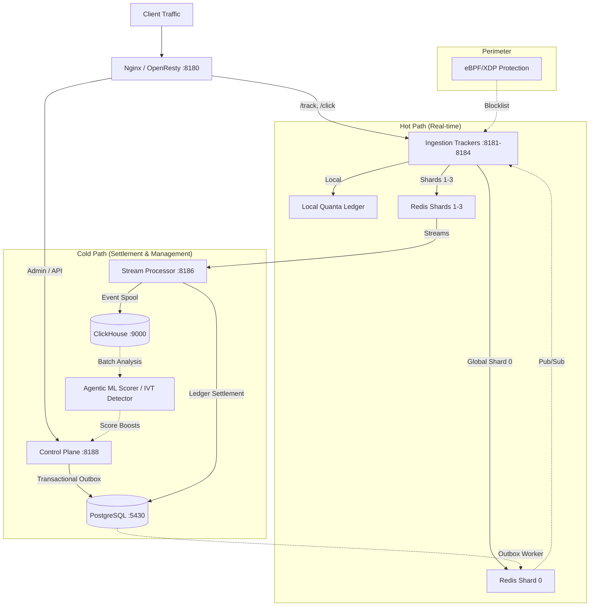
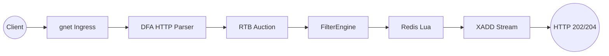
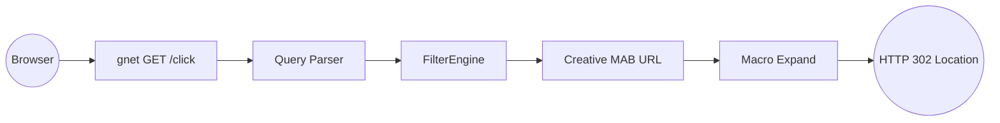

# Platform Architecture

This document describes the system topology, data storage design, request lifecycle, control plane, and architectural justifications for the BidShard platform, updated for the 2026 programmatic landscape.

---

## 1. System Topology

BidShard is a hybrid platform that separates real-time traffic ingestion (Hot Path) from administrative and financial operations (Cold Path).



### Component Port Mapping

| Binary | Port(s) | Role |
| :--- | :--- | :--- |
| `tracker` | `8181-8184` | Ingests traffic via `POST /track` and `GET /click`, runs in-process RTB, executes filters, and debits budgets via Redis Lua or Local Quanta. |
| `processor` | `8186` | Consumes Redis Streams, writes spend aggregates to PostgreSQL, and spools logs to ClickHouse. |
| `control` | `8188`, `8187` | Modular monolith: serves the admin JSON API, handles payment webhooks, manages the ledger, and runs the Transactional Outbox. |
| `ivt-detector` | - | Analyzes ClickHouse logs to detect invalid traffic (IVT) and updates blacklists. |
| `fraud-scorer` | - | Evaluates Agentic AI ML models (LightGBM/Isolation Forest) and writes fraud-score boosts to Redis. |
| `edge-xdp` | - | Drops packets from blacklisted IPs at the network driver level (eBPF/XDP). |

---

## 2. 2026 AdTech & Programmatic Compliance

BidShard is designed for the 2026 advertising ecosystem, prioritizing privacy, supply chain transparency, and agentic AI integration.

### 2.1. OpenRTB 2.6 exchange (SMB scope)

Production SSP integration uses **OpenRTB 2.6** only:

- **Endpoint**: `POST /openrtb/bid` on tracker (`internal/ingestion/openrtb_exchange.go`).
- **Codec**: `internal/openrtb/` — decode, validate (integration profile §0.2), encode bid/no-bid.
- **Auction**: Same in-process `RunAuction` as `/track`; no external bidder service.
- **Ops**: Control plane `/api/v1/rtb/*` — validate, deals, shadow-diff, reconcile export (CH `rtb_exchange_log`).
- **Not in P0**: OpenRTB 3.0, CTV ad pods, DOOH, full macro table — see `OPENRTB-FULL.md` §12.

Runbook: [RTB_PRODUCTION_RUNBOOK.md](RTB_PRODUCTION_RUNBOOK.md).

### 2.2. Supply chain and deals

- **SupplyChain (`schain`)**: Tolerant parse on exchange path; optional allowlist from Postgres.
- **PMP deals**: Postgres `rtb_deals` → hot `DealIndex`; floors in Redis `rtb:floor:{id}`.

### 2.3. Privacy-First & Signal Loss Mitigation
- **Privacy Sandbox Adaptors**: Integrated support for Google Privacy Sandbox (Topics API and Protected Audience API). The `tracker` acts as an orchestrator for Protected Audience interest group bidding.
- **First-Party Data Clean Rooms**: The `control` plane supports secure data sharing with advertiser Data Clean Rooms (DCR), enabling high-precision targeting without exposing PII.
- **Topics-based Filtering**: Native `FilterEngine` support for IAB content taxonomies and Topics API signals, replacing legacy third-party cookie targeting.

### 2.4. Agentic AI & ARTF 1.0 Implementation
- **Agentic Real-Time Framework**: BidShard implements the IAB ARTF 1.0 spec, allowing containerized AI agents (`fraud-scorer`, `ivt-detector`) to operate within the infrastructure and perform bidstream enrichment via the OpenRTB Patch Protocol.
- **ML Scoring Ensemble**: Uses Agentic AI to perform real-time bid mutation, enriching requests with quality scores and predicted conversion probabilities in under 1 ms.

---

## 3. Hot Path vs. Cold Path Separation

To meet the processing SLA under high load, the platform enforces a strict boundary between the hot path and the cold path:

| Attribute | Hot Path | Cold Path |
| :--- | :--- | :--- |
| **Scope** | `/track`, `/click`, `/openrtb/bid`, RTB auction, FilterEngine. | `/api/v1` REST API, billing, reports, payments. |
| **Latency SLA** | **p95 < 50 ms, p99 < 80 ms**, max 100 ms. | Milliseconds to minutes. |
| **Memory Allocations**| **0 heap allocations** (zero-alloc). | Standard Go allocations, sqlc-generated code. |
| **Network Engine** | `gnet` (epoll-based event loop). | Standard Go `net/http`. |
| **Primary Storage** | Redis (in-memory), local quanta. | PostgreSQL (financial truth), ClickHouse. |
| **Integration Layer** | Redis Streams (`ad:events:stream`). | Transactional Outbox (`outbox_events`). |

### Architectural Justification
- **Write Decoupling**: Directly writing event data to a relational database during ingestion introduces disk I/O bottlenecks and lock contention, limiting throughput. By writing to Redis Streams on the hot path and asynchronously settling to PostgreSQL and ClickHouse on the cold path, we decouple ingestion throughput from disk write limits.
- **SLA Protection**: Heavy analytical queries or administrative actions on the cold path cannot starve the hot path of CPU or memory resources, ensuring consistent sub-80ms latencies during traffic spikes.

---

## 4. Data Layer Design

### 4.1. In-Memory State (Redis)
The platform uses **4 standalone Redis masters** (no Redis Cluster) with Sentinel for automatic failover.

#### Routing and Sharding (StaticSlotSharder)
Campaigns are mapped to shards using a static lookup table:
$$\text{slot} = \text{CRC32C}(\text{campaign\_id}) \pmod{1024}$$
$$\text{shard} = \text{slot\_table}[\text{slot}]$$
The `slot_table` is a flat `[1024]uint8` array accessed via lock-free atomic operations (`sync/atomic`). This lookup completes in **~5.6 ns** without map overhead.

#### Key Distribution
- **Shard 0 (Global)**: Handles configuration updates via Pub/Sub (`campaigns:update`), authentication lockouts, global blacklists, and brand creatives.
- **Shards 1-3**: Store campaign-specific data (budgets, frequency caps, idempotency keys, and local event streams `ad:events:stream`).

#### Atomic Lua Execution
To prevent race conditions, budget debits and frequency checks are executed atomically in Redis via Lua scripts:
- **Tier B (`budget-fast.lua`)**: Used for impressions. Evaluates campaign budgets and appends to the stream in a single RTT.
- **Tier C (`unified-filter.lua`)**: Used for clicks and conversions. Evaluates frequency caps, pacing, time-to-click (TTC), and quotas.

#### Circuit Breaker
If Redis requests fail or timeout 150 consecutive times, the circuit breaker opens. The tracker then immediately rejects incoming requests (Fail-Closed) without debiting budgets, protecting the system from cascading failures. The breaker attempts to transition to Half-Open after 5 seconds to test Redis availability.

#### Architectural Justification
- **Why No Redis Cluster**: Redis Cluster introduces routing redirects (MOVED/ASK), cluster bus overhead, and restricts multi-key Lua scripts to keys hashing to the same slot. Standalone masters with client-side `StaticSlotSharder` eliminate cluster routing latency.
- **Why Standalone Shards**: Sharding by `campaign_id` ensures that all keys associated with a single campaign reside on the same Redis instance. This allows multi-key Lua scripts (budget, pacing, fcap) to execute atomically on a single shard in under 10 ms.

### 4.2. Financial Ledger (PostgreSQL)
PostgreSQL serves as the single source of truth for financial balances and system configuration.

- **Balance Ledger (`balance_ledger`)**: Balances are stored as `BIGINT` micro-units ($10^{-6}$ of the currency). Account balances are calculated dynamically using `SUM(amount)` over ledger rows.
- **Idempotency**: Click and conversion uniqueness is verified in Redis Lua and enforced in PostgreSQL via the `sync_idempotency` table during settlement.
- **Transactional Outbox**: Configuration changes are written to the database along with an outbox record in a single transaction. The `OutboxWorker` polls the `outbox_events` table using `SELECT FOR UPDATE SKIP LOCKED` and publishes updates to Redis, ensuring at-least-once delivery.

#### Architectural Justification
- **Why BIGINT Micro-units**: Floating-point types (`float64` or `numeric`) introduce rounding errors and precision loss over millions of transactions. Integer arithmetic in micro-units guarantees exact financial calculations.
- **Why SUM-based Ledger**: Modifying a single balance cell in a database row leads to high lock contention under concurrent writes. An append-only ledger converts updates into inserts, eliminating lock contention and providing a complete audit trail.
- **Why Transactional Outbox**: Direct HTTP-to-Redis writes from administrative handlers can fail if Redis is temporarily unreachable, leading to configuration drift. The outbox pattern guarantees that Redis eventually converges with the PostgreSQL state.

### 4.3. Analytics (ClickHouse)
ClickHouse stores raw event logs for reporting and fraud detection.

- **Storage Engine**: Uses `ReplicatedMergeTree` for horizontal scaling and fault tolerance.
- **Buffered Batching**: The `processor` aggregates events in memory and writes them in large batches to ClickHouse, optimizing disk write patterns.
- **Local Disk Spool**: If ClickHouse is unreachable, the processor writes batches to a local disk spool using sequential appends and `fsync`.

#### Architectural Justification
- **Why ClickHouse**: Relational databases like PostgreSQL are not designed for high-volume analytical queries over billions of rows. ClickHouse provides columnar storage and compression, executing analytical queries up to 100x faster.
- **Why Batching & Spooling**: ClickHouse is optimized for large batch inserts, not single-row inserts. Batching prevents disk saturation, while the local disk spool prevents data loss during database maintenance or network partitions.

---

## 5. Request Lifecycle on the Hot Path

Every incoming request to the `/track` endpoint is processed as follows:



1. **Ingress**: The `gnet` event loop reads bytes from the socket.
2. **Parsing**: A table-driven DFA parser extracts HTTP headers and the JSON body directly from the socket ring buffer into a pooled event structure without allocating memory on the heap.
3. **In-Process RTB**: If `RTB_MODE=live` is enabled, the tracker runs an in-process auction against the local campaign catalog. The winning campaign ID replaces the request's original campaign ID.
4. **FilterEngine Evaluation**:
   - **Emergency Breaker**: Instantly drops traffic if the global breaker is active.
   - **Geo/Fraud Filter**: Evaluates the client IP against the MaxMind database in memory (fails open on error).
   - **Schedule & Placement**: Verifies campaign schedules and publisher placement blacklists.
   - **ML Fraud Boost**: Applies fraud-score coefficients from the local memory snapshot.
5. **Budget Debit**:
   - **Local Quanta**: The tracker attempts to debit the budget from its local memory pool (`TrySpendLocal`). If successful, it proceeds to step 6.
   - **Redis Lua**: If the local quota is exhausted, the tracker executes a Lua script on the designated Redis shard to debit the budget.
6. **Stream Append**: The event is appended to the Redis Stream (`XADD ad:events:stream`), and the tracker returns an HTTP `202 Accepted` or `204 No Content` response.

### 5.1. Click Redirect (`GET /click`)

Arbitrage and affiliate workflows often require a server-side redirect: the ad link points at the tracker, the click is logged and filtered, and the browser receives a single `302` to the offer.



**Request shape**

```http
GET /click?campaign_id=<uuid>&type=click&click_id=<optional>&user_id=<optional>&sub1=...&gclid=... HTTP/1.1
```

| Parameter | Required | Role |
| :--- | :---: | :--- |
| `campaign_id` | Yes | Campaign UUID (same as `POST /track` JSON). |
| `type` | No | Event type; defaults to `click`. |
| `click_id` | No | External click ID; generated if omitted. |
| `user_id` | No | Visitor / sub-ID for frequency cap and creative stickiness. |
| `sub1`-`sub5` | No | Arbitrage sub-IDs; available as landing URL macros. |
| Other query keys | No | Passthrough (e.g. `gclid`, `ttclid`, UTM) appended to the `Location` URL. |

**Landing URL macros** (configured on brand creatives in the control plane):

| Macro | Substituted with |
| :--- | :--- |
| `{click_id}` | Resolved click ID |
| `{user_id}` | `user_id` query param |
| `{sub1}` … `{sub5}` | Matching `subN` query param |

**Responses**

| Status | When |
| :--- | :--- |
| `302 Found` | Filters passed; `Location` set to expanded landing URL + passthrough query. |
| `204 No Content` | Fraud ghost accept (same semantics as silent `POST /track` accept). |
| `4xx` / `5xx` | Filter reject, missing landing URL, or infrastructure fault (same codes as `/track`). |

**Hot-path properties**

- Query parsing, macro expansion, and URL assembly run on the gnet path with **0 heap allocations** when scratch buffers are pre-sized on the connection context.
- Landing URLs are cached as `[]byte` in the brand creative snapshot (cold reload) to avoid per-request string conversions.
- Implementation: `internal/ingestion/click_redirect.go`.

**Alternative: API redirect**

`POST /track` with JSON body still returns `202` with optional `landing_url` in the response body for client-side redirects (mobile SDK, S2S). Use `GET /click` when the traffic source expects an HTTP redirect (display, native, affiliate networks).

---

## 6. In-Process RTB Auction

The RTB auction runs in-process on tracker for `/track` and `POST /openrtb/bid` (OpenRTB 2.6 exchange).

- **Structure of Arrays (SoA)**: Candidate campaigns and creatives are stored in flat, parallel arrays in memory. This layout maximizes CPU cache locality and avoids pointer dereferencing during scans.
- **Early Termination**: Candidates are pre-sorted by expected bid value. The scan terminates early as soon as the candidate's bid falls below the current second-price threshold.
- **Execution Modes (`RTB_MODE`)**:
  - `off`: Auction is bypassed.
  - `shadow`: Runs the auction (`RunAuctionEval`) and logs metrics, but does not modify the campaign ID or debit budgets.
  - `live`: Runs the auction (`RunAuction`), and the winning campaign ID is used for subsequent budget debits.

#### Architectural Justification
- **Why In-Process**: Traditional RTB integrations use external bidding services, adding network latency (RTT) to the request path. Running the auction in-process using pre-sorted SoA structures eliminates network overhead, allowing the tracker to evaluate up to 500 candidates in under 15 microseconds.

---

## 7. Fault Tolerance and Resilience

### 7.1. Local Quanta Ledger
To minimize Redis network traffic, trackers use local budget reservation:
1. The tracker requests a budget quota (e.g., 1000 impressions) from Redis using the `local-quota-refill.lua` script.
2. Incoming impressions are debited locally in the tracker's memory using atomic CAS operations (`TrySpendLocal`), taking **~13 ns**.
3. When the campaign is paused, the tracker receives a SIGTERM, or the quota TTL expires, the unused quota is returned to Redis.

#### Architectural Justification
- **Network Decoupling**: Local budget reservation reduces the volume of Redis commands by up to 90%, preventing Redis CPU saturation and protecting the system from network latency spikes.

### 7.2. Infrastructure Failure Modes

- **Redis Shard 0 Outage**: Trackers continue processing traffic for cached campaigns. New campaigns cannot be resolved (returning `503 registry_stale` after 30 seconds). Configuration updates from the control plane are paused.
- **ClickHouse Outage**: The `processor` diverts event logs to the local disk spool. Once ClickHouse recovers, the processor drains the spooled files sequentially, preserving event order.
- **PostgreSQL Outage**: The `processor` stops committing spend aggregates to PostgreSQL but continues reading events from Redis Streams. The stream buffer absorbs backlog traffic for several hours, preventing data loss.

---

## 8. Security and Compliance

- **PII Protection**: Raw IP addresses and User-Agents are never stored in ClickHouse. The platform uses a rolling hash algorithm (`piihash`) to generate irreversible `ip_hash` and `ua_hash` values during ingestion.
- **Passive Defense**: Malicious traffic is dropped at the network interface level using eBPF/XDP. The platform strictly adheres to passive defense principles: active port scanning, device fingerprinting on publisher pages, or outbound counter-attacks are forbidden.
- **Audit Logging**: All administrative mutations (budget changes, manual blacklist updates, plan adjustments) are recorded in the `admin_audit_log` table within the same transaction as the mutation.
