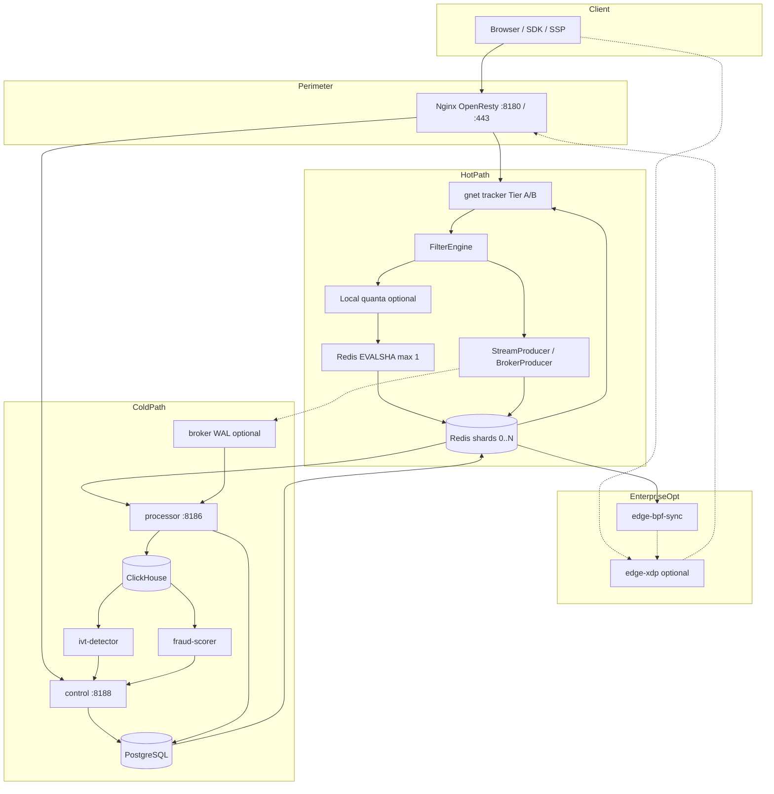

# Architecture

Hot-path ingestion (`/track`, `/click`, `/openrtb/bid`, `/tg/*`) and cold-path settlement (Postgres, ClickHouse, outbox, ML sidecars). Invariants enforced in `.cursor/rules/architecture.mdc` and CI gates.

HTTP **202** on `/track` means ingest accepted and validated on the tracker. It does **not** mean Postgres or ClickHouse committed the event.

---

## Binaries

| Binary | Role | Default listen |
| :--- | :--- | :--- |
| `tracker` | gnet HTTP ingress, `FilterEngine`, stream/broker enqueue | `SERVER_PORT` **8181** (compose lanes 8181-8184); metrics sidecar `METRICS_PORT` **9090** (compose 9101-9104) |
| `processor` | Redis stream / broker WAL consumer; PG settlement; CH batches | `PROCESSOR_PORT` **8186** (`/health`, `/ready`, `/metrics`) |
| `broker` | mmap WAL ingest daemon | **9092** TCP or unix socket (`runtimepaths.BrokerGnetSocket`) |
| `control` | Admin API, in-process workers, outbox, payment webhooks | `MANAGEMENT_PORT` **8188**; `PAYMENT_WEBHOOK_PORT` **8187** |
| `fraud-scorer` | Batch LGBM scoring; writes via management HTTP / outbox | metrics only (no admin HTTP port in tree) |
| `ivt-detector` | CH rule batch + optional embedded scorer | sidecar |
| `edge-bpf-sync` | Redis blocklists/allowlists to pinned BPF maps | `METRICS_PORT` **9090** |
| `edge-xdp` | XDP program attach on NIC | no HTTP admin |
| `region-proxy` | Enterprise multi-region WAL ingress | unix socket + health socket |
| `campaign-shard` | CLI: print static-slot index for campaign UUID | no network |

Default appliance: nginx perimeter + `tracker` + `control` + `processor`. Optional: `broker`, ML sidecars, `edge-xdp` + `edge-bpf-sync` (license `ebpf_xdp_edge`), `region-proxy` (license `multi_region`).

Sources: `cmd/tracker/doc.go`, `cmd/processor/doc.go`, `cmd/control/doc.go`, `cmd/broker/doc.go`, `structure.mdc` cmd map.

---

## Invariants

### Hot path restrictions

| Rule | Rationale |
| :--- | :--- |
| No Postgres or ClickHouse on sync request path | DB RTT breaks p99 SLA; persistence via async streams or broker WAL |
| No ML inference on tracker | `internal/fraud` scoring only in sidecars; tracker reads `ml:score:boost:*` snapshot via `SettingsWatcher` |
| Campaign config from snapshot | `atomic.Pointer` registry + Redis pub/sub reload; no per-request PG fetch |
| At most one sync Redis `EVALSHA` | `unified-filter.lua` for debit/dedup; **zero** when local quanta full-skip eligible (`LOCAL_QUOTA_MODE=live`) |
| Stream log async | `StreamProducer` / `BrokerProducer`; Lua stream key `fcap:ignored` when Go producer is sole writer |
| `TryReserve` before debit | Producer admission at `STREAM_PRODUCER_ADMISSION_PCT` (default 85%) before Lua debit |
| Post-debit enqueue fail | `budget-rollback.lua` or local-quanta refund; metric `ad_stream_producer_post_debit_rejected_total` should stay ~0 |
| Fail closed on overload | 503 when stream admission, worker pool, or Redis breaker open |
| Zero heap allocs on ingest | `make test-alloc-gate`, `escape_heap_gate.sh` |

### Hot path allowed sync I/O

| Stage | I/O |
| :--- | :--- |
| Local filters | CPU + in-memory snapshots (GeoIP, registry, fraud boost map, slot map) |
| Segment filter | Redis `SISMEMBER` on segment keys (before unified) |
| Entitlements filter | Redis `INCR` for ingress RPD (`SetIngressRPDHandledExternally(true)` in `wire.go`) |
| Budget / dedup | 0 RTTs (local quanta full-skip) or 1x `EVALSHA` (`unified-filter.lua` or `budget-fast.lua`) |
| Event log | MPSC ring -> async `XADD` or `BrokerProducer.Produce` |
| OpenRTB `/openrtb/bid` | In-process `RunAuction`; **no** full `FilterEngine` chain |

### Cold path

| Rule | Implementation |
| :--- | :--- |
| Outbox in same PG txn as mutation | Admin write + `public.outbox_events` |
| Outbox poll on control only | Active **20 ms**; idle backoff to **250 ms**; tracker never polls PG outbox |
| Separate payment outbox | `payment.payment_outbox`, **100 ms** poll (`internal/payment/settlement`) |
| No N+1 in handler loops | Batched queries; `cold_path_static_gate.sh` |
| Postgres financial truth | Redis fast debit; `SyncWorker` reconciles `current_spend` |
| Processor does not write `balance_ledger` | Ledger via `cmd/control` billing/settlement handlers |

---

## Topology



Config propagation (not on `/track` request thread):

```
Admin PATCH -> PG txn + outbox_events -> OutboxWorker -> Redis mutations -> pub/sub campaigns:update -> tracker registry reload
```

---

## Hot path: request pipeline

### Edge (nginx Lua)

Access phase reads `ngx.shared` only; worker 0 timers sync from Redis (`deploy/nginx/lua/init-worker.lua`).

Pipeline order (`edge.mdc`, `edge_track_policy.lua`):

```
per-campaign RL -> circuit breaker -> blacklist -> ASN -> body DFA -> fraud tier -> upstream tracker
```

| Path | Upstream | Notes |
| :--- | :--- | :--- |
| `/track`, `/tg/*` | Tracker unix/TCP | Shard by `CRC32C(campaign_id) & 1023` (`edge-shard-balancer.lua`) |
| `/click` | Tracker | Edge 404 when `EDGE_EXPOSE_CLICK` off; tracker still serves on 8181-8184 |
| `/admin/*`, `/api/v1/*` | Control **8188** | |
| `/api/v1/telegram/webhook/*` | Control **8188** | Telegram CIDR allowlist |
| `/metrics/edge` | Edge **8180** | `edge-metrics.lua` |

Wire parity with tracker gnet: POST `/track` requires `Content-Length`, rejects chunked TE; verified by `TestChaos_CrossHop_NginxGnet` (`differential_count=0`).

### Tracker thread model

| Tier | Runtime | Sync `EVALSHA` | Returns when |
| :--- | :--- | :--- | :--- |
| **A** gnet epoll | `OnTraffic`, `WithLockOSThread(false)` | **Forbidden** | After `SubmitOffloadToWorker` + `Discard` frame |
| **B** `PinnedWorkerPool` | `MAX_WORKERS` goroutines, `LockOSThread` | **Allowed** | After full accept path on same worker |

Tier B synchronous pipeline (`internal/ingest/gnet/server.go`, `trackwire.go`):

```
runOffloadedRequest -> React
  -> parseTrackIngest
  -> tryAcquireStreamAdmission (TryReserve)
  -> processTrack -> FilterEngine.Check
  -> publishAcceptedOrRollback
  -> writeGnetTrackAccepted (cloneAsyncWriteBytes before arena release)
```

Queue depth **8192 per worker** (`WORKER_POOL_QUEUE_DEPTH`). Queue full -> 503. `HTTP1OffloadBusy`: one in-flight offload per HTTP/1 connection.

Metrics on ingest port return 404; scrape `METRICS_PORT` sidecar.

### Filter chain order

Wired in `cmd/tracker/wire.go` (assembled into `ingestion.NewFilterEngine`):

```
license
-> license_rps
-> emergency_breaker (SettingsWatcher)
-> geo
-> schedule
-> vpp
-> fraud (geo/DC ASN signals; not ML inference)
-> residential_proxy (optional, env-gated)
-> tcp_mss (optional)
-> device
-> l7_wire (optional)
-> json_serialization (optional)
-> behavior_telemetry (optional)
-> consent
-> segment (Redis SISMEMBER)
-> entitlements (Redis INCR RPD)
-> unified (Redis Lua; last; budget debit EVALSHA)
```

`FILTER_TIMEOUT_MS` sets monotonic deadline on `evt.FilterDeadlineMono` (production <= 100 ms). Fraud boost from `SettingsWatcher.GetFraudScoreBoosts()` is applied inside `FilterEngine.checkInner` before unified path.

Optional filters are nil unless env enables them in `wire.go` (e.g. `DC_ASN_HOT_ENABLED`, `RESIDENTIAL_PROXY_HOT_ENABLED`, `SEC_FETCH_VALIDATE_ENABLED`).

### Unified filter (Redis Lua)

Scripts in `internal/filter/unified/`: `unified-filter.lua`, `budget-fast.lua`, `budget-rollback.lua`, `local-quota-refill.lua`, `local-quota-return.lua`. Preloaded at tracker boot (`InitUnifiedFilterLua`, 30s preheater).

Campaign-scoped keys use `{campaign_id}` hash tag for single-master atomicity.

| Key / pattern | Role |
| :--- | :--- |
| `{id}dup:{type}:{click_id}` | Dedup SET NX |
| Budget key / `budget:quota:{id}` | Budget micro-units |
| `{id}idempotency:click:{click_id}` | Idempotency marker |
| `{dailySpendKeyPrefix}{date}` | Daily pacing |
| Fcap prefix + `user_id` | Frequency cap |
| `migration:fence:{campaign}` | Routing epoch mismatch (return 11) |
| `budget:frozen:{campaign}` | Budget frozen |
| Stream key (KEYS[9]) | `fcap:ignored` when deferred to Go producer |

`SetDeferStreamToProducer(true)` when `StreamProducer` or `BrokerProducer` wired: Lua does not `XADD`; Go is sole writer.

### Admission, publish, rollback

1. `tryAcquireStreamAdmission` -> `TryReserve` at `STREAM_PRODUCER_ADMISSION_PCT` (default **85**). `<= 0` disables check.
2. Broker lane preferred when `brokerProducers` wired; else per-shard `StreamProducer`.
3. Deferred mode without publisher -> **503** before debit (`requirePublisher` in `stream_admission.go`).
4. After accept: `EnqueueReserved` / `ProcessReserved`.
5. Enqueue failure -> `RollbackDebit` -> `budget-rollback.lua` or local-quanta refund.

### Ingest sink modes (`CH_INGEST_SOURCE`)

| Mode | Tracker sink | Processor consumers |
| :--- | :--- | :--- |
| unset / `redis` | Per-shard `StreamProducer` -> `REDIS_STREAM_NAME` | `SettlementWorker` + `StreamConsumer` groups on Redis stream |
| `broker` | `BrokerProducer` -> mmap WAL | `BrokerStreamConsumer` / `BrokerConsumerGroup`; Redis `_ch` consumers **disabled** |

`CH_INGEST_SOURCE=broker` requires `BROKER_URL` (`env_validate.go`). `BROKER_SHADOW_MODE=1` applies to **processor** CH consumer (counts without CH write until cutover), not tracker producer.

### Local quanta (`LOCAL_QUOTA_MODE`)

| Mode | Sync `EVALSHA` |
| :--- | :--- |
| unset | Every eligible accept |
| `shadow` | Local quanta machinery runs; still uses sync Lua for eligible traffic |
| `live` | **Full-skip**: zero sync `EVALSHA` when `localQuantaFullSkipEligible`; async `LocalQuantaStreamPublisher` + `BudgetDeltaPublisher` |

`TryReserve` still applies to authoritative CH path (broker/stream), not the async local-quanta side lane.

### Route-specific behavior

| Route | Filter | Response |
| :--- | :--- | :--- |
| `/track` | Full chain + unified debit | 202 accept, 403 reject, 503 overload |
| `/click` | Full chain on Tier B | 302 redirect |
| `/openrtb/bid` | `RunAuction` only | OpenRTB bid response; chunked body allowed |
| `/tg/*` | Track-like policy | Same shard routing as `/track` |

`RTB_MODE`: `off` / `shadow` / `live` controls in-process auction on `/track` when enabled. `/openrtb/bid` auctions when RTB enabled regardless of shadow/live spend selection.

---

## Cold path: processor pipeline

Per **Redis shard** when `CH_INGEST_SOURCE != broker`:

| Worker / consumer | Stream / group | Sink |
| :--- | :--- | :--- |
| `SyncWorker` | -- | Redis budget -> PG `current_spend` |
| `SettlementWorker` | `REDIS_STREAM_NAME`, group `{REDIS_GROUP_NAME}_pg` | PG events/stats |
| `StreamConsumer` `_ch` | same stream, group `{REDIS_GROUP_NAME}_ch` | ClickHouse batches |
| `StreamConsumer` `_fraud` | `FRAUD_STREAM_NAME` | CH fraud lane |

When `CH_INGEST_SOURCE=broker`:

| Consumer | Group suffix | Sink |
| :--- | :--- | :--- |
| `BrokerStreamConsumer` | `_pg_broker` | PG settlement |
| `BrokerConsumerGroup` | `_ch_broker` | authoritative CH ingest |
| `BrokerConsumerGroup` | `_fraud_broker` | fraud lane (when configured) |

CH writes batched (`CLICKHOUSE_BATCH_SIZE`, `CLICKHOUSE_FLUSH_INTERVAL_MS`); optional `CH_SPOOL_DIR`. Idempotency via `sync_idempotency` on settlement batches.

Processor does **not** insert `balance_ledger` rows.

---

## Cold path: control and outbox

`cmd/control` is a modular monolith: domain packages (`internal/campaign/`, `fraudadmin/`, `billingadmin/`, ...) plus composition root `internal/controlplane/`.

### Config outbox (`public.outbox_events`)

| Parameter | Value |
| :--- | :--- |
| Enqueue | Same PG transaction as domain mutation |
| Claim | `FOR UPDATE SKIP LOCKED`, batch up to **1000** |
| Poll active | **20 ms** |
| Poll idle max | **250 ms** (exponential backoff on empty) |
| Error retry | **2 s** |
| Stuck `PROCESSING` reclaim | **1 min** |
| Handler timeout | **30 s** per iteration |

Appliers registered in `internal/outbox/register.go` (campaign, settings, blacklist, fraud, RTB catalog reload, quota repair, ...). Bridge: `internal/controlplane/outbox_bridge.go`.

Regional cell (`MULTI_REGION_ENABLED` + license): `RegionOutboxRelay` forwards to global; global coordinator skips local `OutboxWorker` (`internal/controlplane/workers.go`).

### In-process workers (selection)

Started from `internal/controlplane/serve.go` / `workers.go`:

| Worker | Package | Tick / trigger |
| :--- | :--- | :--- |
| OutboxWorker / RegionOutboxRelay | `internal/outbox/` | 20 ms seed |
| SyncWorker (per shard) | `internal/domain` | budget reconciliation |
| ReconWorker | `internal/reconciliation/` | `RECON_WORKER_INTERVAL_MS` |
| Campaign schedule / pacing / delivery optimizer | `campaign/worker/` | 1 min / closed-loop |
| Quota manager | `internal/governance/` | `QuotaMode` shadow/live |
| Report job worker | `internal/reportjob/` | async reports |
| Payment settlement outbox | `internal/payment/settlement/` | 100 ms |

Admin HTTP: `/api/v1/*` on **8188**; legacy `/admin/*` returns **410 Gone**. Route catalog: `internal/controlplane/routecatalog/catalog.go`; OpenAPI: `api/openapi/`.

---

## ML and fraud (cold only)

| Component | Path | Hot-path interaction |
| :--- | :--- | :--- |
| `fraud-scorer` | Batch LGBM; CH features; management HTTP for actions | None on `/track`; pauses when outbox PENDING > 500 |
| `ivt-detector` | CH rules; optional embedded scorer unless `FRAUD_SCORER_STANDALONE=1` | None on `/track` |
| Fraud boost snapshot | Redis `ml:score:boost:*` -> `SettingsWatcher` | Read-only on tracker filter path |
| ML actions (ghost/silent_reject) | Outbox -> Redis blacklist | Does not auto-toggle `silent_reject_enabled` in PG |

Tracker must not import `internal/fraud` scoring (`boundaries.mdc`).

---

## Edge BPF path (optional)

Licensed (`ebpf_xdp_edge`):

```
control outbox -> Redis shard 0 blocklists -> edge-bpf-sync -> pinned BPF maps -> edge-xdp -> nginx -> tracker
```

`cmd/edge-bpf-sync`: incremental blocklist sync every `SYNC_INTERVAL` (default 5s); violations ringbuf -> Redis autoban. Control does not write kernel maps directly.

Parallel L7 path: nginx `edge-blacklist-sync.lua` -> generational `blacklist_cache` SHM (same Redis source, different layer).

XDP drops L3/L4 for listed IPs; rotating proxies can evade host maps.

---

## Sharding

```
slot = CRC32C(campaign_id) & 1023
shard = slot_table[slot]   // atomic.Value read in Go; edge-slot-map.lua parity
```

`StaticSlotSharder` in production; `JumpHashSharder` for tests only. Slot CRC: ~5.6 ns on amd64 (`sharding_amd64.s`).

Redis: standalone masters + Sentinel (not Redis Cluster). Shard **0**: pub/sub `campaigns:update`, global blacklists, BPF sync source. Shards **1..N**: per-campaign budgets, dedup, streams.

---

## Edge routing: ngx.shared (worker 0 sync)

Timers in `deploy/nginx/lua/init-worker.lua` (worker id 0 only). Access phase reads SHM; no per-request Redis on hot path.

| Dict | Size | Sync interval | Invalidation |
| :--- | :--- | :--- | :--- |
| `edge_config` | 4m | 5 s | Generational `_asn_ver`; version-last ASN stamp; RL retain on null |
| `blacklist_cache` | 10m | 5 s + quarantine | Generational `_bl_ver`; `b:{ip}` stamp then ver bump on full sync |
| `slot_map` | 2m | 10 s | `s:0..1023` then `version` last |
| `node_weights` | 512k | 10 s | Purge stale `w:*`; `peer_count` last |
| `edge_rl` | 50m | access | TTL sliding windows |
| `circuit_breaker` | 10m | sync + log | `{bucket}:total` / `:errs` ratio gate |

Circuit breaker writers: Redis connect/HMGET/SMEMBERS failures, blacklist stale, upstream 5xx (`edge-circuit-log.lua`).

Verify: `bash scripts/test/edge/lua_tests.sh compliance`.

---

## Port map

| Service | Port | Metrics |
| :--- | :---: | :---: |
| `tracker` | 8181-8184 | 9101-9104 (compose sidecar) |
| `processor` | 8186 | `/metrics` on 8186 |
| `control` | 8188 | `/metrics` on 8188 |
| `payment-webhook` | 8187 | - |
| `ivt-detector` | - | 9112 |
| `fraud-scorer` | - | 9114 |
| `edge-bpf-sync` | - | 9090 |
| nginx edge | 8180, 443 | `/edge/metrics` on 8180 |
| `broker` | 9092 | health 8084 |

Infra defaults: Postgres **5430**, Redis **6479-6482**, ClickHouse **9000**.

---

## Ingress wire policy

Parser alignment between nginx Lua and gnet (`TestChaos_CrossHop_NginxGnet`):

- `/track`: `Content-Length` required; chunked TE rejected.
- Duplicate or obfuscated `Transfer-Encoding` rejected.
- Idle body limits: `HTTP1_INCOMPLETE_MAX`, `HTTP1_BODY_IDLE_MS`.
- `/openrtb/bid`: chunked allowed; size caps `ORTB_SCAN_MAX_BYTES`.

See `.cursor/rules/parser.mdc`.

---

## Data stores

### Redis

Standalone masters + Sentinel (not Redis Cluster). Multi-key Lua requires `{campaign_id}` hash tag on one master.

Streams: default `REDIS_STREAM_NAME` (`ad:events` in compose); fraud lane `FRAUD_STREAM_NAME`. Consumer groups: `{REDIS_GROUP_NAME}_pg`, `_ch`, `_fraud` (or `_pg_broker`, `_ch_broker` when broker-primary).

### PostgreSQL

Ledger and admin source of truth: `balance_ledger`, `campaigns`, `events`, `sync_idempotency`, `outbox_events`, `payment.payment_outbox`.

Tracker PG pool: boot-time registry/slot-map/settings fallback only (`wire.go` phase 2); never on request thread.

### ClickHouse

Analytics ingest from processor. Not on hot path. Materialized views for report aggregates. Admin reports via `internal/reports/` and `internal/reportjob/`.

---

## Multi-region (license `multi_region`)

| Piece | Behavior |
| :--- | :--- |
| `MULTI_REGION_ENABLED` | Gates regional/global cell wiring |
| Regional cell (`RegionCode != 0`) | `RegionOutboxRelay`; processor requires `REGION_PROXY_ADDR` or fail-closed boot |
| Global coordinator (`RegionCode == 0`) | `POST /api/v1/region/ingest/batch`; skips local OutboxWorker |
| `region-proxy` | WAL ingress, optional uplink to `GLOBAL_INGEST_URL` |

Hot path `internal/ingest` must not import `pkg/regionproxy`.

---

## Shadow and unwired surfaces

| Surface | What code actually does |
| :--- | :--- |
| ML on `/track` | Not wired; boost snapshot only |
| `BROKER_SHADOW_MODE` | Processor CH consumer only; tracker with `CH_INGEST_SOURCE=broker` writes live WAL |
| `LOCAL_QUOTA_MODE=shadow` | Does not skip sync `EVALSHA` (only `live` full-skip) |
| `RTB_MODE=shadow` | Auction runs; `live` selects campaign for spend |
| Postgres/CH on accept | Forbidden on tracker request thread |
| Outbox on tracker | Not wired |
| Lua XADD + Go producer dual write | Prevented by `fcap:ignored` + `SetDeferStreamToProducer` |
| Deferred stream without publisher | 503 before debit |
| Edge policy | Early reject/RL; tracker re-runs full filter chain |
| XDP | L4 drop for known IPs; not a substitute for L7 fraud on tracker |

---

## Verification tiers

| Tier | Command | Proves |
| :--- | :--- | :--- |
| Fast / PR | `bash scripts/ci/pr_fast.sh` | Static gates, unit, scoped holdouts |
| Integration | `make test-integration` | testcontainers Redis/PG/CH |
| Fault | `make test-fault` | Budget invariant, broker cutover, admission holdouts |
| Alloc | `make test-alloc-gate` | Hot path zero-alloc budget |
| Parser parity | `TestChaos_CrossHop_NginxGnet` | `differential_count=0` |
| Edge Lua | `bash scripts/test/edge/lua_tests.sh` | SHM sync contracts |
