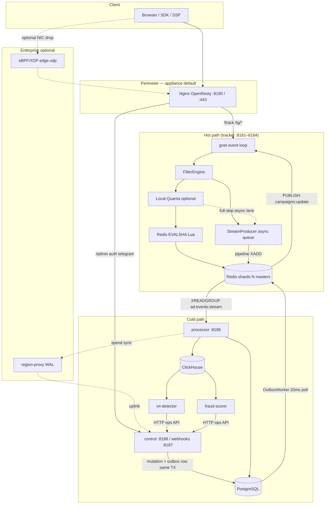
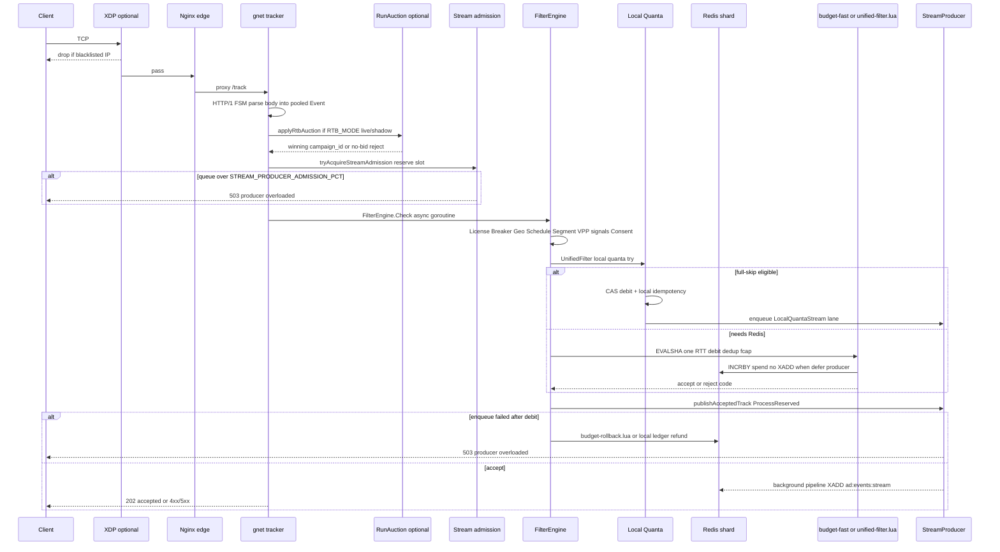
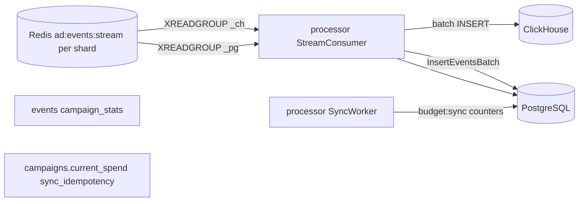
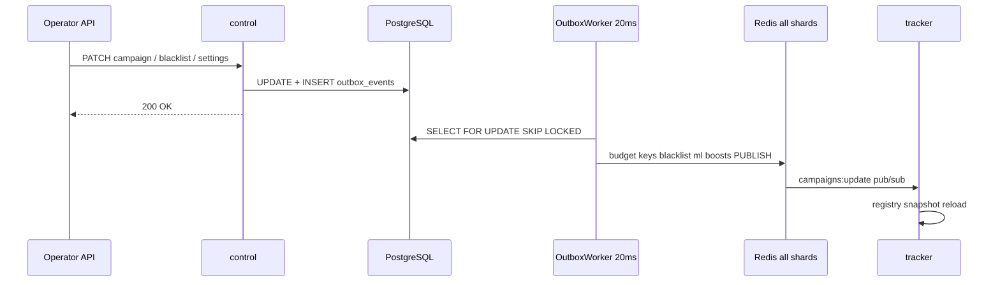
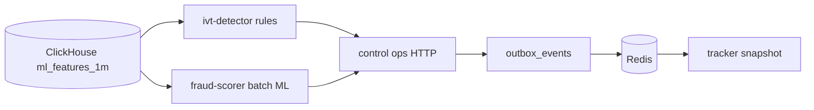

# Platform Architecture

BidShard separates **hot-path ingestion** (tracker: sub-80 ms p99, zero heap allocs) from **cold-path settlement and control** (PostgreSQL truth, ClickHouse analytics, transactional outbox to Redis). Technical stack identity: **ad-event-processor** — [NAMING.md](NAMING.md). This document matches the code as of the current tree.

---

## 1. System Topology

**Appliance default:** Nginx Lua perimeter only (`single_vps`). **Enterprise optional** (license + compose profile): `edge-xdp` on ingress NIC; `region-proxy` for geo/quorum WAL — see [section 11](#11-enterprise-optional).

### 1.1 Edge routing (what hits where)

Nginx is **not** a universal API gateway. Default `deploy/nginx/nginx.conf`:

| Path | Upstream | Notes |
| :--- | :--- | :--- |
| `/track` | trackers `8181–8184` | Lua blacklist + shard balancer; rate limit 100 r/s/IP |
| `/tg/*` | trackers | Telegram bridge endpoints |
| `/admin/*` | control `8188` | Admin UI shell |
| `/api/v1/auth/*` | control | Login and session |
| `/api/v1/telegram/webhook/*` | control | CIDR-restricted |
| `/metrics/edge` | Lua metrics | Edge Prometheus |

**Not on edge nginx** (call tracker or control directly in dev / custom ingress):

| Path | Served by | Port |
| :--- | :--- | :--- |
| `GET /click` | tracker | `8181–8184` |
| `POST /openrtb/bid` | tracker | `8181–8184` |
| `/api/v1/*` (REST admin) | control | `8188` |
| Payment webhooks | control | `8187` |

Shard pick at edge (`edge-shard-balancer.lua`) must match Go `StaticSlotSharder` (same CRC32 slot table).

### 1.2 Component ports

| Binary | Port(s) | Role |
| :--- | :--- | :--- |
| `tracker` | `8181–8184` (+ metrics `9101–9104`) | `POST /track`, `GET /click`, `POST /openrtb/bid`, `/tg/*`; gnet + FilterEngine + Redis Lua / local quanta |
| `processor` | `8186` (default), `8187` second replica in compose | Per-shard Redis Streams → PG settlement + CH batch insert; optional fraud microbatch |
| `control` | `8188` admin API, `8187` payment webhooks | Modular monolith: `/api/v1`, ledger, outbox worker, domain modules in-process |
| `ivt-detector` | — | CH rules → HTTP `POST /api/v1/ops/*` on control |
| `fraud-scorer` | — | CH batch ML → same ops HTTP path |
| `edge-xdp` | — | **Enterprise optional** — NIC-level IP drop from blacklist maps |
| `region-proxy` | — | **Enterprise optional** — regional WAL / quorum (`--profile multi-region`) |

Infrastructure (compose defaults): PostgreSQL `5430`, Redis host ports `6479–6482` (four masters on appliance / `single_vps`; `redis-4`/`redis-5` on host ports `6483–6484` require compose profile `infra`), ClickHouse `9000`. Runtime shard count = `len(REDIS_ADDRS)`; appliance and installer default to **4** shards.

### 1.3 Ingress wire policy (parser security)

`POST /track` uses a **strict wire contract** shared between nginx and gnet:

- **`Content-Length` is required** — no chunked `Transfer-Encoding` on `/track`.
- **Duplicate or obfuscated `TE` headers are rejected** — closes TE.TE smuggling seams.
- **Incomplete bodies are closed** — spin limit (`HTTP1_INCOMPLETE_MAX`) and idle timeout (`HTTP1_BODY_IDLE_MS`) prevent slow-stream holds on direct `:8181` access.

`POST /openrtb/bid` allows chunked bodies for exchange partners; chunk extensions (`;` in chunk size lines) are still rejected.

Body parsers apply bounded work: OpenRTB scan caps (`ORTB_SCAN_MAX_BYTES`, `ORTB_MAX_QUOTE_CHECKS`), protobuf field budget (`PROTO_MAX_FIELDS`), and HPACK continuation limits on HTTP/2.

**Operator guide:** [PARSER.md](PARSER.md). **Out of scope:** admin/cold-path JSON (`pkg/coldpath`), XDP, fraud ML — [PARSER.md](PARSER.md) section 8. **Verification:** `bash scripts/fault/parser_chaos_drill.sh`.

---

## 2. End-to-End Request Lifecycle

This section is the single reference for “what happens to one event.”

### 2.1 `POST /track` — synchronous hot path

**Step-by-step (code path)**

1. **Ingress** — `cmd/tracker/main.go` runs `gnet.Run(AdsPacketHandler)`. `OnTraffic` reads the socket ring buffer; optional `PinnedWorkerPool` offloads parse to worker goroutines (`handler.go`).
2. **Parse** — `parseTrackIngest`: JSON (`ad_event_processor_native` or OpenRTB3 ingress) or protobuf `AdEvent` vtproto; zero-alloc DFA on the hot path (`track_ingest_gnet.go`). Wire policy for `POST /track` matches nginx (see §1.3 and [PARSER.md](PARSER.md)).
3. **RTB (optional)** — `applyRtbAuction` (`rtb_track.go`) **before** filters:
   - `RTB_MODE=off` — skip.
   - `shadow` — `RunAuction`, metrics only.
   - `live` — win rewrites `campaign_id`; no-bid → HTTP reject (does not reach Lua).
4. **Stream admission** — `tryAcquireStreamAdmission` reserves a slot in the per-shard `StreamProducer` (or `BrokerProducer`) queue **before** filter debit when `STREAM_PRODUCER_ADMISSION_PCT` &gt; 0 (default **85**). Over-capacity → **503** `producer overloaded` with no budget debit. Metrics: `ad_stream_producer_queue_depth`, `ad_stream_producer_admission_rejected_total`.
5. **FilterEngine** — fixed order from `main.go`; Redis work runs in a **detached goroutine** on the gnet `/track` path so pinned workers are not blocked on Redis RTT:
   1. License → 2. Emergency breaker → 3. Geo → 4. Schedule → 5. Segment (Redis sets) → 6. VPP → 7. Fraud (**signals only**) → 8. Device (**signals only**) → 9. Consent → 10. **UnifiedFilter** (budget).
6. **UnifiedFilter settlement** (`unified_filter.go`):
   - Try **local quanta** (`TrySpendDebit`, ~13 ns) when `LOCAL_QUOTA_MODE` is `shadow` or `live`.
   - **Full-skip** (`live` + simple campaign): no synchronous `EVALSHA`; async `LocalQuantaStreamPublisher` lane (same defer rules as §7 below).
   - Else **one** Redis round-trip:
     - **budget-fast.lua** — impressions / simple path (`fastPathEnabled`, no TTC/fcap in Lua).
     - **unified-filter.lua** — clicks, conversions, TTC, pacing, freq caps, quotas.
7. **Event logging** — when `StreamProducer` or `BrokerProducer` is wired (`cmd/tracker/main.go`), `SetDeferStreamToProducer(true)` sets Lua stream key and local-quanta stream name to `fcap:ignored` so **only one writer** enqueues `ad:events:stream`. Accepted events call `publishAcceptedTrack` → `ProcessReserved` (consumes the admission lease) → background worker pipeline `XADD`.
8. **Post-debit safety** — if `publishAcceptedTrack` fails after a successful filter debit, `FilterEngine.RollbackDebit` runs (`budget-rollback.lua` on Redis, or local ledger refund + idempotency release for full-skip). Rollback uses a **200 ms** context timeout. Metric: `ad_stream_producer_post_debit_rejected_total` (should stay near zero with reservation).
9. **Response** — `deliverGnetTrack`: **202** on accept (including fraud L1 “ghost accept” on `/track`); pre-built bodies from `filterRejectSpecs` for rejects.

**What does *not* happen on this path:** PostgreSQL write, ClickHouse write, outbox write, ML inference.

#### Design rationale (why this shape)

Condensed design rationale (full narrative removed from docs; see git history if needed):

| Decision | Rationale |
| :--- | :--- |
| **Static slots, not Redis Cluster** | Multi-key Lua must run on one master without `MOVED`; operator controls slot migration |
| **Static slots, not Jump Hash (prod)** | Jump remaps most keys on resize; static table remaps only edited slots; faster `GetShard` |
| **Lua debit, Go `XADD`** | Shorten Redis script time; batch stream writes; admission backpressure |
| **Reserve before debit** | Closes check→enqueue race (`TestStreamProducerAdmissionRaceWithoutReserve`) |
| **Rollback script** | Rare safety net if enqueue fails after debit; 200 ms timeout |
| **Async filter goroutine** | `LockOSThread` workers must not wait on Redis RTT |
| **Single stream writer** | `fcap:ignored` in Lua + local quanta when `StreamProducer` active |
| **Redis UDS (co-located)** | Lower loopback latency on appliance single-VPS |
| **`pkg/broker` (optional)** | mmap WAL for CH ingest / RAM relief — not hot-path budget; not Kafka |

**Verification:** `go test ./internal/ingestion/ -run='TestStreamProducer|TestUnifiedFilter_SetDefer|TestUnifiedFilter_Rollback' -v`; UDS gate `bash scripts/perf/redis_uds_benchmark.sh`; chaos shard drills in `tests/resilience/`.

### 2.2 Hot path → cold path — settlement (minutes later, async)

| Stage | Component | What happens |
| :--- | :--- | :--- |
| Buffer | Redis Stream `ad:events:stream` | Hot path already returned 202; events wait per shard |
| Consume | `cmd/processor` | Per shard: consumer groups `{REDIS_GROUP_NAME}_pg` and `_ch` |
| Analytics | `ClickHouseStore` | Batch insert: `impressions`, `clicks`, `conversions`, `fraud_events`, `tg_events_raw` |
| Operational PG | `SettlementWorker` | `events` rows + `campaign_stats` upsert (stats-only mode when CH enabled) |
| Spend sync | `SyncWorker` | Reads Redis `budget:sync:*` / dirty sets → `campaigns.current_spend` + `sync_idempotency` |
| MVs | ClickHouse | `ml_features_1m` etc. fed by inserts, not written by processor directly |

Fraud rejects on hot path can also land in `ad:fraud:stream` → processor → CH `fraud_events`.

### 2.3 Admin change → outbox → Redis → tracker reload

Configuration and policy **never** write Redis from the HTTP handler directly. Same Postgres transaction: mutate row + insert `outbox_events` (`PENDING`).

**OutboxWorker** (`internal/controlplane/workers.go`, handlers in `outbox.go`) polls every **20 ms**, marks `PROCESSING`, applies side effect, marks `PROCESSED`.

Common `event_type` → Redis effect (fan-out to **all** shards unless campaign-local key):

| Event type | Redis / effect |
| :--- | :--- |
| `CREATE_CAMPAIGN` / `RESUME_CAMPAIGN` | Set `budget:campaign:{id}` + `PUBLISH campaigns:update` |
| `PAUSE_CAMPAIGN` / `CANCEL_CAMPAIGN` | `DEL` budget key + pub/sub |
| `UPDATE_BLACKLIST` | `blacklist:{manual&#124;auto&#124;fraud}` SADD/SREM + pub/sub |
| `ML_SCORE_BOOST` | `ml:score:boost:{campaign_id}` on all shards |
| `ML_GHOST_IVT` | PG flag + pub/sub |
| `UPDATE_SETTINGS` | `config:values` HSET + `config:version` |
| `SYNC_BRAND_CREATIVES` | Brand creative JSON on shards |
| `PAUSE_PLACEMENT` | Placement blacklist hash |

Tracker holds in-memory **registry** and **SettingsWatcher** snapshots; pub/sub triggers reload — no per-request Postgres.

### 2.4 `GET /click` — same core, different wire response

Same `processTrack` pipeline as `/track`, but:

- Parsed from query string (`click_redirect.go`).
- On accept: resolve landing URL from brand creative snapshot → macro expand → **302 Location**.
- On fraud L1: **204** (not 202).
- Typically exposed on tracker ports directly (not default nginx locations).

**`GET /click` query params:** `campaign_id` (required), `type` (default `click`), `click_id`, `user_id`, `sub1`–`sub5`, plus passthrough keys (`gclid`, UTM, …) appended to `Location`. Macros in landing URL: `{click_id}`, `{user_id}`, `{sub1}`…`{sub5}`.

### 2.5 `POST /openrtb/bid` — exchange path (no FilterEngine)

**Does not call `processTrack` or `FilterEngine`.** Flow (`openrtb_exchange.go`):

1. Rate limit → parse OpenRTB 2.6 body.
2. Policy / blocklist checks.
3. Per-impression `RtbCatalog.RunAuction` (same `internal/rtb` core as `/track` RTB).
4. Write bid or no-bid HTTP (`RTB_EXCHANGE_NO_BID_MODE`: 204 or JSON NBR).

Budget authority can be CAS inside RTB (`RTB_BUDGET_AUTHORITY=rtb`); tracker sets `UnifiedFilter.SetSkipBudgetDebit` on exchange path when configured.

### 2.6 Antifraud loop (cold path only)

- **Primary**: `ivt-detector` rules on 1-minute aggregates (CTR spike, datacenter ASN, fingerprint clusters, click ratios, …).
- **Supplementary**: `fraud-scorer` LightGBM/ONNX on 16-dim features → score boosts only.
- **Hot path**: reads pre-loaded `ml:score:boost:{campaign_id}` snapshot; **no inference** in `/track`.
- **Alternative**: processor `fraud.MicroBatcher` (licensed) can write boosts directly to shard Redis with TTL — bypasses outbox for snapshot refresh.

`ivt-detector` pauses when outbox `PENDING` > 500 (backpressure).

---

## 3. Hot Path vs Cold Path

| Attribute | Hot path | Cold path |
| :--- | :--- | :--- |
| **Scope** | `/track`, `/click`, `/openrtb/bid`, RTB, FilterEngine | `/api/v1`, billing, processor, IVT, outbox |
| **SLA** | p95 < 50 ms, p99 < 80 ms, max 100 ms | ms to minutes |
| **Allocations** | 0 heap allocs on ingest (`make test-alloc-gate`) | Standard Go, sqlc |
| **HTTP stack** | `gnet` epoll event loop | `net/http` |
| **Write path** | Redis Streams + optional local quanta | PG + outbox → Redis; processor → PG/CH |
| **Financial truth** | Redis budget counters (operational) | `balance_ledger`, `events`, `campaign_stats` |

**gnet vs net/http:** tracker uses a fixed worker/event-loop model with ring-buffer parse and pooled vtproto events to avoid goroutine-per-connection GC pressure at high RPS.

---

## 4. Redis Layout

### 4.1 Sharding

Standalone Redis masters (no Redis Cluster). Client-side routing:

$$\text{slot} = \text{CRC32C}(\text{campaign\_id}) \land 1023$$
$$\text{shard} = \text{slot\_table}[\text{slot}]$$

`GetShard` ~5.6 ns (`internal/domain/sharding.go`). High-volume campaigns may use sub-slots or shard triplets for load spread and circuit-breaker fallback.

### 4.2 Key placement

| Scope | Examples |
| :--- | :--- |
| **Campaign shard** (by `campaign_id`) | `{cid}budget:*`, `{cid}dup:*`, `{cid}fcap:*`, `ad:events:stream`, idempotency keys |
| **All shards** (outbox fan-out) | `config:values`, `blacklist:*`, `ml:score:boost:*`, brand creatives |
| **Shard 0 emphasis** | `campaigns:update` pub/sub hub, auth lockout, edge blacklist sync source |

Campaign keys use `{campaign_id}` hash tags so multi-key Lua scripts stay on one node.

### 4.3 Lua scripts (hot path)

| Script | When | Does |
| :--- | :--- | :--- |
| `unified-filter.lua` | Full path (clicks, TTC, pacing, fcap) | Budget, dedup, pacing, TTC, quotas, **XADD** in one atomic script |
| `budget-fast.lua` | Fast path impressions | Budget + dedup + **XADD** (fcap may be Go snapshot or async) |
| `local-quota-refill.lua` | Background | Refill local quanta chunk from Redis |
| `local-quota-return.lua` | Shutdown / pause | Return unused quanta |

Circuit breaker: 150 consecutive Redis failures → fail-closed (503), 5 s half-open probe.

**Why Lua + Streams, not Kafka on hot path:** budget state and event log must commit in **one** atomic Redis operation; separate message bus would risk debited-but-not-logged split brain.

---

## 5. PostgreSQL (system of record)

| Table / area | Role |
| :--- | :--- |
| `balance_ledger` | Append-only ledger; `BIGINT` micro-units; balance = `SUM(amount)` |
| `events` | Settled event rows from processor |
| `campaign_stats` | Aggregated counters |
| `campaigns.current_spend` | Flushed from Redis sync worker |
| `sync_idempotency` | Settlement dedup (`event_id`, `campaign_id`) |
| `outbox_events` | `PENDING` → `PROCESSING` → `PROCESSED`; payload `BYTEA` |

Admin mutations and payment webhooks write ledger + outbox in the same transaction. Processor does **not** write `balance_ledger`.

---

## 6. ClickHouse (analytics)

Processor batch-inserts raw telemetry; analytical tables and MVs (`mv_ml_features_1m_*`, hourly campaign stats) are derived in CH.

Local disk spool on processor if CH is down; drained in order on recovery.

---

## 7. In-Process RTB

Shared `RunAuction` (`internal/rtb/auction.go`) for `/track` (optional), `POST /openrtb/bid`, and shadow metrics.

- Candidates pre-sorted on catalog reload; hot path linear scan + early exit.
- Flat parallel slices for bid/floor fields (~500 candidates; layout avoids pointer chains).
- `RTB_MODE`: `off` | `shadow` | `live`.

---

## 8. Fault Tolerance

| Failure | Behavior |
| :--- | :--- |
| Redis shard down | Circuit breaker → 503; triplet fallback if configured |
| Redis shard 0 pub/sub down | Cached campaigns still serve; `503 registry_stale` after ~30 s for new IDs |
| Stream producer queue saturated | Admission reject **before** debit (`STREAM_PRODUCER_ADMISSION_PCT`, default 85%); post-debit enqueue failure triggers budget rollback |
| ClickHouse down | Processor spools to disk; PG settlement can continue |
| PostgreSQL down | Processor stops PG commits; streams buffer backlog |
| Full-skip + local quanta | Zero synchronous Redis RTT for eligible campaigns |
| Local quanta + Redis crash | In-RAM ledger debits without a completed stream `XADD` are lost (no PG spend); unused ledger balance is returned via `local-quota-return.lua` on flush/shutdown when Redis is reachable; `AssertBudgetInvariant` (±1 micro-unit) after recovery |

---

## 9. Security & Compliance

- **PII**: `piihash` rolling hash → `ip_hash` / `ua_hash` in CH; raw IP/UA not stored in analytics tables.
- **Edge (default)**: Nginx Lua blacklist and rate limits on appliance path.
- **XDP (Enterprise)**: optional passive drop at NIC (`edge-xdp`); sync from outbox → Redis shard 0 → BPF maps — see [XDP.md](XDP.md).
- **Audit**: `admin_audit_log` in same TX as admin mutations.

---

## 10. Programmatic & Privacy (2026 scope)

- **OpenRTB 2.6** exchange: `POST /openrtb/bid` on tracker; codec `internal/openrtb/`. Runbook: [RTB.md](RTB.md).
- **Supply chain**: tolerant `schain` parse; optional Postgres allowlist.
- **Runbook**: [RTB.md](RTB.md).

---

## 11. Enterprise (optional)

Appliance SKU (`single_vps`, pilot license) ships **without** multi-region proxy and NIC-level XDP. Code, fault tests, and compose profiles remain in git for Enterprise contracts.

| Feature | License JWT (`features.*`) | Installer profile | Compose | Runbook |
| :--- | :--- | :--- | :--- | :--- |
| **Multi-region / `region-proxy`** | `multi_region: true` | `multi_region: true` (blocked in `compose_dev`) | `--profile multi-region` | [REGIONS.md](REGIONS.md) |
| **XDP edge (`edge-xdp`)** | `ebpf_xdp_edge: true` | `edge_xdp: true` (BTF preflight) | `--profile enterprise-xdp` (not `single_vps`) | [XDP.md](XDP.md) |

Pilot defaults: `deploy/vendor/sku.yaml` — both features `false`.

Runtime checks:

- `control` refuses start when `MULTI_REGION_ENABLED=1` without `multi_region` entitlement (`internal/controlplane/serve.go`).
- `edge-xdp` pins BPF maps but **skips XDP attach** when Redis `entitlement:deployment` `ebpf_xdp_edge` is `0` (`internal/edge/entitlement.go`, `cmd/edge-xdp`).
- `edge-bpf-sync` idles without `ebpf_xdp_edge` (`cmd/edge-bpf-sync`; shared `edge.EbpfEdgeLicensed`).
- Doctor `edge_xdp` probe (when platform `edge_xdp: true`) reports BTF, pinned maps, systemd units, stats snapshot age (`pkg/doctor/xdp_probe.go`).
- Release pilot images exclude `region-proxy` binary (`.github/workflows/release-images.yaml`).

**Appliance default perimeter:** Nginx OpenResty Lua (`deploy/nginx/lua/`) — blacklist, rate limit, shard pick. Redis Sentinel overlay (`deploy/compose/docker-compose.sentinel.yaml`) is HA lab only, not product multi-region. Hot-path ingestion does **not** import `pkg/regionproxy`.

Enterprise drills (do not block PR merge): `mr_*` fault proofs in `scripts/test/run_resilience.sh`; `bash scripts/test/mr_resilience_drill.sh` (manual / `enterprise-resilience` workflow); XDP compliance fingerprint in `scripts/ci/compliance.sh`.

---

## Quick reference — common misconceptions

| Question | Answer |
| :--- | :--- |
| Does `/track` write to Postgres? | **No.** Only Redis Stream (+ optional local quanta async lane). |
| Where is spend finalized? | Processor + `SyncWorker` → `campaigns.current_spend` / `events`. |
| Does ML score on each request? | **No.** Offline batch → outbox → Redis snapshot reload. |
| Does outbox run on tracker? | **No.** Only `control` OutboxWorker. |
| Is `/click` on nginx edge? | **Not in default** `nginx.conf`; hit tracker `8181–8184`. |
| Is `/api/v1` on nginx edge? | **Only** `/api/v1/auth/*` and `/admin/`; rest is control `:8188`. |
| Redis Cluster? | **No.** N standalone masters + `StaticSlotSharder`. |
| How many Lua RTTs per event? | **0** (full-skip) or **1** (`EVALSHA` debit only when `StreamProducer` defers `XADD`). |
| Who writes `ad:events:stream` on tracker? | **`BrokerProducer`** when `CH_INGEST_SOURCE=broker` (default appliance); else **`StreamProducer`** with Lua defer `fcap:ignored`. |
| Can budget debit without logged event? | **No** on the happy path (reservation + rollback on enqueue failure). Monitor `ad_stream_producer_post_debit_rejected_total`. |

Parser security and ingress limits: [PARSER.md](PARSER.md). Production SLAs: handler p95 < 50 ms, p99 < 80 ms (see `.cursor/rules/global/core.mdc`). Lab benches: `make test-alloc-gate`, `bash scripts/test/gate_bench.sh`.

### HTTP status codes (`POST /track`)

| Status | Typical cause |
| :--- | :--- |
| **202** | Accepted (including fraud L1 silent accept) |
| **400** | Bad JSON/proto, malformed HTTP |
| **402** | Budget / bid floor |
| **403** | Geo, schedule, freq, segment, license |
| **404** | Campaign not found |
| **409** | Duplicate click/conversion |
| **413** | Body too large |
| **429** | Rate limit, pacing, daily quota, UDP ingress |
| **503** | Breaker, Redis/infra, registry stale, pool saturated, **producer queue admission** |
| **504** | Filter timeout |

`GET /click`: **302** redirect on success; **204** on fraud L1 (differs from `/track`).
