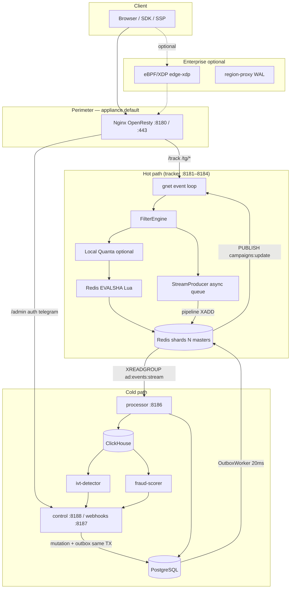
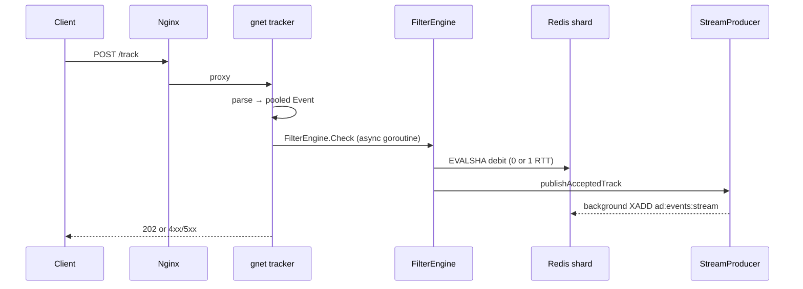

# Platform Architecture

Hot-path ingestion (tracker: p95 < 50 ms, p99 < 80 ms, max 100 ms, zero heap allocs) vs cold-path settlement (PostgreSQL truth, ClickHouse analytics, outbox → Redis). Stack identity: **ad-event-processor** — [NAMING.md](NAMING.md).

## System Topology

**Appliance default:** Nginx Lua perimeter (`single_vps`). **Enterprise optional:** `edge-xdp`, `region-proxy` — [section 11](#enterprise-optional).

### Edge routing

| Path | Upstream | Notes |
| :--- | :--- | :--- |
| `/track` | trackers `8181–8184` | Lua blacklist + shard balancer; 100 r/s/IP |
| `/tg/*` | trackers | Telegram bridge |
| `/admin/*` | control `8188` | Admin UI |
| `/api/v1/auth/*` | control | Login/session |
| `/api/v1/telegram/webhook/*` | control | CIDR-restricted |
| `/metrics/edge` | Lua metrics | Edge Prometheus |

**Not on default edge nginx:**

| Path | Served by | Port |
| :--- | :--- | :--- |
| `GET /click` | tracker | `8181–8184` |
| `POST /openrtb/bid` | tracker | `8181–8184` |
| `/api/v1/*` (REST admin) | control | `8188` |
| Payment webhooks | control | `8187` |

Edge shard pick (`edge-shard-balancer.lua`) must match Go `StaticSlotSharder`.

### Component ports

| Binary | Port(s) | Role |
| :--- | :--- | :--- |
| `tracker` | `8181–8184` (+ metrics `9101–9104`) | `/track`, `/click`, `/openrtb/bid`, `/tg/*` |
| `processor` | `8186` | Redis Streams → PG + CH |
| `control` | `8188` admin, `8187` webhooks | `/api/v1`, outbox worker |
| `ivt-detector` / `fraud-scorer` | — | CH → `POST /api/v1/ops/*` |
| `edge-xdp` / `region-proxy` | — | Enterprise optional |

Infra (compose): PostgreSQL `5430`, Redis `6479–6482` (4 shards default; `6483–6484` with `infra` profile), ClickHouse `9000`. Shard count = `len(REDIS_ADDRS)`.

### Ingress wire policy (`POST /track`)

- **`Content-Length` required** — no chunked TE on `/track`.
- Duplicate/obfuscated `TE` rejected.
- Incomplete bodies closed: `HTTP1_INCOMPLETE_MAX`, `HTTP1_BODY_IDLE_MS`.
- `POST /openrtb/bid`: chunked OK; chunk extensions rejected.
- Bounded parsers: `ORTB_SCAN_MAX_BYTES`, `ORTB_MAX_QUOTE_CHECKS`, `PROTO_MAX_FIELDS`, HPACK limits.

See [PARSER.md](PARSER.md). Verify: `bash scripts/fault/parser_chaos_drill.sh`.

## Request Lifecycle

### `POST /track` — hot path

1. **Ingress** — `gnet.Run(AdsPacketHandler)`; optional `PinnedWorkerPool` for parse.
2. **Parse** — JSON/proto vtproto; zero-alloc DFA (`track_ingest_gnet.go`).
3. **RTB (optional)** — `applyRtbAuction` before filters: `RTB_MODE=off|shadow|live`.
4. **Stream admission** — `STREAM_PRODUCER_ADMISSION_PCT` (default **85**); over-cap → **503** before debit.
5. **FilterEngine order:** License → Breaker → Geo → Schedule → Segment → VPP → Fraud (signals) → Device (signals) → Consent → **UnifiedFilter**.
6. **UnifiedFilter:** local quanta (`LOCAL_QUOTA_MODE=shadow|live`) or 1× `EVALSHA` (`budget-fast.lua` or `unified-filter.lua`). Full-skip: no sync Redis RTT.
7. **Event log** — `StreamProducer`/`BrokerProducer` defers Lua `XADD` (`fcap:ignored`); single writer to `ad:events:stream`.
8. **Post-debit rollback** — enqueue fail → `RollbackDebit` (200 ms timeout).
9. **Response** — **202** accept; fraud L1 ghost accept on `/track`.

**Not on hot path:** PostgreSQL, ClickHouse, outbox, ML inference.

| Decision | Rationale |
| :--- | :--- |
| Static slots (not Cluster/Jump Hash) | Multi-key Lua on one master; controlled migration |
| Lua debit, Go `XADD` | Shorter script; batched stream writes |
| Reserve before debit | Closes check→enqueue race |
| Async filter goroutine | Workers must not block on Redis RTT |

Verify: `go test ./internal/ingestion/ -run='TestStreamProducer|TestUnifiedFilter' -v`.

### Hot → cold settlement

| Stage | Component | Action |
| :--- | :--- | :--- |
| Buffer | Redis `ad:events:stream` | Per shard after 202 |
| Consume | `processor` | Groups `{REDIS_GROUP_NAME}_pg`, `_ch` |
| Analytics | `ClickHouseStore` | Batch insert impressions/clicks/conversions/fraud/tg |
| PG | `SettlementWorker` | `events` + `campaign_stats` |
| Spend sync | `SyncWorker` | `budget:sync:*` → `campaigns.current_spend` |

Fraud rejects → `ad:fraud:stream` → CH `fraud_events`.

### Admin → outbox → tracker reload

Same PG TX: mutate + `outbox_events` (`PENDING`). **OutboxWorker** polls **20 ms**.

| Event type | Redis effect |
| :--- | :--- |
| `CREATE/RESUME_CAMPAIGN` | Set `budget:campaign:{id}` + `PUBLISH campaigns:update` |
| `PAUSE/CANCEL_CAMPAIGN` | `DEL` budget key + pub/sub |
| `UPDATE_BLACKLIST` | `blacklist:{manual\|auto\|fraud}` + pub/sub |
| `ML_SCORE_BOOST` | `ml:score:boost:{campaign_id}` all shards |
| `UPDATE_SETTINGS` | `config:values` HSET + `config:version` |

Tracker registry reload via pub/sub — no per-request Postgres.

### `GET /click`

Same pipeline as `/track`; query string parse. Accept → **302** + macros; fraud L1 → **204**. Params: `campaign_id` (req), `type`, `click_id`, `user_id`, `sub1`–`sub5`, passthrough UTMs.

### `POST /openrtb/bid`

No `FilterEngine`. Rate limit → parse → `RtbCatalog.RunAuction` → bid/no-bid. `RTB_BUDGET_AUTHORITY=rtb` optional CAS.

### Antifraud (cold only)

`ivt-detector` (rules on `ml_features_1m`) + `fraud-scorer` (LightGBM/ONNX) → control ops HTTP → outbox → Redis → tracker snapshot. Hot path reads `ml:score:boost:*` only. `ivt-detector` pauses when outbox `PENDING` > 500.

## Hot vs Cold Path

| Attribute | Hot | Cold |
| :--- | :--- | :--- |
| Scope | `/track`, `/click`, `/openrtb/bid` | `/api/v1`, billing, processor, IVT |
| SLA | p95 < 50 ms, p99 < 80 ms | ms–minutes |
| Allocs | 0 heap on ingest | Standard Go/sqlc |
| Stack | `gnet` | `net/http` |
| Truth | Redis budget counters | PG ledger, events, campaign_stats |

## Redis Layout

**Sharding:** standalone masters; `slot = CRC32C(campaign_id) & 1023`; `shard = slot_table[slot]`. `GetShard` ~5.6 ns.

| Scope | Keys |
| :--- | :--- |
| Campaign shard | `{cid}budget:*`, `{cid}dup:*`, `{cid}fcap:*`, `ad:events:stream` |
| All shards | `config:values`, `blacklist:*`, `ml:score:boost:*` |
| Shard 0 | `campaigns:update` pub/sub hub |

**Lua scripts:**

| Script | When |
| :--- | :--- |
| `unified-filter.lua` | Clicks, TTC, pacing, fcap |
| `budget-fast.lua` | Simple impressions |
| `local-quota-refill.lua` / `return.lua` | Quanta background/shutdown |

Circuit breaker: 150 failures → 503, 5 s half-open.

## PostgreSQL

| Area | Role |
| :--- | :--- |
| `balance_ledger` | Append-only; micro-units |
| `events`, `campaign_stats` | Settled telemetry |
| `campaigns.current_spend` | Redis sync flush |
| `sync_idempotency` | Settlement dedup |
| `outbox_events` | `PENDING` → `PROCESSING` → `PROCESSED` |

Processor does not write `balance_ledger`.

## ClickHouse

Processor batch-inserts; MVs derived in CH. Local disk spool when CH down.

## In-Process RTB

`RunAuction` (`internal/rtb/auction.go`): `/track`, `/openrtb/bid`, shadow. `RTB_MODE`: `off|shadow|live`. ~500 candidates, flat slices.

## Fault Tolerance

| Failure | Behavior |
| :--- | :--- |
| Redis shard down | Circuit breaker 503; triplet fallback |
| Shard 0 pub/sub down | Cached campaigns serve; `503 registry_stale` ~30 s for new IDs |
| Producer queue saturated | Admission reject before debit; rollback on post-debit fail |
| ClickHouse down | Processor spools; PG continues |
| PostgreSQL down | Processor stops PG; streams buffer |
| Full-skip + local quanta | Zero sync Redis RTT |
| Local quanta + Redis crash | In-RAM debits without XADD lost |

## Security

- PII: rolling hash → `ip_hash`/`ua_hash` in CH.
- Edge: Nginx Lua blacklist/rate limits.
- XDP (Enterprise): NIC drop — [XDP.md](XDP.md).
- Audit: `admin_audit_log` same TX as mutations.

## OpenRTB 2.6

`POST /openrtb/bid` on tracker. Runbook: [RTB.md](RTB.md).

## Enterprise (optional)

Appliance (`single_vps`) ships without multi-region XDP. Pilot: `deploy/vendor/sku.yaml` — both features `false`.

| Feature | License JWT | Compose profile | Runbook |
| :--- | :--- | :--- | :--- |
| Multi-region | `multi_region: true` | `--profile multi-region` | [REGIONS.md](REGIONS.md) |
| XDP edge | `ebpf_xdp_edge: true` | `--profile enterprise-xdp` | [XDP.md](XDP.md) |

Runtime: `control` refuses `MULTI_REGION_ENABLED=1` without entitlement; `edge-xdp` skips attach without license; doctor probe in `pkg/doctor/xdp_probe.go`.

Drills: `bash scripts/test/mr_resilience_drill.sh`; XDP compliance in `scripts/ci/compliance.sh`.

## Quick Reference

| Question | Answer |
| :--- | :--- |
| `/track` writes Postgres? | No — Redis Stream only |
| Spend finalized where? | Processor + SyncWorker |
| ML on each request? | No — batch → outbox → Redis snapshot |
| Outbox on tracker? | No — control only |
| `/click` on nginx edge? | No — tracker `8181–8184` |
| Redis Cluster? | No — N masters + StaticSlotSharder |
| Lua RTTs per event? | 0 (full-skip) or 1 |
| Stream writer? | `BrokerProducer` if `CH_INGEST_SOURCE=broker`; else `StreamProducer` |

### HTTP status (`POST /track`)

| Status | Cause |
| :--- | :--- |
| **202** | Accepted (incl. fraud L1 ghost) |
| **400** | Bad body/HTTP |
| **402** | Budget/floor |
| **403** | Geo, schedule, license, segment |
| **404** | Campaign not found |
| **409** | Duplicate |
| **429** | Rate/pacing/quota |
| **503** | Breaker, Redis, registry stale, admission |
| **504** | Filter timeout |

`GET /click`: **302** success; **204** fraud L1.

Verify: `make test-alloc-gate`, `bash scripts/test/gate_bench.sh`.
