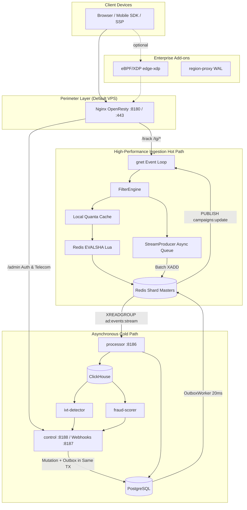

# BidShard Platform Architecture

This document describes the high-performance system architecture of BidShard. It outlines the division between the low-latency hot-path ingestion (p95 < 50 ms, p99 < 80 ms, zero heap allocations) and the PostgreSQL/ClickHouse-backed cold-path settlement and analytics processes.

---

## Architectural Constraints & Invariants

These architectural rules are non-negotiable and enforced by static and runtime gates (`.cursor/rules/architecture.mdc`).

### 1. Hot Path — Strict Restrictions

The hot-path ingestion engine handles `/track`, `/click`, `/openrtb/bid`, and Telegram mini-app request lifecycles. An HTTP 202 response indicates successful ingestion and validation, not that downstream databases have committed the write.

| Constraint | Technical Rationale |
| :--- | :--- |
| **No Postgres or ClickHouse on the Hot Path** | Any synchronous DB round-trip violates the < 80ms p99 SLA. Real-time data persistence is handled asynchronously via high-performance streams. |
| **No Real-Time ML Inference** | The `/track` and `/click` pipelines are strictly non-blocking. Heavy LightGBM/ONNX models run asynchronously on the cold path, and the tracker only reads in-memory risk boosts. |
| **No Dynamic DB Lookups for Campaigns** | Campaign targeting, budgets, and status rules are cached as an in-memory snapshot (`atomic.Pointer`), reloaded via Redis pub/sub upon administrative changes. |
| **At Most One Redis Round-Trip (`EVALSHA`)** | Tail latency is heavily impacted by sequential network I/O. The ingestion path utilizes a single highly optimized Lua script (`unified-filter.lua`) for debit and checks, and drops to **zero sync RTTs** when Local Quanta is active. |
| **Asynchronous Stream Loggers** | Event logging to `ad:events:stream` is pushed to background buffers using pipelined batch writes, ensuring slow stream writers never block the client response. |
| **Fail-Closed on Resource Exhaustion** | If downstream streams are saturated, the system rejects traffic with an **HTTP 503 (Service Unavailable)** instead of silently dropping tracking events or letting memory buffers blow up. |
| **Zero Heap Allocations on Ingest** | Crucial to avoid Go Garbage Collection (GC) pauses under high throughput. Validated continuously in CI via `make test-alloc-gate`. |

### 2. Hot-Path Allowed Synchronous I/O

| Ingestion Phase | Maximum Allowed Synchronous I/O |
| :--- | :--- |
| **Local Filtering** | CPU execution only (includes reading local GeoIP, scheduling maps, and in-memory ML boost caches). |
| **Budget & Deduplication** | **0 RTTs** (when Local Quanta full-skip is active) or **1x `EVALSHA`** call to Redis. |
| **Event Logging** | Pushed to lock-free queues for asynchronous batch ingestion (never written synchronously to disk). |
| **OpenRTB Bidding** | In-process auction execution (`RunAuction`) with direct memory scans; does not evaluate the standard redirect tracking filters. |

### 3. Cold Path — Guaranteed Actions

| Requirement | Technical Implementation |
| :--- | :--- |
| **Atomic Outbox Transactions** | Administrative edits, budget updates, and campaign mutations are saved along with an `outbox_events` record within a **single PostgreSQL transaction** to prevent dual-write drift. |
| **Dedicated Outbox Workers** | Polling is restricted to control nodes (polling every ~20 ms). Ingestion trackers never query PostgreSQL. |
| **No N+1 Database Queries** | DB-in-a-loop queries are forbidden. Data fetch calls must be batched or use array-based querying (`ANY($1)`). |
| **PostgreSQL is the Financial Source of Truth** | Redis acts as a fast-debit cache. Definitive ledger settlements and budget reconciliations are calculated and written to PostgreSQL. |
| **Isolated Balance Ledger** | The event-processing engine does not write to the financial `balance_ledger`. Ledger appends are reserved for dedicated billing/payment handlers. |

---

## System Topology & Data Flow

*Deployment Setup:* The standard single-VPS setup uses OpenResty for perimeter protection. Enterprise setups can activate high-speed `edge-xdp` (eBPF) filtering and regional proxy caching.

---

## Edge Path Routing

| Request Path | Destination Service | Ports | Key Features / Rates |
| :--- | :--- | :--- | :--- |
| `/track` | Tracker Ingest Pool | `8181–8184` | Lua Blacklist + Shard Balancer, rate-capped at 100 r/s/IP. |
| `/tg/*` | Tracker Ingest Pool | `8181–8184` | Telegram Bot API bridge routing. |
| `/admin/*` | Control Plane | `8188` | Delivers the Single-Page React Admin UI. |
| `/api/v1/auth/*` | Control Plane | `8188` | Login, session validation, and administrative API. |
| `/api/v1/telegram/webhook/*` | Control Plane | `8188` | Webhook handler, IP-restricted to official Telegram CIDRs. |
| `/metrics/edge` | Edge Metrics | `8180` | Real-time edge metrics parsed by Prometheus. |

---

## Microservice Port Allocations

| Service Name | Port Mapping | Metric Port | System Role |
| :--- | :---: | :---: | :--- |
| `tracker` | `8181–8184` | `9101–9104` | Standard ingestion paths (`/track`, `/click`, `/openrtb/bid`). |
| `processor` | `8186` | `9106` | Consumes Redis Streams and bulk-inserts to PostgreSQL & ClickHouse. |
| `control` | `8188` | `9108` | Exposes the Admin API and hosts the outbox sync workers. |
| `payment-webhook` | `8187` | - | Ingests secure balance top-up hooks from payment providers. |
| `ivt-detector` | - | `9112` | Evaluates ClickHouse tables for macro fraudulent patterns. |
| `fraud-scorer` | - | `9114` | Runs LightGBM models over raw click streams to update risk scores. |

*Infrastructure Ports:* PostgreSQL runs on `5430`, Redis shard masters are mapped to `6479–6482` (extendable to `6484` with the `infra` profile), and ClickHouse native connection runs on `9000`.

---

## Ingress Invariants & Request Body Policy

To prevent Slowloris and other application-layer Denial of Service (DoS) attacks, BidShard enforces strict body constraints at the network boundary:
- **`Content-Length` Header Required:** Chunked Transfer Encoding (TE) is strictly rejected on the `/track` endpoint to prevent streaming request attacks.
- **Obfuscated TE Rejections:** Requests with duplicate or malformed Transfer-Encoding headers are immediately dropped.
- **Strict Read Deadlines:** Requests that idle while uploading payload data are closed when hitting limits (`HTTP1_INCOMPLETE_MAX` and `HTTP1_BODY_IDLE_MS`).
- **OpenRTB Bidding Exception:** Chunked TE is permitted on `/openrtb/bid`, but chunk extensions are discarded, and overall sizes are limited by `ORTB_SCAN_MAX_BYTES`.

---

## High-Performance Database Layouts

### 1. Redis Sharding Topology

BidShard splits campaign tracking data across standalone Redis masters (no Redis Cluster, which would block multi-key Lua scripts).
- **Static Slot Sharding:** Campaigns are assigned to hash slots using `slot = CRC32C(campaign_id) & 1023`. The slot mapping index resolves to a specific Redis shard, executing in under 6 nanoseconds.
- **Key Constraints:** Shard-specific keys (campaign budgets, deduplication caches, and streams) are forced onto the same master node by grouping them under a common `{campaign_id}` hash tag, guaranteeing atomic transaction operations inside Lua.
- **Shared Config:** Global variables, residential proxy allowlists, and IP blacklists are mirrored across all Redis shards. Shard 0 serves as the primary hub for administrative pub/sub events.

### 2. PostgreSQL Schema Roles

PostgreSQL serves as the system's durable ledger and administrative source of truth:
- `balance_ledger`: An append-only ledger tracking micro-unit financial balances.
- `events` & `campaign_stats`: Holds aggregated, reconciled campaign totals.
- `campaigns`: Stores budgets, status flags, and the reconciled `current_spend` field.
- `sync_idempotency`: Prevents double-counting during stream worker flushes.
- `outbox_events`: Coordinates state synchronization from PostgreSQL to Redis.

### 3. ClickHouse Analytical Role

Used strictly for heavy multi-dimensional analytics. The `processor` batches incoming streams and writes to raw click and impression log tables. ClickHouse Materialized Views (MVs) continuously aggregate metrics, ensuring complex analytical dashboards load in under 100 milliseconds without burdening PostgreSQL.
