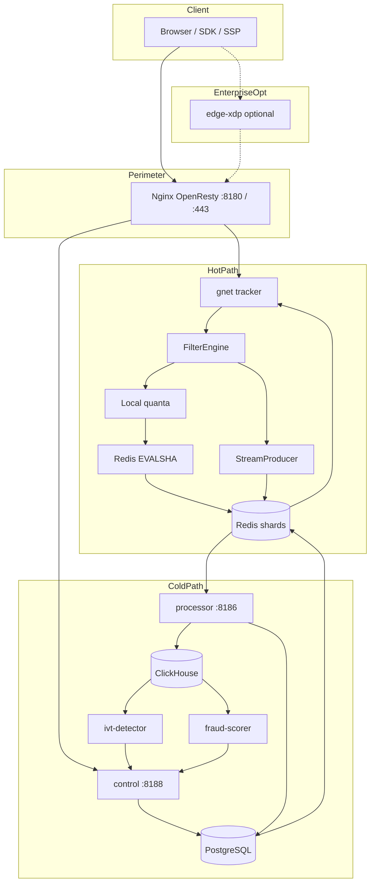

# Architecture

Hot-path ingestion (`/track`, `/click`, `/openrtb/bid`, `/tg/*`) and cold-path settlement (Postgres, ClickHouse, outbox, ML workers). Enforced by `.cursor/rules/architecture.mdc` and CI gates.

---

## Invariants

### Hot path restrictions

HTTP 202 on `/track` means ingest accepted and validated, not that Postgres or ClickHouse committed the event.

| Rule | Rationale |
| :--- | :--- |
| No Postgres or ClickHouse on sync request path | DB RTT breaks p99 SLA; persistence via async streams |
| No ML inference on tracker | `internal/fraud` scoring only in sidecars; tracker reads `ml:score:boost:*` snapshot |
| Campaign config from snapshot | `atomic.Pointer` registry + Redis pub/sub reload; no per-request PG fetch |
| At most one sync Redis `EVALSHA` | `unified-filter.lua` for debit/dedup; zero when local quanta full-skip |
| Stream log async | `StreamProducer` / `BrokerProducer`; not in same Lua script as debit |
| Fail closed on overload | 503 when stream admission or Redis breaker open |
| Zero heap allocs on ingest | `make test-alloc-gate`, `escape_heap_gate.sh` |

### Hot path allowed sync I/O

| Phase | I/O |
| :--- | :--- |
| Local filters | CPU + in-memory snapshots (GeoIP, registry, fraud boost map) |
| Budget / dedup | 0 RTTs (local quanta full-skip) or 1x `EVALSHA` |
| Event log | MPSC queue -> async `XADD` |
| OpenRTB | In-process `RunAuction`; no full FilterEngine on `/openrtb/bid` |

### Cold path

| Rule | Implementation |
| :--- | :--- |
| Outbox in same PG txn as mutation | Admin write + `outbox_events` |
| Outbox poll on control only | ~20 ms; tracker never polls PG |
| No N+1 in handler loops | Batched queries; `cold_path_static_gate.sh` |
| Postgres financial truth | Redis fast debit; settlement reconciles to PG |
| Processor does not write `balance_ledger` | Ledger via payment/billing handlers |

---

## Topology



Default deploy: nginx perimeter on single VPS. Optional: `edge-xdp` (license `ebpf_xdp_edge`), `region-proxy`.

---

## Edge routing

| Path | Backend | Notes |
| :--- | :--- | :--- |
| `/track`, `/tg/*` | Tracker 8181-8184 | Shard by `CRC32C(campaign_id) & 1023` |
| `/click` | Tracker | Edge gate `EDGE_EXPOSE_CLICK` |
| `/admin/*`, `/api/v1/*` | Control 8188 | |
| `/api/v1/telegram/webhook/*` | Control 8188 | Telegram CIDR allowlist |
| `/metrics/edge` | Edge 8180 | Prometheus scrape |

---

## Port map

| Service | Port | Metrics |
| :--- | :---: | :---: |
| `tracker` | 8181-8184 | 9101-9104 |
| `processor` | 8186 | 9106 |
| `control` | 8188 | 9108 |
| `payment-webhook` | 8187 | - |
| `ivt-detector` | - | 9112 |
| `fraud-scorer` | - | 9114 |

Infra defaults: Postgres 5430, Redis 6479-6482, ClickHouse 9000.

---

## Ingress wire policy

Parser alignment between nginx Lua and gnet (`TestChaos_CrossHop_NginxGnet`):

- `/track`: `Content-Length` required; chunked TE rejected.
- Duplicate or obfuscated `Transfer-Encoding` rejected.
- Idle body limits: `HTTP1_INCOMPLETE_MAX`, `HTTP1_BODY_IDLE_MS`.
- `/openrtb/bid`: chunked allowed; size caps `ORTB_SCAN_MAX_BYTES`.

See `.cursor/rules/parser.mdc`.

---

## Data stores

### Redis

Standalone masters + Sentinel (not Redis Cluster). Multi-key Lua requires `{campaign_id}` hash tag on one master.

```
slot = CRC32C(campaign_id) & 1023
shard = slot_table[slot]
```

`StaticSlotSharder` in production; `JumpHashSharder` for tests only. Slot CRC: ~5.6 ns on amd64 (`sharding_amd64.s`).

Shard 0: pub/sub `campaigns:update`, global blacklists, BPF sync source. Shards 1..N: budgets, dedup, streams per campaign.

### PostgreSQL

Ledger and admin source of truth: `balance_ledger`, `campaigns`, `events`, `sync_idempotency`, `outbox_events`.

### ClickHouse

Analytics ingest from processor. Not on hot path. Materialized views for report aggregates.
